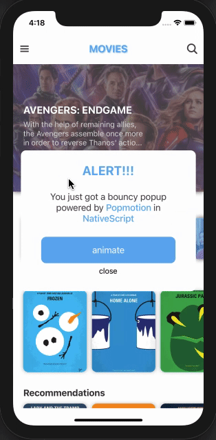

You've seen apps with really cool spring animations. You've heard of developers talking about Framer Motion or Remotion for React Native. What if I told you that you can create a similar animation in NativeScript?

Let me show you how you can create spring animations in NativeScript using a Javascript library called [Popmotion](https://popmotion.io). This is the library that powers Framer Motion!



I showcased this type of animation in one of the episodes on my [Movies Speed Code Series](https://www.youtube.com/watch?v=EUf3pQUHc74&list=PL44i_PSsr5XyxSt5hzJazPw8HMaVcesVu) on Youtube. You can check out the episode below 👇

<br/><br/>

<div class="videoWrapper">
    <iframe width="560" height="315" src="https://www.youtube.com/embed/tt81oyPS-nE" frameborder="0" allowfullscreen></iframe>
</div>

<br/><br/>

> For those that prefer going through the source code, check out the repo [here](https://github.com/williamjuan027/nativescript-movies-demo)

## Let's get started

I'll be using the Angular flavor of NativeScript for this blog post. However, since Popmotion is a Javascript library, you should be able to use it with the other frameworks with a few tweaks.

Let's start by adding the Popmotion dependency

```bash
npm i --save popmotion
```

Let's create a simple layout that we can animate using Popmotion

```html
<GridLayout rows="*" columns="*">
  <StackLayout #element margin="10" borderWidth="2" borderColor="#000">
    <Label text="I'm a label"></Label>
  </StackLayout>
</GridLayout>
```

## Accessing the Element

In your component file, access the layout using its `id` and the `ViewChild` decorator:

```typescript

import { ElementRef, ViewChild } from '@angular/core';

...
export class YourComponent {

    @ViewChild('#element') element: ElementRef;

    ...
}
```

> When using other flavors (e.g. Vue, React, etc.), getting the reference to the elements from your template would be different, but the sections to follow should be identical.

## Animate!

Before we get into the details of the implementation, let's take a step back and go over Popmotion's anatomy and how it works first.

At its core, Popmotion takes a `from` and a `to` parameter which then gets emitted periodically on an `onUpdate` callback. Below is a basic example of this 👇

```typescript
import { animate } from "popmotion";

animate({
  from: 0,
  to: 100,
  onUpdate: (latest) => console.log(latest),
});
```

You can use numbers, strings, colors, etc. for the `from` and `to` values and Popmotion will manipulate that value, emitting the value of each step in the `onUpdate` callback until it reaches the final `to` value. The `onUpdate` callback is where you would define your UI element's style updates.

Let's see what animating an element's opacity from 0 to 1 looks like using Popmotion 👇

```typescript
import { animate } from "popmotion";

animate({
  from: 0,
  opacity: 1,
  onUpdate: (latest) => {
    this.element.nativeElement.opacity = latest;
  },
});
```

You must be thinking that you could easily do this using a regular timer via a `setInterval` 🧐.

This is what makes Popmotion interesting. It lets you pass in different properties that would modify the `onUpdate callback resulting in different types of animation.

To create a **spring** effect, you could pass in a `type` of `spring` to the animate function.

```typescript
import { animate } from "popmotion";

animate({
  from: 0,
  to: 100,
  type: "spring",
  onUpdate: (latest) => {},
});
```

To create a **decay** effect, you could pass in a `type` of `decay` to the animate function.

```typescript
import { animate } from "popmotion";

animate({
  from: 0,
  to: 100,
  type: "decay",
  onUpdate: (latest) => {},
});
```

## Spring Animation

Tying this together with the previous section, to create a spring animation for your element, you would pass in a `from` and a `to` value to the `animate` function and update the element's properties in the `onUpdate` callback. This is how you would add a scale stretch animation like the demo above 👇

```typescript
import { ElementRef, ViewChild } from '@angular/core';
import { animate } from 'popmotion';

...
export class YourComponent {

    @ViewChild('#element') element: ElementRef;

    startAnimation(): void {
        animate({
            from: '1,1',
            to: '1.2,0.8',
            duration: 200,
            onUpdate: (latest) => {
                const [scaleX, scaleY] = latest.split(',').map((val) => +val);
                this.element.nativeElement.scaleX = scaleX;
                this.element.nativeElement.scaleY = scaleY;
            },
            onComplete: () => {
                animate({
                    from: '1.2,0.8',
                    to: '1,1',
                    duration: 1000,
                    type: 'spring' // <- Note that this one has type spring to get the bouncy effect
                    onUpdate: (latest) => {
                        const [scaleX, scaleY] = latest.split(',').map((val) => +val);
                        this.element.nativeElement.scaleX = scaleX;
                        this.element.nativeElement.scaleY = scaleY;
                    }
                })
            }
        })
    }
}
```

## Angular Tip

The `onUpdate` callback fires frequently throughout the animation. This triggers Angular's change detection multiple times - which is to be expected. By default, if the code runs inside `NgZone`, change detection is triggered every time the last function in the call stack is executed.

You can verify this by adding the following code in your component and checking the number of times the message gets logged in your console.

```typescript
ngDoCheck(): void {
    console.log('Change detection triggered!');
}
```

To fix this and optimize our animation, we can reduce the number of times change detection gets triggered. We can do this by wrapping the animation code with a `NgZone.runOutsideAngular` like this 👇

```typescript
import { NgZone } from '@angular/core';
import { animate } from "popmotion";

export class YourComponent {

    constructor(private ngZone: NgZone) {}

    startAnimation(): void {
        this.ngZone.runOutsideAngularZone(() => {
            animate({
                ...
            })
        });
    }
}
```

Running the animation code outside of `NgZone` will prevent change detection from getting triggered due to the `onUpdate` callback. Angular isn't aware that these callbacks are getting called and as a result doesn't trigger change detection.

That brings us to the end of the tutorial. If you have any questions or comments about the post, leave them in the comments below, or get in touch with me on Twitter [@williamjuan27](https://twitter.com/williamjuan27).