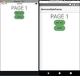
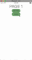
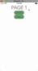

By popular demand, in this tutorial, we'll be creating an animated bottom sheet that works on iOS and Android.

## TL;DR

If you prefer watching a video of the tutorial, then here you go:

<br/><br/>

<div class="videoWrapper">
    <iframe width="560" height="315" src="https://www.youtube.com/embed/SeTol800wFQ" frameborder="0" allowfullscreen></iframe>
</div>

<br><br>

## Introduction

This article is the third part in a series of articles we've posted. We'll be using concepts and code covered in the previous two articles, so you might want to first check them out. The first was on [multiple frames](https://nativescripting.com/posts/multiple-frames-in-nativescript) and the second on [custom events](https://nativescripting.com/posts/custom-events-in-nativescript).

<br/>

In this tutorial, we'll use multiple frames to create the bottom sheet, but this is not the only way that can be achieved. We do however believe that it is the most flexible, reusable and maintainable way do it. If you've implemented a NativeScript bottom sheet before using a different method, we'd love to hear about it. You can let us know in the comments below.

<br/>

## Getting Started

We'll start off with the app created in the [multiple frames](https://nativescripting.com/posts/multiple-frames-in-nativescript) tutorial.

<br/>

![Starting app]](starting_app.png)

<br/>

The app displays two frames. When the `GO TO 2` button is tapped, the top frame navigates from Page 1 to Page 2 while the bottom red frame remains in place.

<br/>

To start off, let's add another button to the `home-page.xml` file, which is the default page of the top Frame.

<br/>

```xml
<!-- home-page.xml -->

<Page xmlns="http://schemas.nativescript.org/tns.xsd">
  <StackLayout>
    <Label text="Page 1" class="page-name" />
    <Button text="Go to 2" tap="page1BtnTap" />
    
    <Button text="Show" tap="btnShowTap" />
  </StackLayout>
</Page>
```

<br/>

You can see both Frames in `main-page`:

<br/>

```xml
<!-- main-page.xml -->

<Page xmlns="http://schemas.nativescript.org/tns.xsd" actionBarHidden="true">
  <GridLayout>
    <Frame defaultPage="home-page">
    </Frame>
    
    <Frame defaultPage="action-page" loaded="actionFrameLoaded">
    </Frame>
  </GridLayout>
</Page>
```

<br/>

When the button we added is tapped, we'll make it so that it triggers the bottom sheet to animate and move upwards. Notice that the button is on a different Frame from the bottom Frame. To communicate between different frames, we'll use custom events just as we did in the [previous article](https://nativescripting.com/posts/custom-events-in-nativescript).

<br/>

Before doing that, let's first make sure that the bottom Frame is completely positioned below the screen and hidden from view.

<br/>

```typescript
// main-page.ts

import { EventData } from "tns-core-modules/data/observable";
import { Page } from "tns-core-modules/ui/page";
import { HelloWorldModel } from "./main-view-model";
import { Frame } from "tns-core-modules/ui/frame/frame";
import { screen, isIOS } from "tns-core-modules/platform";

export function actionFrameLoaded(args: EventData) {
  const frame = args.object as Frame;
  
  frame.translateY = screen.mainScreen.heightDIPs;
}
```

<br/>

Now when you run the app, the bottom frame won't be visible.

<br/>



<br/>

Before implementing the `btnShowTap` event handler that will be called when the Show button is tapped, thus triggering the bottom sheet to slide up, let's first register the custom event that will perform this animation:

<br/>

```typescript
// main-page.ts

import { EventData } from "tns-core-modules/data/observable";
import { Page } from "tns-core-modules/ui/page";
import { HelloWorldModel } from "./main-view-model";
import { screen, isIOS } from "tns-core-modules/platform";
import { CubicBezierAnimationCurve } from "tns-core-modules/ui/animation/animation";
import * as frameModule from "tns-core-modules/ui//frame";

export function actionFrameLoaded(args: EventData) {
  const frame = args.object as frameModule.Frame;
  
  frame.translateY = screen.mainScreen.heightDIPs;
  
  frameModule.topmost().on('showBottomSheet', () => {
    frame.animate({
      duration: 1000,
      translate: { x: 0, y: 200 },
      curve: new CubicBezierAnimationCurve(.44, .63, 0, 1)
    });
  });
}
```

<br/>

In the above code, we get the root/topmost frame and add a listener to it with the `on()` function. Frames are Views and thus are [Observables](https://docs.nativescript.org/ns-framework-modules/observable) which is why we can call that method on the frame.

<br/>

We register a custom event named `showBottomSheet` that animates the frame upwards. We use [CubicBezierAnimationCurve](https://docs.nativescript.org/api-reference/classes/_ui_animation_.cubicbezieranimationcurve) to define a custom animation timing curve by using the cubic-bezier function. Possible values are numeric values from 0 to 1. To test out different animations, you can use this [cubic-bezier](https://cubic-bezier.com/) tool.

<br/>

To trigger that event, let's implement the Show button's `btnShowTap` event handler.

<br/>

```typescript
// home-page.ts

import { EventData } from "tns-core-modules/ui/page/page";
import { Button } from "tns-core-modules/ui/button";
import * as frameModule from "tns-core-modules/ui/frame";

export function page1BtnTap(args: EventData) {
  const button = args.object as Button;
  button.page.frame.navigate('page2-page');
}

export function btnShowTap(args: EventData) {
  // Show botom sheet
  
  frameModule.topmost().notify({ eventName: 'showBottomSheet', object: args.object });
}
```

<br/>

When the Show button is tapped, we emit/trigger the `showBottomSheet` custom event we had registered. The `notify()` method takes any implementer of the EventData interface as event data. It includes basic information about an event—its name as `eventName` and an instance of the event sender as `object`. The `eventName` is used to execute all event handlers associated with this event.

<br/>

Run the app and you should be able to bring up the bottom sheet by tapping the Show button.

<br/>



<br/>

We can bring up the bottom sheet, but we have no way of dismissing it at the moment. We'll wire up the Tap Me button so that when it's tapped, the bottom sheet will animate back down below the screen. You can use a swipe gesture for this instead of a button tap if you prefer.

<br/>

```typescript
// action-page.ts

import * as frameModule from "tns-core-modules/ui//frame";
import { EventData } from "tns-core-modules/ui//frame";

export function tapMeTap(args: EventData) {
  frameModule.topmost.()notify({ eventName: 'hideBottomSheet', object: args.object })
}
```

<br/>

When the button is tapped, it will trigger the `hideBottomSheet` event. Let's register that event:

<br/>

```typescript
// main-page.ts

import { EventData } from "tns-core-modules/data/observable";
import { Page } from "tns-core-modules/ui/page";
import { HelloWorldModel } from "./main-view-model";
import { screen, isIOS } from "tns-core-modules/platform";
import { CubicBezierAnimationCurve } from "tns-core-modules/ui/animation/animation";
import * as frameModule from "tns-core-modules/ui//frame";

export function actionFrameLoaded(args: EventData) {
  const frame = args.object as frameModule.Frame;
  
  frame.translateY = screen.mainScreen.heightDIPs;
  
  frameModule.topmost().on('showBottomSheet', () => {
    frame.animate({
      duration: 1000,
      translate: { x: 0, y: 200 },
      curve: new CubicBezierAnimationCurve(.44, .63, 0, 1)
    });
  });
  
  frameModule.topmost().on('hideBottomSheet', () => {
    frame.animate({
      duration: 1000,
      translate: { x: 0, y: screen.mainScreen.heightDIPs },
      curve: new CubicBezierAnimationCurve(.44, .63, 0, 1)
    });
  });
}
```

<br/>

Now when the Tap Me button is tapped, the bottom sheet moves back down.

<br/>


<br/>

We can animate the bottom sheet onto the screen and dismiss it with the touch of a button. This is great, but there are ways we can improve the app. For instance, on some iOS apps, when a bottom sheet slides up a page, the page in the background shrinks a bit. Let's create this effect.

<br/>

Since we are going to be scaling the top frame, we need to first add a `loaded` event to it.

<br/>

```xml
<!-- main-page.xml -->

<Page xmlns="http://schemas.nativescript.org/tns.xsd" actionBarHidden="true">
  <GridLayout>
    <Frame defaultPage="home-page" loaded="pageFrameLoaded">
    </Frame>
    
    <Frame defaultPage="action-page" loaded="actionFrameLoaded">
    </Frame>
  </GridLayout>
</Page>
```

<br/>

Now let's handle the `pageFrameLoaded` event handler:

<br/>

```typescript
// main-page.ts

import { EventData } from "tns-core-modules/data/observable";
import { Page } from "tns-core-modules/ui/page";
import { HelloWorldModel } from "./main-view-model";
import { screen, isIOS } from "tns-core-modules/platform";
import { CubicBezierAnimationCurve } from "tns-core-modules/ui/animation/animation";
import * as frameModule from "tns-core-modules/ui//frame";

export function pageFrameLoaded(args: EventData) {
  const frame = args.object as frameModule.Frame;
  
  frameModule.topmost().on('showBottomSheet', () => {
    frame.borderRadius = 10;
    frame.animate({
      duration: 1000,
      scale: { x: .95, y: .95 },
      opacity: .6,
      curve: new CubicBezierAnimationCurve(.44, .63, 0, 1)
    });
  });
  
  frameModule.topmost().on('hideBottomSheet', () => {
    frame.animate({
      duration: 1000,
      scale: { x: 1, y: 1 },
      opacity: 1,
      curve: new CubicBezierAnimationCurve(.44, .63, 0, 1)
    }).then(() => { frame.borderRadius = 0; });
  });
}

export function actionFrameLoaded(args: EventData) {
  const frame = args.object as frameModule.Frame;
  
  frame.translateY = screen.mainScreen.heightDIPs;
  
  frameModule.topmost().on('showBottomSheet', () => {
    frame.animate({
      duration: 1000,
      translate: { x: 0, y: 200 },
      curve: new CubicBezierAnimationCurve(.44, .63, 0, 1)
    });
  });
  
  frameModule.topmost().on('hideBottomSheet', () => {
    frame.animate({
      duration: 1000,
      translate: { x: 0, y: screen.mainScreen.heightDIPs },
      curve: new CubicBezierAnimationCurve(.44, .63, 0, 1)
    });
  });
}
```

<br/>

In the above, we register the `showBottomSheet` and `hideBottomSheet` events which show and hide the bottom sheet respectively while scaling down the background page in case of the former and scaling the page back up in case of the latter.

<br/>

Last thing to do, let's make the entire background of the page black so that it will look like the top frame is actually fading into darkness when we bring up the bottom sheet.

<br/>

```xml
<!-- main-page.xml -->

<Page xmlns="http://schemas.nativescript.org/tns.xsd" actionBarHidden="true" backgroundColor="black">
  ...
</Page>
```

<br/>

Run the app and the background frame should now darken and scale down when the bottom sheet slides onto the screen.

<br/>



<br/>

And that, folks, is one of the ways you can create an animated bottom sheet. We hoped you learned a thing or two!

<br/>

Let me know what you thought of this tutorial on Twitter: [@digitalix](https://twitter.com/digitalix) or leave a comment down below. You can also send me your NativeScript related questions that I can answer in video form. If I select your question to make a video answer, I'll send you swag. Use the #iScriptNative hashtag.

<br/>

For more tutorials on NativeScript, check out our courses on [NativeScripting.com](https://nativescripting.com). We have a [NativeScript Hands-On UI course](https://nativescripting.com/course/nativescript-hands-on-ui) that covers NativeScript user interface, views and components. You might also be interested in the following two courses on styling NativeScript applications: [Styling NativeScript Core Applications](https://nativescripting.com/course/styling-nativescript-core-applications) and [Styling NativeScript with Angular Applications](https://nativescripting.com/course/styling-nativescript-with-angular-applications).
