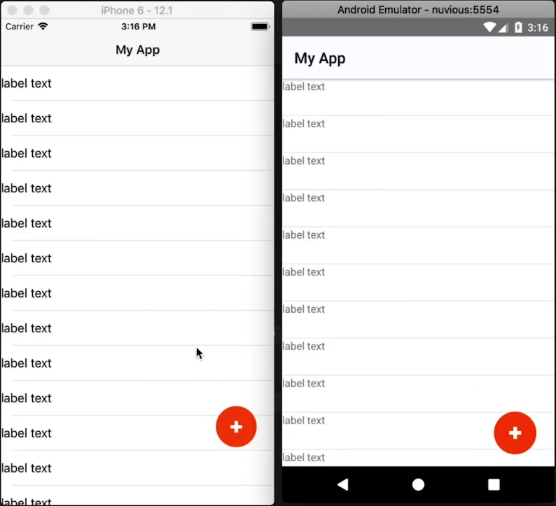
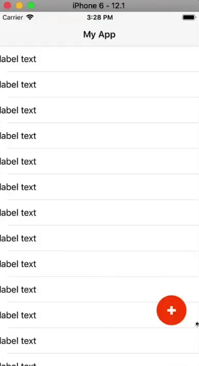
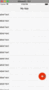
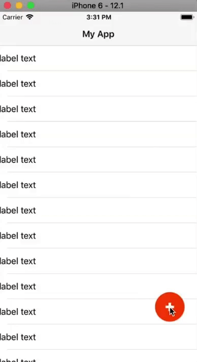
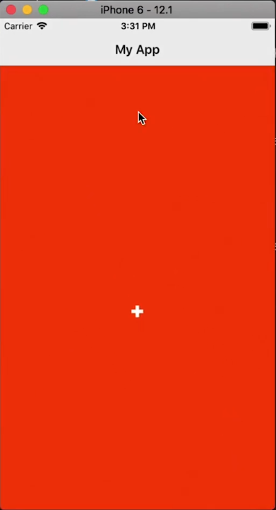
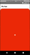
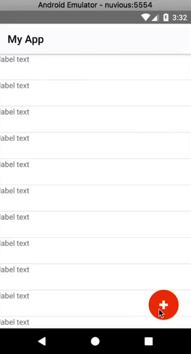
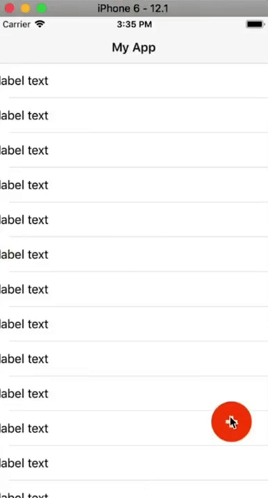
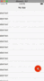

Today, we'll be animating from a Floating Action Button (FAB) into a Modal Dialog.

## TL;DR

Here's a video for you if you prefer a more visual tutorial:

<br/><br/>

<div class="videoWrapper">
    <iframe width="560" height="315" src="https://www.youtube.com/embed/lQRo66JNG0Y" frameborder="0" allowfullscreen></iframe>
</div>

<br><br>

## Introduction

[In the last tutorial](https://nativescripting.com/posts/custom-fab-with-css-in-nativescript), we created a Floating Action Button (FAB) using just the widgets that come with NativeScript and CSS. We didn't use any third-party libraries in creating the FAB.

<br>

In this tutorial, we are going to pick up where we left off in that tutorial and animate the FAB into a custom modal dialog window when it is tapped. When the modal is dismissed, it will animate back to a FAB. Again, we'll do all this without the help of third-party libraries.

## All Right, Let's Do This...

As mentioned, we are starting with the code from the last tutorial. Below is the running app:

<br>



<br>

And here's the code:

<br>

```xml
<!-- main-page.xml -->

<Page xmlns="http://schemas.nativescript.org/tns.xsd" navigatingTo="navigatingTo" class="page">
  <Page.actionBar>
    <ActionBar title="My App" icon="" class="action-bar">
    </ActionBar>
  </Page.actionBar>
  
  <AbsoluteLayout>
    <ListView items="{{items}}" itemTap="{{onItemTap}}">
      <ListView.itemTemplate>
        <Label text="label text"></Label>
      </ListView.itemTemplate>
    </ListView>
    
    <GridLayout id="btnFab" tap=onButtonTap">
      <Label class="lbl-plus" />
    </GridLayout>
  </AbsoluteLayout>
</Page>
```

<br>

```typescript
// main-page.ts

import { EventData } from "tns-core-modules/data/observable";
import { Page, View } from "tns-core-modules/ui/page";
import { HelloWorldModel } from "./main-view-model";
import { screen } from "tns-core-modules/platform";

export function navigatingTo(args: EventData) {
  const page = <Page>args.object;
  page.bindingContext = new HelloWorldModel();
  
  const btnFab = page.getViewById('btnFab') as View;
  
  btnFab.top = screen.mainScreen.heightDIPs - 200;
  btnFab.left - screen.mainScreen.widthDIPs - 80;
}

export function onButtonTap(args: EventData) {
  alert('FAB btn tapped');
}
```

<br>

```typescript
// main-view-model.ts

import { Observable } from "tns-core-modules/data/observable";
import { ItemEventData } from "tns-core-modules/ui/list-view";

export class HelloWorldModel extends Observable {
  public items = [];
  
  constructor() {
    super();
    
    for (let i = 1; i < 30; i++) {
      this.items.push(i);
    }
  }
  
  public onItemTap(args: ItemEventData) {
    alert('Item tapped: ' + args.index);
  }
}
```

<br>

```css
// app.css

@import '~nativescript-theme-core/css/core.light.css';

ListView {
  width: 100%;
  height: 100%;
}

ListView Label {
  height: 48;
  min-height: 48;
}

#btnFab {
  width: 56;
  height: 56;
  background-color: orangered;
  border-radius: 28;
}

.lbl-plus {
  height: 16;
  width: 16;
  background-color: white;
  clip-path: polygon(0 35%, 35% 35%, 35% 0, 65% 0%, 65% 35%, 100% 35%, 100% 65%, 65% 65%, 65% 100%, 35% 100%, 35% 65%, 0 65%);
}

.fab-icon {
  height: 16;
  width: 16;
}

.fab-dash--1,
.fab-dash--2 {
  background-color: #fff;
  transform: translate(0, -2);
  height: 16;
  width: 3;
}

.fab-dash--1 {
  transform: rotate(90deg) translate(0, -2);
}
```

## Animating the FAB

To animate the FAB, we are going to use a technique we used in a previous video tutorial named [NativeScript Animation of ANY View Property](https://www.youtube.com/watch?v=OGoCNPssPZg).

<br>

In that tutorial, we created some animation helper functions that we're going to reuse in this tutorial. Here's the code:

<br>

```typescript
// animation-helpers.ts

export interface AnimationRange {
  from: number;
  to: number;
}

export interface JsAnimationDefinition {
  getRange: () => AnimationRange;
  curve(progress: number): number;
  step(deltaResult: number): void;
  // condition: () => boolean;
}

export function amountFromTo(range: AnimationRange) {
  return (t: number) {
    const ret = range.from + t * (range.to - range.from);
    return ret;
  }
}

export function animate(
  duration: number,
  defs: JsAnimationDefinition[]) {

  return new Promise((resolve) => {
    const start = new Date();
    
    const timerId = setInterval(() => {
      const timePassed = new Date().valueOf() - start.valueOf();
      
      let progress = timePassed / duration;
      if (progress > 1) progress = 1;
      
      for (let i = 0; i < defs.length; i++) {
        const def = defs[i];
        
        const delta = def.curve(progress);
        const v = amountFromTo(def.getRange())(delta);
        
        def.step(v);
      }
      
      if (progress === 1) {
        clearInterval(timerId);
        resolve();
      }
    }, 17);
  });
}
```

<br>

The animation will be triggered by tapping the FAB, so we start by changing the implementation of the `onButtonTap()` event handler from displaying an alert, to calling a function that will handle the animation.

<br>

```typescript
// main-page.ts

import { EventData } from "tns-core-modules/data/observable";
import { Page, View } from "tns-core-modules/ui/page";
import { HelloWorldModel } from "./main-view-model";
import { screen } from "tns-core-modules/platform";
import { animate, JsAnimationDefinition, AnimationRange } from "./animation-helpers";
import * as d3 from "d3-ease";

const DURATION = 3000;
const FAB_SIZE = 56;

let btnFab: View = null;
let fabTop = 0;
let fabLeft = 0;

export function navigatingTo(args: EventData) {
  const page = <Page>args.object;
  page.bindingContext = new HelloWorldModel();
  
  btnFab = page.getViewById('btnFab') as View;
  
  btnFab.top = screen.mainScreen.heightDIPs - 200;
  btnFab.left - screen.mainScreen.widthDIPs - 80;
  
  fabTop = btnFab.top;
  fabLeft = btnFab.left;
}

export function onButtonTap(args: EventData) {
  animateFab();
}

function animateFab() {
  const ani1: JsAnimationDefinition = {
    curve: t => t,
    getRange: () => { return { from: fabTop, to: 0 }; },
    step: (v) => btnFab.top = v
  }
  
  animate(DURATION, [ani1]);
}
```

<br>

In the `animateFab()` function, we are going to end up animating various properties of the FAB simultaneously, like the width, height, opacity and border-radius. To animate these in JavaScript, we are going to use the animation helpers we included earlier. The animation helpers will also help us synchronize the various animations we'll implement.

<br>

In the above code, we remove `btnFab()` from inside the scope of the `navigatingTo()` function as we'll need to use it in `animateFab()`. We instantiate `fabTop` and `fabLeft` which we'll later use to keep track of the FAB's position. We also set some constants: `FAB_SIZE` which is the size of the FAB (we set it to `56x56` in the CSS) and `DURATION` which is the time it will take to run the animation (we've set a large number for now for demonstration, but the final value will be much smaller).

<br>

To carry out the animation, we call the `animate()` function that is defined in the animation helpers file. The function takes the duration and an array of `JsAnimationDefinition` objects. `JsAnimationDefinition` is an interface defined in the helpers file. We create a `JsAnimationDefinition` object named `ani1` and pass it into `animate()`. If you look at the `JsAnimationDefinition` definition in the animation helpers file, you will see that it has a curve, range and step.

<br>

For `ani1` we give it a linear curve (this is the animation timing function). For `getRange`, we define a function that returns an `AnimationRange` (defined in the helpers file. We set the top of the FAB as the starting value and the top of the screen as the end value. This will move the FAB from its position to the top of the screen. We also provide a `step` function that will get the final value of the calculation and assign `btnFab.top` to that value.

<br>

You can now run the app to see the effect:

<br>



<br>

The FAB moves to the top of the screen. When it reaches the top on iOS, it stretches past the edge. This is the typical behavior of a widget touching the safe areas on iOS. Don't worry too much about that as it will be automatically taken care of as we progress.

<br>

Let's add another animation definition. Add the following below `ani1` and remember to update `animate()` with the new definition:

<br>

```typescript
const ani2: JsAnimationDefinition = {
  curve: t => t,
  getRange: () => { return { from: fabLeft, to: 0 }; },
  step: (v) => btnFab.left = v
};

animate(DURATION, [ani1, ani2]);
```

<br>

The above moves the FAB to the top left corner of the screen as shown:

<br>



<br>

Next, we'll animate the height and width.

<br>

```typescript
const ani3: JsAnimationDefinition = {
  curve: t => t,
  getRange: () => { return { from: FAB_SIZE, to: screen.mainScreen.heightDIPs }; },
  step: (v) => btnFab.height = v
};

animate(DURATION, [ani1, ani2, ani3]);
```

<br>

The above changes the height of the FAB as it moves:

<br>


<br>

```typescript
const ani4: JsAnimationDefinition = {
  curve: t => t,
  getRange: () => { return { from: FAB_SIZE, to: screen.mainScreen.widthDIPs }; },
  step: (v) => btnFab.width = v
};

animate(DURATION, [ani1, ani2, ani3, ani4]);
```

<br>

The above expands the width of the FAB:

<br>



<br>

On iOS, the FAB expands to fill up the whole area:

<br>



<br>

On Android, this is not the case.

<br>



<br>

When the FAB expands, the border-radius we had set for it remains. On iOS, since the above edge of the FAB ends up touching the safe areas, it stretches and so there's no curvature. On Android, there are no safe areas and so we see the effects of the border-radius. So, not only do we need to animate the height and width, but we also need to animate the border-radius, which we do below:

<br>

```typescript
const ani5: JsAnimationDefinition = {
  curve: t => t,
  getRange: () => { return { from: FAB_SIZE / 2, to: 0 }; },
  step: (v) => btnFab.borderRadius = v
};

animate(DURATION, [ani1, ani2, ani3, ani4, ani5]);
```

<br>

On running the app, you should see the border-radius changing as the FAB expands. The final value for the border-radius is `0` as indicated by the `to` value we set for the range, so now on Android, there won't be a curvature of the FAB's corners after it expands.

<br>



<br>

Before finishing up the FAB-to-modal-and-back animation, let's change the timing function that we've been using so far. We've been using a linear curve and it doesn't make the animation look that great.

<br>

First, install the `d3-ease` package that has some pre-written easing functions that we can use. Since we are using TypeScript, we also install its type definitions:

<br>

```
$ npm install d3-ease --save
$ npm install @types/d3-ease --save-dev
```

<br>

Next, import the library:

<br>

```
import * as d3 from "d3-ease";
```

<br>

And replace all instances of `curve: t => t` with `curve: d3.easeExpInOut`.

<br>

`easeExpInOut` does symmetric exponential easing. It starts out real slow, speeds up in the middle and then slows down towards the end. You can see the result below. The animation looks much better now.

<br>



<br>

Our FAB is expanding outwards, but we have no way of making it shrink back into a FAB. We'll start working on this next. But first, let's add some content to the modal.

<br>

```xml
<GridLayout id="btnFab" tap=onButtonTap">
  <Label id="fabPlus" class="lbl-plus" />
  
  <GridLayout id="modal" rows="auto, *" columns="*, 60" padding="20">
    <Label text="Dialog" width="100%" height="60" fontSize="40" />
    <Label class="lbl-close" col="1" />
    
    <StackLayout row="1">
      <Label text="this is the content sdfshdfladsfla dsfadsf adf asdf kjasdf jklahsdflkj ahsdjkf hasdf adf lajdfhasdf a" textWrap="true" />
    </StackLayout>
  </GridLayout>
</GridLayout>
```

<br>

We create an inner GridLayout that will hold the content of the modal. We add two Labels to it: one is it's title `Dialog` and the other will be the `x` icon that closes the modal when tapped (we'll style this with CSS shortly). Below these, we add some text to the modal.

<br>

Let's style that Label into an `x`.

<br>

```css
// app.css

...

.lbl-close {
  height: 16;
  width: 16;
  background-color: white;
  clip-path: polygon(20% 0%, 0% 20%, 30% 50%, 0% 80%, 20% 100%, 50% 70%, 80% 100%, 100% 80%, 70% 50%, 100% 20%, 80% 0%, 50% 30%);
}
```

<br>

And here is the expanded modal:

<br>


<br>

To close the FAB, you could add a tap handler on the close button, but we aren't going to do that. Instead, we'll reuse the `onButtonTap` handler that we set on the FAB so that when it's tapped when the modal is open, it will play the animations in reverse order and shrink down the modal into a FAB.

<br>

```typescript
// main-page.ts

import { EventData } from "tns-core-modules/data/observable";
import { Page, View } from "tns-core-modules/ui/page";
import { HelloWorldModel } from "./main-view-model";
import { screen } from "tns-core-modules/platform";
import { animate, JsAnimationDefinition, AnimationRange } from "./animation-helpers";
import * as d3 from "d3-ease";

const DURATION = 3000;
const FAB_SIZE = 56;

let btnFab: View = null;
let fabTop = 0;
let fabLeft = 0;

let rev = false;

export function navigatingTo(args: EventData) {
  const page = <Page>args.object;
  page.bindingContext = new HelloWorldModel();
  
  btnFab = page.getViewById('btnFab') as View;
  
  btnFab.top = screen.mainScreen.heightDIPs - 200;
  btnFab.left - screen.mainScreen.widthDIPs - 80;
  
  fabTop = btnFab.top;
  fabLeft = btnFab.left;
}

export function onButtonTap(args: EventData) {
  animateFab(rev);
  rev = !rev;
}

function orderRange(range: AnimationRange, rev: boolean): AnimationRange {
  return {
    from: rev ? range.to : range.from,
    to: rev ? range.from : range.to
  }
}

function animateFab(rev: boolean) {
  const ani1: JsAnimationDefinition = {
    curve: d3.easeExpInOut,
    getRange: () => orderRange({ from: fabTop, to: 0 }, rev),
    step: (v) => btnFab.top = v
  };
  
  const ani2: JsAnimationDefinition = {
    curve: d3.easeExpInOut,
    getRange: () => orderRange({ from: fabLeft, to: 0 }, rev),
    step: (v) => btnFab.left = v
  };
  
  const ani3: JsAnimationDefinition = {
    curve: d3.easeExpInOut,
    getRange: () => orderRange({ from: FAB_SIZE, to: screen.mainScreen.heightDIPs }, rev),
    step: (v) => btnFab.height = v
  };
  
  const ani4: JsAnimationDefinition = {
    curve: d3.easeExpInOut,
    getRange: () => orderRange({ from: FAB_SIZE, to: screen.mainScreen.widthDIPs }, rev),
    step: (v) => btnFab.width = v
  };
  
  const ani5: JsAnimationDefinition = {
    curve: d3.easeExpInOut,
    getRange: () => orderRange({ from: FAB_SIZE / 2, to: 0 }, rev),
    step: (v) => btnFab.borderRadius = v
  };
  
  animate(DURATION, [ani1, ani2, ani3, ani4, ani5]);
}
```

<br>

In the above code, we use `rev` to keep track of whether the animation should run in reverse or not. It starts off as being `false` and get's toggled in `onButtonTap` after the animation runs.

<br>

We use `orderRange()` to reverse the range of our animation definitions. It takes an `AnimationRange` and a boolean indicating whether to reverse or not. If `rev` is `true`, then it reverses the range order and returns it, otherwise, it returns the same range.

<br>

We then modify the `getRange()` of all the `JsAnimationDefinition`s so that they call `orderRange()` to get their range.

<br>

Now if you tap on the FAB, it will expand, and if you tap it again, it will shrink back.

<br>



<br>

We still have some work to do. First, the FAB's `+` icon shouldn't remain visible in the expanded modal and the modal's content shouldn't be visible in the FAB.

<br>

```typescript
// main-page.ts

import { EventData } from "tns-core-modules/data/observable";
import { Page, View } from "tns-core-modules/ui/page";
import { HelloWorldModel } from "./main-view-model";
import { screen } from "tns-core-modules/platform";
import { animate, JsAnimationDefinition, AnimationRange } from "./animation-helpers";
import * as d3 from "d3-ease";

const DURATION = 3000;
const FAB_SIZE = 56;

let btnFab: View = null;
let fabPlus: View = null;
let modal: View = null;
let fabTop = 0;
let fabLeft = 0;

let rev = false;

export function navigatingTo(args: EventData) {
  const page = <Page>args.object;
  page.bindingContext = new HelloWorldModel();
  
  btnFab = page.getViewById('btnFab') as View;
  
  btnFab.top = screen.mainScreen.heightDIPs - 200;
  btnFab.left - screen.mainScreen.widthDIPs - 80;
  
  fabTop = btnFab.top;
  fabLeft = btnFab.left;
  
  fabPlus = page.getViewById('fabPlus') as View;
  modal = page.getViewById('modal') as View;
  modal.opacity = 0;
}

export function onButtonTap(args: EventData) {
  animateFab(rev);
  rev = !rev;
}

function orderRange(range: AnimationRange, rev: boolean): AnimationRange {
  return {
    from: rev ? range.to : range.from,
    to: rev ? range.from : range.to
  }
}

function animateFab(rev: boolean) {
  const ani1: JsAnimationDefinition = {
    curve: d3.easeExpInOut,
    getRange: () => orderRange({ from: fabTop, to: 0 }, rev),
    step: (v) => btnFab.top = v
  };
  
  const ani2: JsAnimationDefinition = {
    curve: d3.easeExpInOut,
    getRange: () => orderRange({ from: fabLeft, to: 0 }, rev),
    step: (v) => btnFab.left = v
  };
  
  const ani3: JsAnimationDefinition = {
    curve: d3.easeExpInOut,
    getRange: () => orderRange({ from: FAB_SIZE, to: screen.mainScreen.heightDIPs }, rev),
    step: (v) => btnFab.height = v
  };
  
  const ani4: JsAnimationDefinition = {
    curve: d3.easeExpInOut,
    getRange: () => orderRange({ from: FAB_SIZE, to: screen.mainScreen.widthDIPs }, rev),
    step: (v) => btnFab.width = v
  };
  
  const ani5: JsAnimationDefinition = {
    curve: d3.easeExpInOut,
    getRange: () => orderRange({ from: FAB_SIZE / 2, to: 0 }, rev),
    step: (v) => btnFab.borderRadius = v
  };
  
  const ani6: JsAnimationDefinition = {
    curve: d3.easeExpInOut,
    getRange: () => orderRange({ from: 1, to: 0 }, rev),
    step: (v) => fabPlus.opacity = v
  };
  
  const ani7: JsAnimationDefinition = {
    curve: d3.easeExpInOut,
    getRange: () => orderRange({ from: 0, to: 1 }, rev),
    step: (v) => modal.opacity = v
  };
  
  animate(DURATION, [ani1, ani2, ani3, ani4, ani5, ani6, ani7]);
}
```

<br>

In the above code, we get a reference to the modal and the FAB's `+` icon in `navigatingTo` (`modal` and `fabPlus`, respectively). We then set the modal's opacity to `0`, so it starts off hidden.

<br>

We then add two more animation definitions. `ani6` animates the plus icon's opacity so that it disappears on expansion and vice-versa on shrinking, and `ani7` animates the modal's opacity so that it becomes visible on expansion and the opposite on shrinking. Now things should look much better.

<br>


<br>

Finally, let's speed things up a little bit by changing the animation's duration `const DURATION = 600;`.

<br>


<br>

Wooh! That was a long one. We hope you learned a thing or two. Keep checking the blog and [YouTube](https://www.youtube.com/channel/UCajiMK_CY9icRhLepS8_3ug/videos) as we are going to be posting more videos on animations in the coming weeks.

<br>

Let me know what you thought of this tutorial on Twitter: [@digitalix](https://twitter.com/digitalix) or leave a comment down below. You can also send me your NativeScript related questions that I can answer in video form. If I select your question to make a video answer, I'll send you swag. Use the #iScriptNative hashtag.

<br>

For more tutorials on NativeScript, check out our courses on [NativeScripting.com](https://nativescripting.com). We have a [NativeScript Hands-On UI course](https://nativescripting.com/course/nativescript-hands-on-ui) that covers NativeScript user interface, views and components. You might also be interested in the following two courses on styling NativeScript applications: [Styling NativeScript Core Applications](https://nativescripting.com/course/styling-nativescript-core-applications) and [Styling NativeScript with Angular Applications](https://nativescripting.com/course/styling-nativescript-with-angular-applications).
