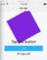
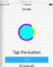
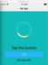
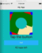
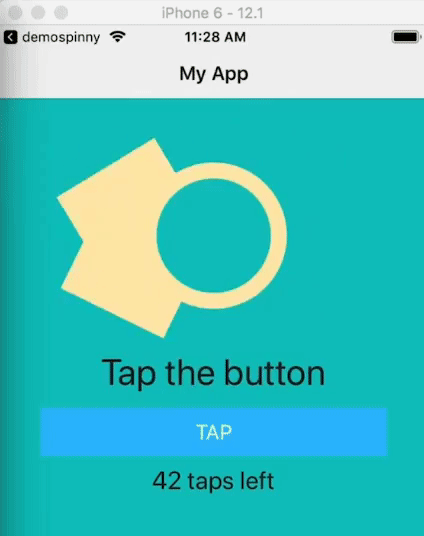
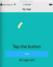

In this NativeScript tutorial, we'll show you how to replace the 'ActivityIndicator' that comes with the iOS and Android platforms with a more flexible one that we'll design ourselves. We'll create one that resembles the Android built-in activity indicator, which means we'll be able to have a consistent look across the two platforms. Along the way, you'll also learn some cool techniques of using just markup and CSS with built-in keyframe animations to create really neat effects.

## TL;DR

For those who prefer video, we've got you covered. Here are the two videos of the tutorial (both of these are covered in the written format below):

<br>

### Part 1 

<div class="videoWrapper">
    <iframe width="560" height="315" src="https://www.youtube.com/embed/YjuSeuFCAFw" frameborder="0" allowfullscreen></iframe>
</div>

<br>

### Part 2 

<div class="videoWrapper">
    <iframe width="560" height="315" src="https://www.youtube.com/embed/dJv6zX0vC6Y" frameborder="0" allowfullscreen></iframe>
</div>

<br><br>

## Getting Started

The activity indicator on iOS is very basic and plain and it can't be customized to look different. On the other hand, the built-in Android activity indicator looks pretty nice and is configurable.

<br>

In this tutorial, we're going to replace the ActivityIndicator that comes with NativeScript with a custom built one that resembles the built-in Android activity indicator. We'll do this with only markup and CSS—no third-party libraries.

<br>

Before we get started, let's look at the demo app

<br>


<br>

You can see the default iOS activity indicator above the "Tap the button" Label. On iOS, you can't configure the indicator, but on Android, you can change some options like its size, color, etc.

<br>

Here's the code for the page:

<br>

```xml
<!-- main-page.xml -->

<Page xmlns="http://schemas.nativescript.org/tns.xsd" navigatingTo="navigatingTo" class="page">

  <Page.actionBar>
    <ActionBar title="My App" icon="" class="action-bar">
    </ActionBar
  </Page.actionBar>

  <StackLayout class="p-20">
  
    <ActivityIndicator busy="true" />
    
    <Label text="Tap the button" class="h1 text-center" />
    <Button text="TAP" tap="{{ onTap }}" class="btn btn-primary btn-active" />
    <Label text="{{ message }}" class="h2 text-center" textWrap="true" />
  </StackLayout
</Page>
```

<br>

Now let's create our own activity indicator. Replace the `<ActivityIndicator busy="true" />` above with the following:

<br>

```xml
<AbsoluteLayout class="cv">
  <Label class="cv-lbl" />
  <Label class="inner-circle" />
</AbsoluteLayout>
```

<br>

Then add the following styles:

<br>

```css
// main-page.css

Page {
  background-color: #0dc5c1;
}

.cv {
  background-color: blueviolet;
  height: 200;
  width: 200;
  
  animation-name: rotate;
  animation-duration: 2s;
  animation-iteration-count: infinite;
  animation-timing-function: linear;
}

@keyframes rotate {
  from { transform: rotate(0deg); }
  to {transform: rotate(360deg); }
}
```

<br>

We use keyframe animations to rotate the AbsoluteLayout. We set the duration of one rotation to 2 seconds and specify that it should rotate indefinitely—we want it to keep on rotating as long as the indicator is visible. We set the `animation-timing-function` to `linear` so that we get a nice, steady spin instead of an erratic swing.

<br>

Notice we don't specify units (e.g. px) when we set rules for sizes. You can specify pixels, but the view will look different on different devices. In NativeScript, if you don't specify units, the value will be taken to be dips (density-independent pixels). We go into the more details on this in our [Styling NativeScript Core Applications](https://nativescripting.com/course/styling-nativescript-core-applications) and [Styling NativeScript with Angular Applications](https://nativescripting.com/course/styling-nativescript-with-angular-applications) courses, so you can check those out to learn more.

<br>

Here's the result of the styles we added:

<br>



<br>

Next, let's set some styles for the two Labels that are inside the AbsoluteLayout.

<br>

```css
// main-page.css

Page {
  ...
}

.cv {
  ...
}

.cv-lbl {
  height: 100;
  width: 100;
  background-color: yellow;
}

.inner-circle {
  height: 100;
  width: 100;
  background-color: aqua;
  border-radius: 50%;
  top: 50;
  left: 50;
}

@keyframes rotate {
  ...
}
```

<br>

And with that, we get:

<br>


<br>

The two labels are being animated because their container parent—the absolute layout—is being animated.

<br>

Next, let's clip part of the purple and yellow squares to make a circle around the middle aqua circle.

<br>

```css
.cv {
  ...
  
  clip-path: circle(60% at 50% 50%);
  margin: 20;
}
```

<br>

Now we have our circular spinner:

<br>



<br>

The thickness of the outer circle can be adjusted by changing the first percentage value of `clip-path`, e.g. ` clip-path: circle(80% at 50% 50%);` makes it thicker.

<br>

The spinner is almost done, let's tweak the colors we are using a little bit.

<br>

First, the following style isn't getting applied:

<br>

```xml
Page {
  background-color: #0dc5c1;
}
```

<br>

Let's move it to `app.css`:

<br>

```css
// app.css

@import '~nativescript-theme-core/css/core.light.css';

.cv-page {
  background-color: #0dc5c1;
}

.btn {
  font-size: 18;
}
```

<br>

And then change the class of the Page to `cv-page`:

<br>

```xml
<Page xmlns="http://schemas.nativescript.org/tns.xsd" navigatingTo="navigatingTo" class="cv-page">
```

<br>

Now the background color has changed.

<br>

Next, let's change the colors of the spinner. Here's the full code for `main-page.css`:

<br>

```css
// main-page.css

.cv {
  background-color: rgba(255, 233, 176, 0.2);
  height: 200;
  width: 200
  
  animation-name: rotate;
  animation-duration: 2s;
  animation-iteration-count: infinite;
  animation-timing-function: linear;
  
  clip-path: circle(60% at 50% 50%);
  margin: 20;
}

.cv-lbl {
  height: 100;
  width: 100;
  background-color: #ffe9b0;
}

.inner-circle {
  height: 100;
  width: 100;
  background-color: #0dc5c1;
  border-radius: 50%;
  top: 50;
  left: 50;
}

@keyframes rotate {
  from { transform: rotate(0deg); }
  to {transform: rotate(360deg); }
}
```

<br>

Here's our spinner now:

<br>



<br>

That looks pretty great. Next, we are going to build another version of the spinner that's closer to the Android built-in one.

## Another Version of the Activity Indicator

In this section, we are going to start with the code we have so far and adjust it to create an activity indicator that looks a bit different. It will closely resemble the Android built-in one.

<br>

First, modify the markup for the AbsoluteLayout as shown:

<br>

```xml
<AbsoluteLayout class="cv-wrapper">
  <AbsoluteLayout class="cv0">
    <Label class="cv-ring" />
    <Label class="cv-lbl1" />
  </AbsoluteLayout>
  
  <AbsoluteLayout class="cv1">
    <Label class="cv-lbl1" />
    <Label class="inner-circle2" />
  </AbsoluteLayout>
</AbsoluteLayout>
```

<br>

Our last spinner had one layout that was spinning. For this, we are going to have two spinning layouts going at different speeds. Let's get started on the styling:

<br>

```css
// main-page.css

.cv-wrapper {
  height: 200;
  width: 200;
  background-color: blue;
}

.cv0 {
  height: 200;
  width: 200
  animation-name: rotate;
  animation-duration: 2s;
  animation-iteration-count: infinite;
  animation-timing-function: linear;
  animation-delay: 200ms;
  background-color: red;
}

.cv1 {
  height: 200;
  width: 200
  animation-name: rotate;
  animation-duration: 2s;
  animation-iteration-count: infinite;
  animation-timing-function: linear;
  background-color: green;
}

.cv-lbl1 {
  height: 100;
  width: 100;
  background-color: #ffe9b0;
}

.cv-ring {
  top: 36;
  left: 36;
  height: 128;
  width: 128;
  background-color: #ffe9b0;
  border-radius: 64;
}

.inner-circle2 {
  height: 100;
  width: 100;
  background-color: #0dc5c1;
  border-radius: 50%;
  top: 50;
  left: 50;
}

@keyframes rotate {
  from { transform: rotate(0deg); }
  to {transform: rotate(360deg); }
}
```

<br>

If you take a look at the running app, you will see the spinning views: `cv0` (red square) and `cv1` (green square), with `cv0` having a bit of a delay. Right now, the delay is constant. Later, we'll adjust the timing functions of these two so that we get a swing effect.

<br>



<br>

If we remove the blue, red and green background colors for `cv-wrapper `, `cv0` and `cv1`, respectively, we get the following:

<br>



<br>

Let's adjust the timing for `cv0` and `cv1`:

<br>

```css
.cv0 {
  ...
  animation-timing-function: ease-in-out;
  ...
}

.cv1 {
  ...
  animation-timing-function: ease-out;
  ...
}
```

<br>

That gives us:

<br>


<br>

Now let's change the color of the spinning labels so that only the ring part shows. We also set their width to `200`:

```css
.cv-lbl1 {
  height: 100;
  width: 200;
  background-color: #0dc5c1;
}
```

<br>

And now we have our swinging spinner:

<br>



<br>

For a different effect, you can play around with different timings and durations for each of the animated views.

<br>

That's it, folks! We hope you gained something from reading the article.

<br>

For more video tutorials about NativeScript, check out our courses on [NativeScripting.com](https://nativescripting.com). For an in-depth look at styling NativeScript applications, check out our two courses on [Styling NativeScript Core Applications](https://nativescripting.com/course/styling-nativescript-core-applications) and [Styling NativeScript with Angular Applications](https://nativescripting.com/course/styling-nativescript-with-angular-applications). You might also be interested in our [NativeScript Hands-On UI course](https://nativescripting.com/course/nativescript-hands-on-ui) that covers NativeScript user interface views and components.

<br>

Let me know what you thought of this tutorial on Twitter: [@digitalix](https://twitter.com/digitalix) or leave a comment down below. You can also send me your NativeScript related questions that I can answer in video form. If I select your question to make a video answer, I'll send you swag. Use the #iScriptNative hashtag.
