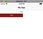
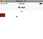
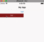
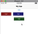
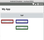

In this NativeScript tutorial, we'll create an animated material design type of ripple effect on your buttons using JavaScript and CSS, and no external iOS or Android libraries needed.

<br/>

We use buttons for the demo, but you can apply the effect on other UI elements. At the end, you'll have a nice animation that will look consistent on iOS and Android.

## TL;DR

Here's a video for you if you prefer working through the tutorial in that way:

<br/>

<div class="videoWrapper">
    <iframe width="560" height="315" src="https://www.youtube.com/embed/Pt71TCUxHVI" frameborder="0" allowfullscreen></iframe>
</div>

<br/>

## Let's Get Started!

To get started, create the demo project:

<br>

```sh
$ tns create demo-material-ripple --tsc
```

<br>

We won't need the View Model so you can delete `main-view-model.ts`. The following is the initial code for `main-page.xml`:

<br>

```xml
<Page xmlns="http://schemas.nativescript.org/tns.xsd" class="page">
    <Page.actionBar>
        <ActionBar title="My App" icon="" class="action-bar">
        </ActionBar>
    </Page.actionBar>

    <StackLayout class="p-20">
        <Button text="TAP" tap="onTap" />
        <StackLayout orientation="horizontal">
            <Button class="button" text="TAP" tap="onTap" />
        </StackLayout>
    </StackLayout>
</Page>
```

<br>

`main-page.ts`:

<br>

```typescript
export function onTap() {
  console.log('tap event');
}
```

<br>

and `app.css`:

<br>

```css
.button {
  width: 200;
  height: 30;

  margin: 0;
  padding: 0;
}
```

<br>

When you run it on iOS, you'll see an app with two buttons that log out a string when tapped. We'll style the one inside the `StackLayout`; we use the other button to provide a reference point of where we started. At first, we'll work through the tutorial while testing on iOS. As you will later see, the resulting button will look slightly different on Android, but we'll look at how to deal with this so that we have a consistent-looking button across the two platforms.

<br>

We set a width and height for the button we are styling. We want to control its dimensions because we'll use these values in calculating the dimensions of the ripple inside of it.

## Creating the Ripple

To create a ripple effect on the button, we need to add an animated circle that expands outward from the position where a tap was made. Since buttons can't have child elements in NativeScript, we need to get a little creative here. What we are going to do is to add the circle on top of the button.

<br>

Before we do that, let's make sure the button is positioned absolutely. The way we do that is to place it inside `AbsoluteLayout`. Add the classes shown to the layout as we're going to add some styles to it. Even though the button is inside the `AbsoluteLayout`, we'll think of the whole thing (the `btn-wrapper`) as the button.

<br>

```xml
<AbsoluteLayout class="btn-red btn-wrapper">
    <Button class="button" text="TAP" tap="onTap" />
</AbsoluteLayout>
```

<br>

Modify the styles as shown:

<br>

```css
.btn-wrapper {
  width: 200;
  height: 30;
}

.button {
  width: 200;
  height: 30;

  margin: 0;
  padding: 0;
  color: white;
}

.btn-red {
  background-color: rgb(143, 26, 26);
}
```

<br>

An important thing to note here is that the width and height of the button and the `AbsoluteLayout` have to be the same.

<br>

On iOS, by default, buttons have a transparent background. To give our button some color, we set the color on the wrapper layout.

<br>

Now if you run the app, you should see a red button beneath the default-looking one.

<br>



<br>

The ripple can be activated when you touch the button or when you let go. We are going to activate it when the user puts a finger down on the button. In NativeScript, you differentiate between up and down by using the touch event on the button.

<br>

Add a `touch` event handler to the button as shown:

<br>

```xml
<Button class="button" text="TAP" tap="onTap" touch="onTouch" />
```

### Adding a "Circle" to the Button

As mentioned previously, we'll get the ripple effect by adding a circle to the button that expands outward from the point of contact. Now, you may be aware that NativeScript doesn't actually have a Circle/Shape element. So we'll have to take another component and style it as a circle. We'll use a `Label` for this. I chose a Label as I found it easier to manipulate it into a circle. I also tried `ContentView`, but it wasn't behaving how I wanted it to.

<br>

In `main-page.ts`, let's handle the button's touch event:

<br>

```typescript
import { TouchGestureEventData } from 'tns-core-modules/ui/gestures';
import { View } from 'tns-core-modules/ui/core/view';
import { LayoutBase } from 'tns-core-modules/ui/layouts/layout-base';
import { Label } from 'tns-core-modules/ui/label';

export function onTap() {
  console.log('tap event');
}

export function onTouch(args: TouchGestureEventData) {
  if (args.action !== 'down') {
    return;
  }

  const x = args.getX();
  const y = args.getY();

  const btn = args.object as View;
  const wrapper = btn.parent as LayoutBase;

  const circle = new Label();

  const btnHeight = Number(btn.height);
  const btnWidth = Number(btn.width);

  const d = Math.max(btnHeight, btnWidth);

  circle.width = d;
  circle.height = d;
  circle.borderRadius = d / 2;
  circle.top = y - d / 2;
  circle.left = x - d / 2;
  circle.backgroundColor = 'white';
  circle.opacity = 1;

  wrapper.addChild(circle);
}
```

<br>

That's quite a bit of code (and math). Let's go over it line by line.

<br>

When `onTouch()` is called, it will be passed a `TouchGestureEventData` object that contains some information about the touch gesture.

<br>

First, we use this object to determine if the touch `action` is due to the user touching down on the button. If it is, we continue on and get the position of the touch with `getX()` and `getY()`. We'll need this to position our expanding circle.

<br>

Next, we use the same object to get references to the button (the View the gesture was applied on) and its parent (our wrapper `AbsoluteLayout`). `args.object` gives an `Observable` so we cast it into a `View`. You can cast it to a `Button`, but since the generic View has all the methods we require, we decided to go with this instead.

<br>

We then create a `Label` that will be our expanding circle.

<br>

Then, we get the width and height of the button. We'll need these to calculate the size of the circle. We want the circle's diameter to be the size of the largest side of the button. We get this value and assign it to a constant I reluctantly called `d`. Sorry, I ran out of good variable names.

<br>

Next, we set the circle's dimensions and add a `borderRadius` to it to turn the rectangular Label into a perfect circle. We then position it so that its center is at the position of the touch and then we give it a white color and set its opacity to `1`. We'll later change this to `0` as we want the circle to start out being invisible. Right now we'll leave it at `1` so that we can test the app to see if the circle appears on touch and if it is positioned correctly.

<br>

Finally, we add the circle as a child of the wrapper view.

<br>

If you run the application and tap on the button, you will see a partial white circle cover the button. Its center will be the point of contact.

<br>



### Animating the Circle

Now for the fun part: animation.

<br>

We have a circle that is the size of the button and we want to animate it so that it starts out small and expands outward. So we are going to start out by first shrinking the circle. You might be wondering why we didn't just start with a circle of `0` width and height. Well, if you set the circle's width and height to `0` it's not going to properly calculate the border radius.

<br>

Add the following to the code. Note that we've changed the circle's opacity to `0`.

<br>

```typescript
export function onTouch(args: TouchGestureEventData) {

    ...

    circle.opacity = 0;

    wrapper.addChild(circle);

    circle.animate({
        scale: { x: 0, y: 0 },
        opacity: 0.4,
        duration: 1
    }).then(() => {
        circle.animate({
            scale: { x: 2, y: 2 },
            opacity: 0,
            duration: 500
        }).then(() => {
            wrapper.removeChild(circle);
        });
    });
}
```

<br>

We chain animations to achieve the whole ripple effect. First, the circle is quickly scaled down to `0` and its opacity is set to `0.4`. This will happen very quickly—in one millisecond—it will be hardly noticeable.

<br>

After that animation, another is run, this time scaling the circle up to double its size and changing its opacity until it disappears. We set a duration of `500` milliseconds for this animation. The value you set for this is a matter of taste. If you look at the Material Design implementation on Android, the duration is usually set to `250`, but for this particular effect, I preferred to slow it down a bit.

<br>

Now, every time the button is tapped and a ripple is created, a label is added to the stack of views. We shouldn't just keep these hanging around, we should clean up after ourselves. This is what we are doing in the final callback with the call to `removeChild()`.

<br>

If you run the app and test it out, you should see the ripple effect:

<br>



<br>

It works wonderfully. And if you add it to multiple buttons, it still works:

<br>

```xml
<Page xmlns="http://schemas.nativescript.org/tns.xsd" class="page">

    <Page.actionBar>
        <ActionBar title="My App" icon="" class="action-bar">
        </ActionBar>
    </Page.actionBar>

    <StackLayout class="p-20">

        <Button text="TAP" tap="onTap" />

        <StackLayout orientation="horizontal">

            <AbsoluteLayout class="btn-red btn-wrapper">
                <Button class="button" text="TAP" tap="onTap" touch="onTouch" />
            </AbsoluteLayout>

            <AbsoluteLayout class="btn-blue btn-wrapper">
                <Button class="button" text="TAP" tap="onTap" touch="onTouch" />
            </AbsoluteLayout>

        </StackLayout>

        <AbsoluteLayout class="btn-green btn-wrapper">
            <Button class="button" text="TAP" tap="onTap" touch="onTouch" />
        </AbsoluteLayout>

    </StackLayout>
</Page>
```

<br>

```css
.btn-wrapper {
  width: 100;
  height: 30;
  margin: 10;
}

.button {
  width: 100;
  height: 30;

  margin: 0;
  padding: 0;
  color: white;
}

.btn-red {
  background-color: rgb(143, 26, 26);
}

.btn-blue {
  background-color: rgb(25, 25, 121);
}

.btn-green {
  background-color: rgb(38, 90, 38);
}
```

### But it Looks Weird on Android...

If you run the app on Android, you'll find that the buttons we've added don't look like their iOS counterparts.

<br>

iOS:

<br>



<br>

Android:

<br>



<br>

Before we fix this, try tapping the unstyled button at the top. Notice that by default, Android buttons already have the ripple effect, so we don't really need to add a ripple effect to them. But for the sake of this tutorial, let's just go ahead and do it anyway.

<br>

To fix the styling of the buttons so that they look similar to the iOS ones, add the following to the `.button` styling:

<br>

```css
border-width: 1;
border-color: transparent;
```

<br>

That's it! Now you should have a consistent look and ripple effect across the two platforms.

<br>

Find the [completed project](https://github.com/alexziskind1/demo-tns-btn-material-ripple) files on GitHub.

## Related Video

You might also like the following animation tutorial on creating a custom action bar in NativeScript that looks like the Twitter timeline bar:

<br>

EMBEDDED VIDEO: https://youtu.be/k6v4VQwGdnQ

<br>

For more video tutorials about NativeScript, check out our courses on [NativeScripting.com](https://nativescripting.com). For an in-depth look at styling NativeScript applications, check out our two courses on [Styling NativeScript Core Applications](https://nativescripting.com/course/styling-nativescript-core-applications) and [Styling NativeScript with Angular Applications](https://nativescripting.com/course/styling-nativescript-with-angular-applications). You might also be interested in our [NativeScript Hands-On UI course](https://nativescripting.com/course/nativescript-hands-on-ui) that covers NativeScript user interface views and components.

<br>

Let me know what you thought of this tutorial on Twitter: [@digitalix](https://twitter.com/digitalix) or leave a comment down below. You can also send me your NativeScript related questions that I can answer in video form. If I select your question to make a video answer, I'll send you swag. Use the #iScriptNative hashtag.
