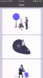

Have you ever wanted to create an animation to show that a user is tapping on something (pressed and unpressed state) - similar to how the `button:higlighted` class works but with more control over the animation and being able to apply it to any UI elements? Here is a way to create that effect using Angular directives.



Here is a <a href="https://play.nativescript.org/?template=play-ng&id=sxs0F7&v=7" target="_blank">link to a playground demo</a> of this animation.

### Why a Directive
There are multiple ways to create this effect. Here are a few reasons why I chose to use a directive for this

1. the animation code will be in its own file separate from the component, keeping your component file small  
2. the directive can be reused on any component in your app wherever you want the same animation applied
3. it can be applied to any UI element in your html
4. its only an addition on one property on your template file to add the animation :)

### Setting up the component to be animated

Let start with creating a parent `StackLayout` where we will add a few `StackLayout` which will get animated when the user taps on it. The tap events here will be wired to your actual logic in the component file (unrelated to the animation we are going to be applying to the layout).

```xml
<StackLayout>
    <StackLayout (tap)="onLayoutTap(1)">
        <Label text="Layout 1"></Label>
        <Label text="Another Text Here"></Label>
    </StackLayout>
    <StackLayout (tap)="onLayoutTap(2)">
        <Label text="Layout 2"></Label>
        <Label text="Another Text Here"></Label>
    </StackLayout>
</StackLayout>
```

### Creating the directive

The directive will contain 3 parts:
1. the touch event handler
2. press animation - when the finger is touching the element
3. release animation - when the finger is lifted off the screen

Before we start with the first step, lets first set up the directive and assign the element to a global variable so it can be accessed throughout the directive

```typescript
// touch-scale-animation.directive.ts

import { Directive, ElementRef } from '@angular/core';

@Directive({
    selector: '[appTouchScale]'
})
export class TouchScaleDirective {
    private element: ElementRef;
    
    constructor(el: ElementRef) {
        this.element = el;
    }
}
```

Now that we have the directive setup, we can add our logic to implement our custom animation. First, we need a touch event handler. We can do this by attaching a `HostListener` to the touch event as shown in the code below. Since we are only interested in the finger down and finger up events, we will add a check for those specific events and ignore everything else.

```typescript
// touch-scale-animation.directive.ts

import { HostListener } from '@angular/core';
import { TouchGestureEventData } from "tns-core-modules/ui/gestures";

 @HostListener('touch', ['$event'])
    onTouch(args: TouchGestureEventData): void {
        if (args.action === 'down') {
          // finger first touches the screen
        } else if (args.action === 'up') {
          // finger is lifted off the screen
        }
    }
```

Let's create a simple animation where the element will shrink and be a little transparent when it is being pressed and revert to its original state when the user lets go.

I added a `currentAnimation.cancel()` before running the animation and a `catch` to the actual animation code to account for the finger down and up event being fired to closely to each other where the first animation is not done when the other animation needs to start. In this case, the first animation will be cancelled before running the second animation (which will throw an error on the first animation complaining about the animation being cancelled - hence the catch block).

```typescript
// touch-scale-animation.directive.ts
import { AnimationCurve } from "tns-core-modules/ui/enums";

private currentAnimation;

private animatePressed(): void {
    if (this.currentAnimation) {
        this.currentAnimation.cancel();
    }
    this.currentAnimation = this.element.nativeElement.animate({
        scale: { x: 0.98, y: 0.98 },
        opacity: 0.8,
        curve: AnimationCurve.easeIn,
        duration: 100
    }).catch(e => {});
}

private animateReleased(): void {
    if (this.currentAnimation) {
        this.currentAnimation.cancel();
    }
    this.currentAnimation = this.element.nativeElement.animate({
        scale: { x: 1, y: 1 },
        opacity: 1,
        curve: AnimationCurve.easeIn,
        duration: 100
    }).catch(e => {});
}
```

Below is the complete code for our animation directive.

```typescript
// touch-scale-animation.directive.ts

import { Directive, ElementRef, HostListener } from '@angular/core';
import { TouchGestureEventData } from "tns-core-modules/ui/gestures";
import { AnimationCurve } from "tns-core-modules/ui/enums";

@Directive({
    selector: '[appTouchScaleAnimation]'
})
export class TouchScaleAnimationDirective {

    private element: ElementRef;
    private currentAnimation;

    constructor(el: ElementRef) {
        this.element = el;
    }

    @HostListener('touch', ['$event'])
    onTouch(args: TouchGestureEventData): void {
        if (args.action === 'down') {
            this.animatePressed();
        } else if (args.action === 'up') {
            this.animateReleased();
        }
    }

    private animatePressed(): void {
        if (this.currentAnimation) {
            this.currentAnimation.cancel();
        }
        this.currentAnimation = this.element.nativeElement.animate({
            scale: { x: 0.98, y: 0.98 },
            opacity: 0.8,
            curve: AnimationCurve.easeIn,
            duration: 100
        }).catch(e => {});
    }

    private animateReleased(): void {
        if (this.currentAnimation) {
            this.currentAnimation.cancel();
        }
        this.currentAnimation = this.element.nativeElement.animate({
            scale: { x: 1, y: 1 },
            opacity: 1,
            curve: AnimationCurve.easeIn,
            duration: 100
        }).catch(e => {});
    }

}
```

### Using the Directive in our Component

We will need to import the Directive we created and add it to the Declarations array into the module that has your component before we can use it.

```typescript
import { TouchScaleAnimationDirective } from './touch-scale-animation.directive.ts'

@NgModule({
    ...
    declarations: [
      ...
      TouchScaleAnimationDirective
    ]
})
```

From the component we created in the beginning of the tutorial, all we need to add to the html in order to add the animation is `touchScaleAnimation`!

```xml
<StackLayout>
    <StackLayout appTouchScaleAnimation (tap)="onLayoutTap(1)">
        <Label text="Layout 1"></Label>
        <Label text="Another Text Here"></Label>
    </StackLayout>
    <StackLayout appTouchScaleAnimation (tap)="onLayoutTap(2)">
        <Label text="Layout 2"></Label>
        <Label text="Another Text Here"></Label>
    </StackLayout>
</StackLayout>
```

This is a basic implementation of an animation that can be done using this technique. It can be used for more complex animations, and also be triggered using different gestures or events. 
