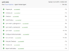

Hey Everybody! Today I’m going to show you how to do some automated unit testing with NativeScript using Azure Pipelines.


> **Notes:** This post assumes you are using Azure DevOps to host your repository, but if you are hosting on Bitbucket, GitHub, Subversion, or "Other Git" (whatever that means..) you can still use Azure Pipelines. 

> If you get lost you can always refer to the Azure Pipelines documentation found here [https://docs.microsoft.com/en-us/azure/devops/pipelines/?view=azure-devops](https://docs.microsoft.com/en-us/azure/devops/pipelines/?view=azure-devops)

## Agenda

1. Create Azure Pipelines Script
2. Pipeline Structure
3. Install Environment Dependencies
4. Install Project Dependencies
5. Install Platform Dependencies (iOS)
6. Set Up Simulator
7. Run Unit Tests
8. Final Review


## Create Azure Pipeline Script

There are 2 ways you can create your azure pipelines script file:

1. You can create an `azure-pipelines.yml` file in the root of your repository and Azure will recognize it next time you push that file up.

2. You can create the pipeline through the browser. If you navigate to your repository in Azure DevOps. Then tap on the Pipelines option on the left and hit New > New build pipeline. Follow the prompt and select your


Now we need to configure our pipeline. If you created your own `azure-pipeline.yml` file then it is probably empty now which is fine.


## Pipeline Structure

Azure Pipelines are just a script for the server.

They can contain a ton of options but we will look at the simplest way to set up unit testing:

1. We need to set up a schedule or trigger for the pipeline to run
2. We need to create a job
3. We need to create a task list for the job

### 1. Schedule

We need to talk about when we want our pipeline to run. I'll give a few options here:

1. CI Trigger  - On commit
2. PR Trigger - On pull request
3. Scheduled - Timed using cron
4. Pipeline Trigger - On success of another pipeline

At the top of your pipeline you need to specify a schedule:

We will set up a CI trigger for this post.

Here is the syntax for triggers:
```
trigger:
- master
- uat
```
Here we are specifying which branches we want to trigger the pipeline from.

### *Bonus*

If you wanted to see a scheduled trigger, here is how to do that also:

```
schedules:
	- cron: "0 5 * * *"
	  displayName: UAT Nightly UI Tests (nightly at midnight)
	  branches:
		include:
		  - uat
		  - dev
		exclude:
		  - master
	- cron: "0 17 * * 0"
	  displayName: Production Weekly UI Tests (Sunday at noon)
	  branches:
		include:
	    - prod
		exclude:
		- dev
		- master
		- uat
```

### 2. Jobs

Jobs are just a set of commands for the server to execute.

Here is the syntax for jobs:

```
jobs:

- job: unit_tests
	pool:
		vmImage: 'macOS-10.13'
	steps:
```

### 3. Tasks

Jobs are made up of a set of tasks or scripts.

Here is the syntax for tasks:

```
jobs:

- job: unit_tests
  pool:
	vmImage: 'macOS-10.13'
  steps:

- task: NodeTool@0
  inputs:
	versionSpec: '10.x'
  displayName: 'Install Node.js'
```

Here is the syntax for scripts:

```
jobs:

- job: unit_tests
  pool:
	vmImage: 'macOS-10.13'
  steps:

- script: |
	npm install -g @angular/cli
  displayName: 'Install Angular'
```

Now that we have all that out of the way, you can probably see where this is going now.

 Let's make sure we're on the same page.

Here is my `azure-pipelines.yml` file at this point:

```
trigger:
- master
- uat

jobs:

- job: unit_tests
  pool:
	vmImage: 'macOS-10.13'
  steps:

- task: NodeTool@0
  inputs:
	versionSpec: '10.x'
  displayName: 'Install Node.js
```

If you auto generated your `azure-pipelines.yml` file from the web then it should look similar.

## Install Environment Dependencies

NativeScript apps have a few dependencies to run:

1. Node
2. Angular
3. NativeScript

Let's add some scripts for those commands to your jobs.

All you have to do is add these commands to the bottom of your `azure-pipelines.yml` file.

> **Note:** YML is **VERY** picky about layout. These tasks/scripts must be inline with the previous task/script.

#### *Node* - We already have this added

#### *Angular*
```
- script: |
	npm install -g @angular/cli
  displayName: 'npm install -g @angular/cli'
```

#### *NativeScript*
```
- script: |
	npm install -g nativescript
  displayName: 'npm install -g nativescript'
```

## Install Project Dependencies

Now we need to navigate to our project and install our project dependencies using `npm install`

Here is how we do that:

```
- task: CmdLine@2
  inputs:
	script: |
	  npm install
	workingDirectory: 'TestProject'
  displayName: 'npm install'
```
Where `TestProject` is the root directory for your project.

Notice we set `workingDirectory`. This will ensure that the VM is in the correct directory when we try to execute that script.


## Install Platform Dependencies (iOS)

If you want to run unit tests for iOS then you will need to include your provisioning profile and certificate in order to build.

Here are what those tasks look like:

```
 - task: InstallAppleCertificate@2
	 inputs:
	   certSecureFile: 'dev_certificate.p12'
	   certPwd: 'azure'
	   keychain: 'temp'
 - task: InstallAppleProvisioningProfile@1
	 inputs:
	   provisioningProfileLocation: 'secureFiles'
	   provProfileSecureFile: 'dev.mobileprovision'
```

> **Note:** You can use SecureFiles in Azure Pipelines Library to store your certificate and provisioning profile and have the pipeline pull them from there instead of storing them in your repository.

## Set Up Simulator

### iOS

If you want to run tests on iOS then you don't have to do anything in this step.

Since we selected `MacOS-10.13` as the `vmImage` in the job, the VM will have XCode installed which means it already has some iOS simulators installed.

### Android

For Android you have to set up an emulator.

Here is how I am doing it:

```
- task: CmdLine@2
  inputs:
	script: |
	  echo "y" | $ANDROID_HOME/tools/bin/sdkmanager --install 'system-images;android-27;google_apis;x86'
	  echo "no" | $ANDROID_HOME/tools/bin/avdmanager create avd -n xamarin_android_emulator -k 'system-images;android-27;google_apis;x86' --force
	  $ANDROID_HOME/emulator/emulator -list-avds
	  echo "adb devices list"
	  $ANDROID_HOME/platform-tools/adb devices
	workingDirectory: 'TestProject'
  displayName: 'Configure Android emulator'
```

Notice again we set `workingDirectory` to the root of our project.

## Run Unit Tests

Now we just have to run the unit tests!

Here we go:

```
- task: CmdLine@2
  inputs:
	script: |
	  tns test android --justlaunch
	workingDirectory: 'TestProject'
  displayName: 'Run unit tests'
```
Notice again we set `workingDirectory` to the root of our project.

## Final Review

I have my tests running on Android so here is my final `azure-pipelines.yml` file from this post:

```
trigger:
- master
- dev

jobs:

- job: unit_tests
  pool:
	vmImage: 'macOS-10.13'
  steps:

- task: NodeTool@0
  inputs:
	versionSpec: '10.x'
  displayName: 'Install Node.js

- script: |
	npm install -g @angular/cli
  displayName: 'npm install -g @angular/cli'

- script: |
	npm install -g nativescript
  displayName: 'npm install -g nativescript'
  
- task: CmdLine@2
  inputs:
	script: |
	  npm install
	workingDirectory: 'TestProject'
  displayName: 'npm install'

- task: CmdLine@2
  inputs:
	script: |
	  echo "y" | $ANDROID_HOME/tools/bin/sdkmanager --install 'system-images;android-27;google_apis;x86'
	  echo "no" | $ANDROID_HOME/tools/bin/avdmanager create avd -n xamarin_android_emulator -k 'system-images;android-27;google_apis;x86' --force
	  $ANDROID_HOME/emulator/emulator -list-avds
	  echo "adb devices list"
	  $ANDROID_HOME/platform-tools/adb devices
	workingDirectory: 'TestProject'
  displayName: 'Configure Android emulator'

- task: CmdLine@2
  inputs:
	script: |
	  tns test android --justlaunch
	workingDirectory: 'TestProject'
  displayName: 'Run unit tests'
```

Here is what the output of the pipeline looks like after it runs:




I hope this helps you implement automated testing in your NativeScript apps.

If you have any questions feel free to reach out on Twitter or in the NativeScript slack!