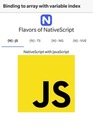

Let's say you are in a situation where you want to show the user the corresponding
image when the user selects a particular SegmentedBar option in NativeScript Core.
We'll use the `<Image>` widget to display the image, and `<SegementedBar>` to
display the options.

<br/>

The intuitive approach here would be to bind the `src` property of the `Image` to `{{ images[index] }}`. However, this doesn't quite work as you'd expect, and I'll show you a workaround.

## Initial Setup

First, a little bit of setup. Here are the files involved in this NativeScript Core app.

### home-page.xml

```xml
      <Page loaded="pageLoaded" unloaded="pageUnLoaded" class="page" xmlns="http://www.nativescript.org/tns.xsd">
        <ActionBar title="Binding to array with variable index" class="action-bar">
        </ActionBar>
        <FlexboxLayout flexDirection="column" class="p-10">
          <Image width="50" src="https://play.nativescript.org/dist/assets/img/NativeScript_logo.png" />
          <Label class="h2 text-center" text="Flavors of NativeScript" />
          <SegmentedBar id="segmentedBar">
            <SegmentedBar.items>
              <SegmentedBarItem title="{N} - JS" />
              <SegmentedBarItem title="{N} - TS" />
              <SegmentedBarItem title="{N} - NG" />
              <SegmentedBarItem title="{N} - Vue" />
            </SegmentedBar.items>
          </SegmentedBar>
          <!--  Bind the label to `index`th element in the `text` array -->
          <Label class="h3 m-10 text-center" text="" />
          <!--  Bind the src to `index`th element in the `images` array -->
          <Image width="250" src="" />
        </FlexboxLayout>
      </Page>
```

<br/>

### home-page.js

```js
const HomeViewModel = require('./home-view-model');
const homeViewModel = new HomeViewModel();

exports.pageLoaded = args => {
  const page = args.object;
  page.bindingContext = homeViewModel;

  const segmentedBar = page.getViewById('segmentedBar');
  segmentedBar.on('selectedIndexChange', homeViewModel.onIndexChange);
};

exports.pageUnloaded = args => {
  const page = args.object;
  const segmentedBar = page.getViewById('segmentedBar');
  segmentedBar.off('selectedIndexChange');
};
```

<br/>

### home-view-model.js

```js
const observableModule = require('data/observable');

function HomeViewModel() {
  const viewModel = observableModule.fromObject({
    index: 0,
    images: [
      'https://shiv19.com/assets/img/logos/js.png',
      'https://shiv19.com/assets/img/logos/ts.png',
      'https://shiv19.com/assets/img/logos/ng.png',
      'https://shiv19.com/assets/img/logos/vue.png'
    ],
    text: [
      'NativeScript with JavaScript',
      'NativeScript with TypeScript',
      'NativeScript with Angular',
      'NativeScript with Vue'
    ],
    onIndexChange(args) {
      viewModel.set('index', args.object.selectedIndex);
    }
  });

  return viewModel;
}

module.exports = HomeViewModel;
```

<br/>

> **Note:** At the time of writing this article it is not possible to bind to `selectedIndexChange` event from the XML file in NativeScript Core, so we're binding it programmatically in `home-page.js`.

<br/>

## The Challenge

Before you proceed reading this further, I have a challenge for you. You can try to do this yourself using this playground I've set up. Here is the link to starter code: [https://play.nativescript.org/?template=play-js&id=tZVTxB](https://play.nativescript.org/?template=play-js&id=tZVTxB)

<br/>
Did you manage to do it? If yes, well done! If no, read on for the solution!

<br/>

## The Solution

As I've mentioned, the intuitive approach here would be to bind the `text` property of the label to `{{ text[index] }}` and bind the `src` property of the image to `{{ src[index] }}`.

<br/>

However, using multiple variables in an expression like that is **not supported in NativeScript**. So the way we can achieve binding is by specifying the different variables that we will be using, **before** using them in an expression.

<br/>
So the correct way to bind it is,

- `text="{{ text index, text[index] }}"` for the label and
- `src="{{ images index, images[index] }}"` for the image.

> **Note:** The order in which you specify the variables does not matter

Here is the link to the completed code: [https://play.nativescript.org/?template=play-js&id=LG7lHa](https://play.nativescript.org/?template=play-js&id=LG7lHa)

<br/>

## The Result



<br/>

Let me know if you enjoyed this tip on Twitter [@MultiShiv19](https://twitter.com/MultiShiv19),
and what else you'd like to see in these tutorials.
