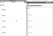
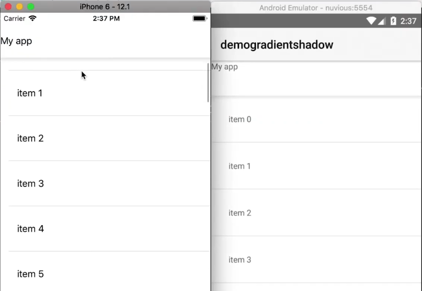
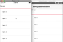
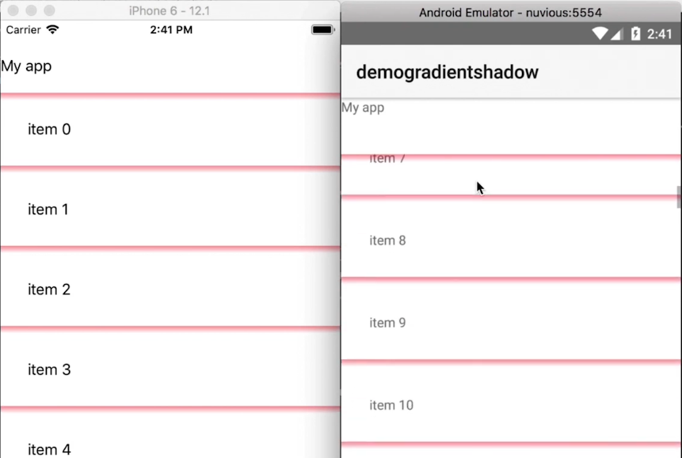

In this tutorial, I'll show you how to get those clean line shadows that you can fully control in intensity, size, and color, just by using CSS. And they will look pretty much the same on iOS and Android.

## TL;DR

If you prefer going through a video tutorial, here's one for you:

<br><br>


<div class="videoWrapper">
    <iframe width="560" height="315" src="https://www.youtube.com/embed/mor88GTm5BE" frameborder="0" allowfullscreen></iframe>
</div>

<br><br>

## Let's Jump Right In

People have been asking for a cross-platform implementation of a shadow in NativeScript that looks the same on iOS and Android. Version 5.4 of NativeScript introduced elevation support in Android but missed out on iOS (which is coming soon).

<br>

In this article, we are going to create a similar shadow line that is cross-platform, and we are going to do it using only CSS, no third-party libraries or Native calls.

<br>

Before we get started, let's look at the initial code of our NativeScript Core app:

<br>

```xml
<!-- main-page.xml -->

<Page xmlns="http://schemas.nativescript.org/tns.xsd" navigatingTo="navigatingTo" class="page">

</Page>
```

<br>

```typescript
// main-view-model.ts

import { Observable } from "tns-core-modules/data/observable";

export class HelloWorldModel extends Observable {

    public items: string[] = [];

    constructor() {
        super();

        for (var i = 0; i < 100; i++) {
            this.items.push('item ' + i);
        }
    }
}
```

<br>

The main page is empty and in our model class, we create an array of strings which we'll later use to populate a ListView.

<br>

If you run the app on iOS and Android, you will see that by default, the Android app has an ActionBar with a shadow underneath, while the iOS app is just blank. That's the shadow we'll be emulating.

<br>


<br>

Now let's add a GridLayout to the main page. It will contain two rows—one will act as the ActionBar, while the second will hold a ListView.

<br>

```xml
<!-- main-page.xml -->

<Page xmlns="http://schemas.nativescript.org/tns.xsd" navigatingTo="navigatingTo" class="page">

    <GridLayout rows="60 *">

        <Label text="My app" />

        <ListView items="{{ items }}" row="1">
            <ListView.itemTemplate>
                <Label text="{{ $value }}" class="list-item" />
            </ListView.itemTemplate>
        </ListView>

    </GridLayout>


</Page>
```

<br>

Add the following styles to the app to add some padding to the list view items:

<br>

```css
// app.css

.list-item {
    padding: 30;
}
```

<br>

If you run the app, you should see a list view below an app/navigation bar with the label **My app**. Right now there's no visible barrier between the listview and the app bar. We'll add that next.

<br>



<br>

We add a Label below the ListView:

<br>

```xml
<!-- main-page.xml -->

<Page xmlns="http://schemas.nativescript.org/tns.xsd" navigatingTo="navigatingTo" class="page">

    <GridLayout rows="60 *">

        <Label text="My app" />

        <ListView items="{{ items }}" row="1">
            <ListView.itemTemplate>
                <Label text="{{ $value }}" class="list-item" />
            </ListView.itemTemplate>
        </ListView>
        
        <Label class="shadow-down" row="1" verticalAlignment="top" />

    </GridLayout>


</Page>
```

<br>

The Label will be our shadow line. It should overlap the ListView so we align it to the top of its parent.

<br>

Next, let's add some styling to the shadow line:

<br>

```css
// app.css

.list-item {
    padding: 30;
}

.shadow-down {
    height: 8;
    background: linear-gradient(to bottom, rgba(0,0,0, .1), rgba(0,0,0, 0))
}
```

<br>

If you run the app, you should now see the shadow beneath the app bar. When you scroll through the items in the ListView, they slide underneath the app bar.

<br>



<br>

You can customize the appearance of the shadow. For instance, in the following, we change its color to red and increase its opacity.

<br>

```css
.shadow-down {
    height: 8;
    background: linear-gradient(to bottom, rgba(255,0,0, .4), rgba(255,0,0, 0))
}
```

<br>

You can see the effect below:

<br>



<br>

You can continue playing around with the shadow and add one for each of your list view items:

<br>

```xml
<Page xmlns="http://schemas.nativescript.org/tns.xsd" navigatingTo="navigatingTo" class="page">

    <GridLayout rows="60 *">

        <Label text="My app" />

        <ListView items="{{ items }}" row="1" separatorColor="transparent">
            <ListView.itemTemplate>
                <StackLayout>
                    <Label text="{{ $value }}" class="list-item" />
                    <Label class="shadow-down" row="1" verticalAlignment="top" />
                </StackLayout>
            </ListView.itemTemplate>
        </ListView>

        <Label class="shadow-down" row="1" verticalAlignment="top" />

    </GridLayout>


</Page>
```

<br>

We add the Label that makes the shadow line to each list item. Notice that we set `separatorColor="transparent"` to remove the default grey separator between list items.

<br>

If you run the app you should see the red shadow line on every list item.

<br>



<br>

That's it, folks! Hopefully, you found this useful. If you have any questions or comments about the tutorial, leave them in the comments below, or get in touch with me on Twitter [@digitalix](https://twitter.com/digitalix?lang=en). You can also send me your NativeScript related questions that I can answer in video form. If I select your question to make a video answer, I'll send you swag. Use the #iScriptNative hashtag.

<br>

For more video tutorials about NativeScript, check out our courses on [NativeScripting.com](https://nativescripting.com). We have courses that cover all flavors of NativeScript (Core, Angular and Vue) and that cater to different levels of experience, whether you are just beginning your journey in the NativeScript world or you have some experience with NativeScript and are looking to level up.
