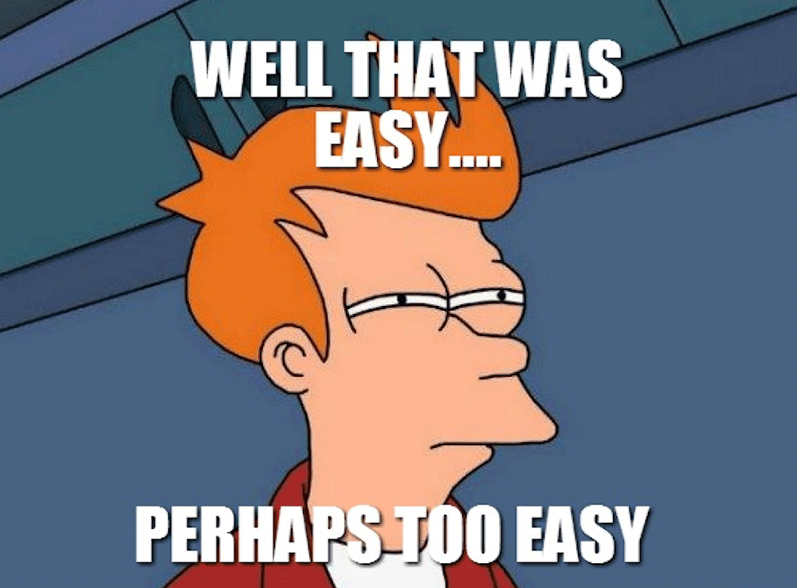
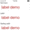

There are a few basic UI modules that come with NativeScript. Some of them, like the Label, offer a few simple features like styling and text wrapping, while the native iOS label allows you to do much more. Did you know that you could extend the NativeScript modules to take advantage of other features that native elements offer? In this post, I will show you how to bend the label to your will by appending native functionality to it that doesn't come with NativeScript. 

#### Versions used in this post 

* NativeScript: 1.0.1

NativeScript already comes with a label that works for most needs. But let's say you wanted a label that automatically adjusts the font size so it can fit the text without wrapping or showing the ellipsis. What do you do? Well, it just so happens that the iOS UILabel has a property called `adjustsFontSizeToFitWidth`. I know, they just have long names for everything, but it's pretty descriptive.

> I will show you how to bend the label to your will by appending native functionality to it

> **Note:** You could create a module that does this like [TJ VanToll demonstrates in his post on the subject](http://developer.telerik.com/featured/building-your-own-nativescript-modules-for-npm/), but for the purpose of this demo, I will just create a file in my project. 

Let's jump right in. If you want to get the demo code and run it yourself, [you can get it here](https://github.com/alexziskind1/nativescript-scalinglabel-demo). 

1. Create a new NativeScript project, or use an existing one. This is how you can create a new project

```
tns create scalinglabeldemo
```

2. Add a new file in the _app_ directory called _scalinglabel.ios.js_. This file has _ios_ in it's filename because it's a convention that NativeScript uses. This file will be ignored on android platforms. You could call this file just _scalinglabel.js_ and it will work fine on iOS devides, but it will blow up on android because the code accesses native iOS properties.

3. The contents of the file should be as follows

```
var label = require( "ui/label/label" );
function ScalingLabel() {
    this.mylabel = UILabel.alloc().init();
    this.ios.adjustsFontSizeToFitWidth = true;
    this.ios.addSubview( this.mylabel );
}
ScalingLabel.prototype = new label.Label();
exports.ScalingLabel = ScalingLabel;
```



> Eh, not done yet
> -Me 

4. You need to use this new label called `ScalingLabel` in your UI xml. The first step is to add the namespace to the page. Without this, NativeScript will look in the _tns_modules_ directory, but your `ScalingLabel` isn't there.

```
<page xmlns="http://www.nativescript.org/tns.xsd" xmlns:scalinglabel="scalinglabel" loaded="pageLoaded">
...
</page>
```

5. Then place the actual `ScalingLabel` on the page.

```
<scalinglabel:scalinglabel text="{{ message }}">
</scalinglabel:scalinglabel>
```

6. When the message property gets long enough, the label won't wrap or show an ellipsis. Instead the font size will adjust to fit the width of the container.

Cool, huh? 

Here is what the [downloadable demo](https://github.com/alexziskind1/nativescript-scalinglabel-demo) looks like when you run it.



## Summary

Not only can you make your own custom elements in NativeScript, you can augment the UI elements that come out of the box as well. The example here shows how to do this with a simple label, but you can do this with all the elements that wrap native elements..
