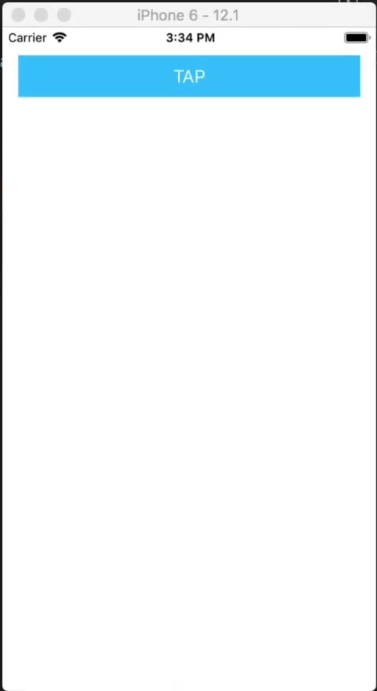
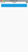

Besides all the different events that you can listen for in NativeScript views, did you know that you can also create custom events? That's what we'll be doing in this tutorial!

## TL;DR

Here's a video for you if you prefer a more visual tutorial:

<br/><br/>

<div class="videoWrapper">
    <iframe width="560" height="315" src="https://www.youtube.com/embed/VA3UaBwS7HE" frameborder="0" allowfullscreen></iframe>
</div>

<br><br>

## Introduction

Custom events are just as important in NativeScript apps as they are in web apps (or really in any app). In this NativeScript tutorial, we'll cover the basics of setting up custom events as we get ready to implement an animated bottom sheet in the next post. This tutorial continues where the multiple frames tutorial left off. If you haven't read that, [be sure to check it out](https://nativescripting.com/posts/multiple-frames-in-nativescript).

## Let's Dive Right In...

To start off, we have a simple app that displays a button.

<br>

```xml
<!-- main-page.xml -->

<Page xmlns="http://schemas.nativescript.org/tns.xsd" navigatingTo="navigatingTo">

  <StackLayout>
      <Button text="TAP" tap="onTap" class="btn btn-primary btn-active"/>
  </StackLayout>

</Page>

```

<br>



<br>

The button does nothing at the moment. We haven't implemented its `onTap` event handler:

<br>

```typescript
// main-page.ts

import { EventData } from "tns-core-modules/data/observable";
import { Page } from "tns-core-modules/ui/page";

export function navigatingTo(args: EventData) {
  const page = <Page>args.object;
}
```

<br>

So let's do something when the button is tapped:

<br>

```typescript
// main-page.ts

import { EventData } from "tns-core-modules/data/observable";
import { Page } from "tns-core-modules/ui/page";

let page: Page = null;

export function navigatingTo(args: EventData) {
  page = <Page>args.object;
}

export function onTap(args: EventData) {
  page.animate({
    duration: 3000,
    scale: { x: .5, y: .5 }
  });
}
```

<br>

In the above code, we first declare an instance of Page and set it to `null`. When the page is navigated to, we store the current Page in the `page` object. Then, when the button on the page is tapped, the page is animated to scale down to half its size in 3 seconds.

<br>

Let's see that in action:

<br>



<br>

The above works because we have a reference to the Page and we are on that same page in the page's code file. However, there are a couple of caveats to consider. First, when you create a page like this, it stays in memory even if you navigate to another page. The `page` variable that we declared will have a reference to that Page even if we navigate to another page. So that'll continue taking up memory unless we clear it out specifically (for example, in the page's `unloaded` event). The second caveat is that, if we had two custom components and we wanted to send messages from one component to another, then we would need to have references to all of them in our code file or the other option would be to have a reference to the page and then drill down into it to find those components, which would be a pain—everything would be tied together and it'll be hard to decouple things.

<br>

So let's make the code a bit modular and decouple things a little bit. The technique we are about to go through is also the technique you would use if you were using multiple frames in your app and needed the frames to communicate with each other.

<br>

```typescript
// main-page.ts

import { EventData } from "tns-core-modules/data/observable";
import { Page } from "tns-core-modules/ui/page";
import { Button } from "tns-core-modules/ui/button";

export function navigatingTo(args: EventData) {
  const page = <Page>args.object;
  
  page.on('pageShrink', (arg:EventData) => {
    page.animate({
      duration: 3000,
      scale: { x: .5, y: .5 }
    });
  });
}

export function onTap(args: EventData) {
  const btn = args.object as Button;
  const evtData: EventData = {
    eventName: 'pageShrink',
    object: btn
  };
  btn.page.notify(evtData);
}
```

<br>

In the above code, we instantiate the `page` object when the page is navigated to. Page is a View, which means it is an [observable](https://docs.nativescript.org/ns-framework-modules/observable) so we can add a listener to it with the `on()` method. We register a custom event named `pageShrink`. When the event is raised, we'll perform a similar animation to what we had before.

<br>

When the button on the page is tapped, we trigger the `pageShrink` custom event that we had registered by calling the `notify()` method. This method takes any implementer of the `EventData` interface as event data. It includes basic information about an event—its name as `eventName` and an instance of the event sender as `object`. The minimum information needed to raise an event is the `eventName`—it will be used to execute all event handlers associated with this event.

<br>

When you run the app and tap the button, you will get the same animation we saw earlier, but this time, that functionality is completely decoupled.

## Using Custom Events Defined in a Different Frame

The example we looked at is a bit trivial since we are triggering events on the same page. Let's now look at a more complex example where we'll be dealing with multiple frames.

<br>

We'll define an event in our root Frame and trigger it in the main page.

<br>

First, let's take a look at the markup for the root frame:

<br>

```xml
<!-- app-root.xml -->

<Frame defaultPage="main-page" loaded=onMainFrameLoaded">
</Frame>
```

<br>

In its code file, we implement `onMainFrameLoaded()`:

<br>

```typescript
// app-root.ts

import { EventData, Frame } from "tns-core-modules/ui/frame";

export function onMainFrameLoaded(args: EventData) {
  const frame = args.object as Frame;
  
  frame.on('frameMove', (arg: EventData) => {
    frame.animate({
      duration: 3000,
      translate: { x: 0, y: 300 }
    });
  });
}
```

<br>

Here, we register a custom event that will animate the Frame when it gets raised.

<br>

Below, we change the `onTap` method in `main-page.ts` so that it triggers this event when the button is tapped.

<br>

```typescript
// main-page.ts

import { EventData } from "tns-core-modules/data/observable";
import { Page } from "tns-core-modules/ui/page";
import { Button } from "tns-core-modules/ui/button";

export function onTap(args: EventData) {
  const btn = args.object as Button;
  const evtData: EventData = {
    eventName: 'frameMove',
    object: btn
  };
  btn.page.frame.notify(evtData);
}
```

<br>

Instead of notifying the page of the event, we notify its frame.

<br>

If you run the app and tap the button, you will see that the frame moves downwards.

<br>

[Page translate animation](page_translate_animation.gif)

<br>

There is another way we can do that without referring to the page:

<br>

```typescript
// main-page.ts

import { EventData } from "tns-core-modules/data/observable";
import { Page } from "tns-core-modules/ui/page";
import { Button } from "tns-core-modules/ui/button";
import * as frameModule from "tns-core-modules/ui/frame";

export function onTap(args: EventData) {
  const btn = args.object as Button;
  const evtData: EventData = {
    eventName: 'frameMove',
    object: btn
  };
  frameModule.topmost().notify(evtData);
}
```

<br>

In the above, we use the `topmost()` method from the `tns-core-modules/ui/frame` module to get the topmost frame in the frames stack and then call `notify()` on it.

<br>

If you run the application, you will get the same animation of the frame moving downward.

<br>

When dealing with multiple frames, you might want to consider storing all your custom events on the topmost frame so that you not only have a central place to store them but also so that you don't get confused about what frame you are dealing with. You can then get a reference to that frame with the `topmost()` method from the frame module.

<br>

That brings us to the end of the tutorial. Be sure to check out the next article where we'll use what we've learned in this and the previous article to create an animated bottom sheet.

<br>

Let me know what you thought of this tutorial on Twitter: [@digitalix](https://twitter.com/digitalix) or leave a comment down below. You can also send me your NativeScript related questions that I can answer in video form. If I select your question to make a video answer, I'll send you swag. Use the #iScriptNative hashtag.

For more tutorials on NativeScript, check out our courses on [NativeScripting.com](https://nativescripting.com). We have a [NativeScript Hands-On UI course](https://nativescripting.com/course/nativescript-hands-on-ui) that covers NativeScript user interface, views and components. You might also be interested in the following two courses on styling NativeScript applications: [Styling NativeScript Core Applications](https://nativescripting.com/course/styling-nativescript-core-applications) and [Styling NativeScript with Angular Applications](https://nativescripting.com/course/styling-nativescript-with-angular-applications).
