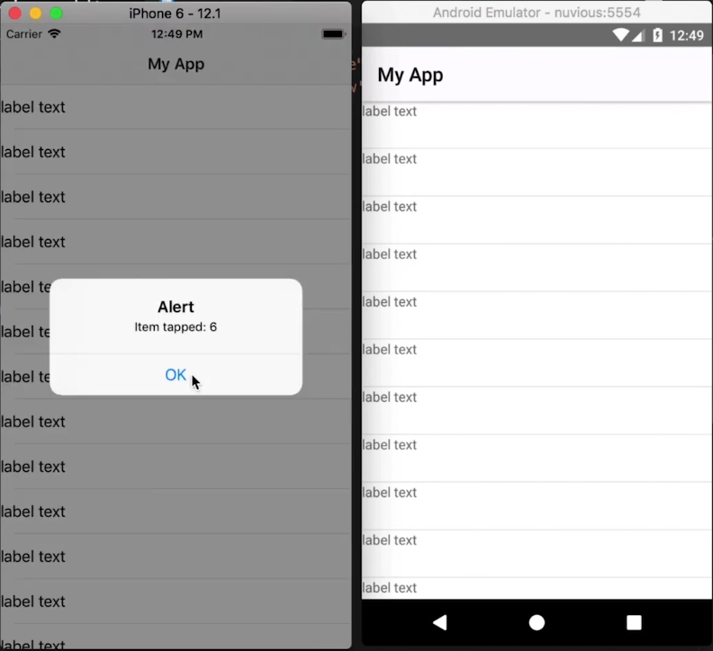
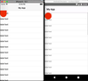
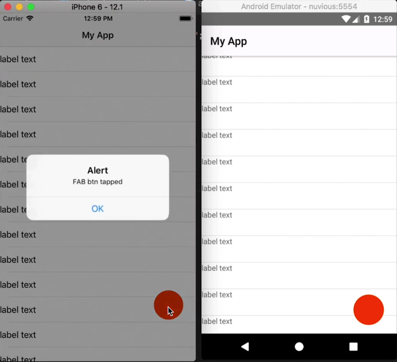
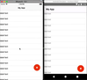

In this tutorial, we'll be creating a Floating Action Button (FAB) in a NativeScript Core application using just CSS and no third-party libraries.

## TL;DR

Check out the video below if you prefer a more visual way of learning.


<br/><br/>

<div class="videoWrapper">
    <iframe width="560" height="315" src="https://www.youtube.com/embed/4rXdmRhkhkI" frameborder="0" allowfullscreen></iframe>
</div>

<br><br>


## Introduction
About two years ago, I posted a series of videos on [YouTube](https://www.youtube.com/channel/UCajiMK_CY9icRhLepS8_3ug/videos) showcasing how you could create a Floating Action Button in NativeScript without using third-party libraries. We just used CSS and the widgets that come with NativeScript. The old method I used still works, but I thought I'd improve and update it. We'll still be using just CSS, but this time it's MUCH simpler. The old tutorials were done with NativeScript Angular, but this one is more general, using NativeScript Core.

## Let's Jump Right In...
To start off, we have an app with a single page containing a ListView populated with some items. When a list view item is tapped, an alert is displayed showing the index of the item. You can see the app running on iOS and Android below.

<br>



<br>

Below is the starting code:

<br>

```xml
<!-- main-page.xml -->

<Page xmlns="http://schemas.nativescript.org/tns.xsd" navigatingTo="navigatingTo" class="page">
  <Page.actionBar>
    <ActionBar title="My App" icon="" class="action-bar">
    </ActionBar>
  </Page.actionBar>
  
  <ListView items="{{items}}" itemTap="{{onItemTap}}">
    <ListView.itemTemplate>
      <Label text="label text"></Label>
    </ListView.itemTemplate>
  </ListView>
</Page>
```

<br>

```typescript
// main-page.ts

import { EventData } from "tns-core-modules/data/observable";
import { Page } from "tns-core-modules/ui/page";
import { HelloWorldModel } from "./main-view-model";

export function navigatingTo(args: EventData) {
  const page = <Page>args.object;
  page.bindingContext = new HelloWorldModel();
}
```

<br>

```typescript
// main-view-model.ts

import { Observable } from "tns-core-modules/data/observable";
import { ItemEventData } from "tns-core-modules/ui/list-view";

export class HelloWorldModel extends Observable {
  public items = [];
  
  constructor() {
    super();
    
    for (let i = 1; i < 30; i++) {
      this.items.push(i);
    }
  }
  
  public onItemTap(args: ItemEventData) {
    alert('Item tapped: ' + args.index);
  }
}
```

<br>

```css
// app.css

@import '~nativescript-theme-core/css/core.light.css';

ListView Label {
  height: 48;
  min-height: 48;
}
```

## Adding a FAB

To add a FAB to the layout, modify `main-page.xml` as shown.

<br>

```xml
<!-- main-page.xml -->

<Page xmlns="http://schemas.nativescript.org/tns.xsd" navigatingTo="navigatingTo" class="page">
  <Page.actionBar>
    <ActionBar title="My App" icon="" class="action-bar">
    </ActionBar>
  </Page.actionBar>
  
  <AbsoluteLayout>
    <ListView items="{{items}}" itemTap="{{onItemTap}}">
      <ListView.itemTemplate>
        <Label text="label text"></Label>
      </ListView.itemTemplate>
    </ListView>
    
    <GridLayout id="btnFab" tap=onButtonTap">
      
    </GridLayout>
  </AbsoluteLayout>
</Page>
```

<br>

In the above code, we added a GridLayout to the page. This will be our FAB. We placed the FAB and the ListView inside an AbsoluteLayout because we want the FAB to overlay (be on top of) the ListView. We add a `tap` event handler to the FAB. Implement it in `main-page.ts` as shown below:

<br>

```typescript
// main-page.ts

...

export function onButtonTap(args: EventData) {
  alert('FAB btn tapped');
}
```

<br>

If you run the app now, the ListView won't be visible. This is because when it's inside an AbsoluteLayout, it doesn't know how big it should be, so you have to manually set its size. Below, we specify a `width` and `height` of `100%` for the ListView.

<br>

```css
// app.css

@import '~nativescript-theme-core/css/core.light.css';

ListView {
  width: 100%;
  height: 100%;
}

ListView Label {
  height: 48;
  min-height: 48;
}

#btnFab {
  width: 56;
  height: 56;
  background-color: orangered;
  border-radius: 28;
}
```

<br>

We also style our FAB (`#btnFab`) in the above code. Run the app and you should see it:

<br>



<br>

On Android, the FAB is circular, as it should be, but on iOS, it looks like a stretched-out semicircle. This is because the FAB (which is a GridLayout) is touching the edge of the page. On iOS, there are [safe areas](https://developer.apple.com/documentation/uikit/uiview/positioning_content_relative_to_the_safe_area#2936293), and when a layout touches a safe area, it automatically gets stretched. We don't have to worry too much about this because we'll eventually move the FAB to the lower right of the screen, so it won't be touching any safe areas.

<br>

To position the FAB in a responsive-way, we can't use exact dimensions otherwise it won't be positioned properly on all screen sizes. To cater for all screen sizes, we first have to get the size of the display it is running on, and then position the FAB with respect to that. We do this below:

<br>

```typescript
// main-page.ts

import { EventData } from "tns-core-modules/data/observable";
import { Page, View } from "tns-core-modules/ui/page";
import { HelloWorldModel } from "./main-view-model";
import { screen } from "tns-core-modules/platform";

export function navigatingTo(args: EventData) {
  const page = <Page>args.object;
  page.bindingContext = new HelloWorldModel();
  
  const btnFab = page.getViewById('btnFab') as View;
  
  btnFab.top = screen.mainScreen.heightDIPs - 200;
  btnFab.left - screen.mainScreen.widthDIPs - 80;
}

export function onButtonTap(args: EventData) {
  alert('FAB btn tapped');
}
```

<br>

We grab the `screen` object from the Platform module. This object holds some information about the display. From it, we use `mainScreen` (which contains information about the main screen of the current device) to get the width and height of the screen. We then use these to calculate the position of the FAB, which will be in the lower right corner of the screen:

<br>



<br>

If you tap the FAB, it works as expected (it alerts the message `FAB btn tapped`).

<br>

Something you should keep in mind: if the FAB didn't have a tap event handler (`<GridLayout id="btnFab">`) and we tapped it on iOS, nothing would happen, but on Android, the tap event handler would fall through to what's under the FAB, which would be a list view item. So on tapping the button (with no tap event handler) on Android, the list view item's tap event will be executed and you'll get an alert displaying the item's index.

<br>

Now that we have our FAB working and positioned correctly, we should add an icon to it to indicate what it's for. You can add an image or create a shape inside it using views that are available in NativeScript. We'll do the latter. We'll create a `+` shape inside the FAB. We'll cover two ways in which you can create a shape inside the button. If you want to learn more about creating shape views in NativeScript, check out [this video on YouTube](https://www.youtube.com/watch?v=pW9X-ygrvEY).

### Method 1 for Creating the FAB Icon Shape

In the first method, we add a GridLayout inside the FAB and add two Labels inside it. The two Labels will be the two crossing lines of the plus `+` icon.

<br>

```xml
<!-- main-page.xml -->

...

<GridLayout id="btnFab" tap=onButtonTap">
  <GridLayout>
    <Label class="fab-dash--1" />
    <Label class="fab-dash--2" />
  </GridLayout>
</GridLayout>
```

<br>

```css
// app.css

...

.fab-dash--1,
.fab-dash--2 {
  background-color: #fff;
  transform: translate(0, -2);
  height: 16;
  width: 3;
}

.fab-dash--1 {
  transform: rotate(90deg) translate(0, -2);
}
```

<br>

In the CSS file, we give the Labels a white color and rotate one of them to a 90-degree angle and position it so that it crosses the other. Run the app and you should see the `+` icon inside the FAB.

<br>


<br>

If you take a closer look, you'll notice that the plus icon isn't exactly centered vertically. To center it, modify the GridLayout as shown:

<br>

```xml
<!-- main-page.xml -->

...

<GridLayout id="btnFab" tap=onButtonTap">
  <GridLayout rows="2, auto" class=fab-icon">
    <Label row="1" class="fab-dash--1" />
    <Label row="1" class="fab-dash--2" />
  </GridLayout>
</GridLayout>
```

<br>

We split the GridLayout into two rows, where the first row takes up 2 DIPs. We then place both Labels into the second row.

<br>

In the CSS file, we set the height and width of the inner GridLayout:

<br>

```css
// app.css

...

.fab-icon {
  height: 16;
  width: 16;
}
```

<br>

Now the icon should be vertically centered.

<br>


<br>

Next, we'll look at a simpler way of creating the plus shape.

### Method 2 for Creating the FAB Icon Shape

In the second method, we'll use a clip-path to create the plus shape.

<br>

We don't need the inner GridLayout and the two Labels in the layout file. We replace those with a Label which we'll shape into a plus.

<br>

```xml
<!-- main-page.xml -->

...

<GridLayout id="btnFab" tap=onButtonTap">
  <Label class="lbl-plus" />
</GridLayout>
```

<br>

Style it as follows:

<br>

```css
// app.css

...

.lbl-plus {
  height: 16;
  width: 16;
  background-color: white;
  clip-path: polygon(0 35%, 35% 35%, 35% 0, 65% 0%, 65% 35%, 100% 35%, 100% 65%, 65% 65%, 65% 100%, 35% 100%, 35% 65%, 0 65%);
}
```

<br>

We add a clip-path to the Label which shapes it into a plus. To get the clip-path, we used [this clip-path maker tool](https://bennettfeely.com/clippy/). We started with a cross shape and styled it to look like a plus.

<br>

Run the app and you should see the plus icon in the FAB.

<br>



<br>

That brings us to the end of this tutorial. Hopefully, it taught you a thing or two. In the next weeks, we'll post several tutorials on animations starting with the tutorial that will follow this one. In the next post, we'll take the FAB that we just built and animate it so that when the button is tapped, it will expand into a modal page and when that modal page is dismissed, it will shrink back down to the FAB. So, look out for that!

<br>

Let me know what you thought of this tutorial on Twitter: [@digitalix](https://twitter.com/digitalix) or leave a comment down below. You can also send me your NativeScript related questions that I can answer in video form. If I select your question to make a video answer, I'll send you swag. Use the #iScriptNative hashtag.

<br>

For more tutorials on NativeScript, check out our courses on [NativeScripting.com](https://nativescripting.com). We have a [NativeScript Hands-On UI course](https://nativescripting.com/course/nativescript-hands-on-ui) that covers NativeScript user interface, views and components. You might also be interested in the following two courses on styling NativeScript applications: [Styling NativeScript Core Applications](https://nativescripting.com/course/styling-nativescript-core-applications) and [Styling NativeScript with Angular Applications](https://nativescripting.com/course/styling-nativescript-with-angular-applications).
