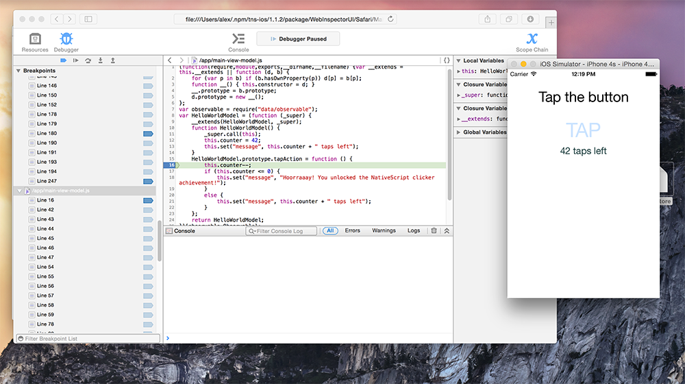

Let's face it, deploying to a device just to have the ability to debug your NativeScript app is so 4 months ago. I just wanted to write a quick entry on debugging a NativeScript app while running it on the iOS simulator. So hopefully searching for how to debug a NativeScript app on the simulator, or a combination of those words will help someone out next time they need help, as I did. 

#### Versions used in this post 

* NativeScript: 1.1.2

If you’re using the NativeScript CLI and not [AppBuilder](http://developer.telerik.com/products/appbuilder-in-45-minutes), debugging your app while running on the iOS Simulator has only been available recently. The command to do so has been elusive and not exactly straightforward to figure out either.

Follow your standard workflow for [creating and configuring a NativeScript app](http://docs.nativescript.org/hello-world/hello-world-ns-cli.html) as well as adding the iOS platform to your app.

And when you’re ready to debug on using the iOS simulator… drumroll, please…

```
tns debug ios --debug-brk --emulator
```

This will spin up the iOS Simulator and Safari as well as attach Safari’s a debugger to your code like in the screenshot below.



Well done! Now go debug some code.
