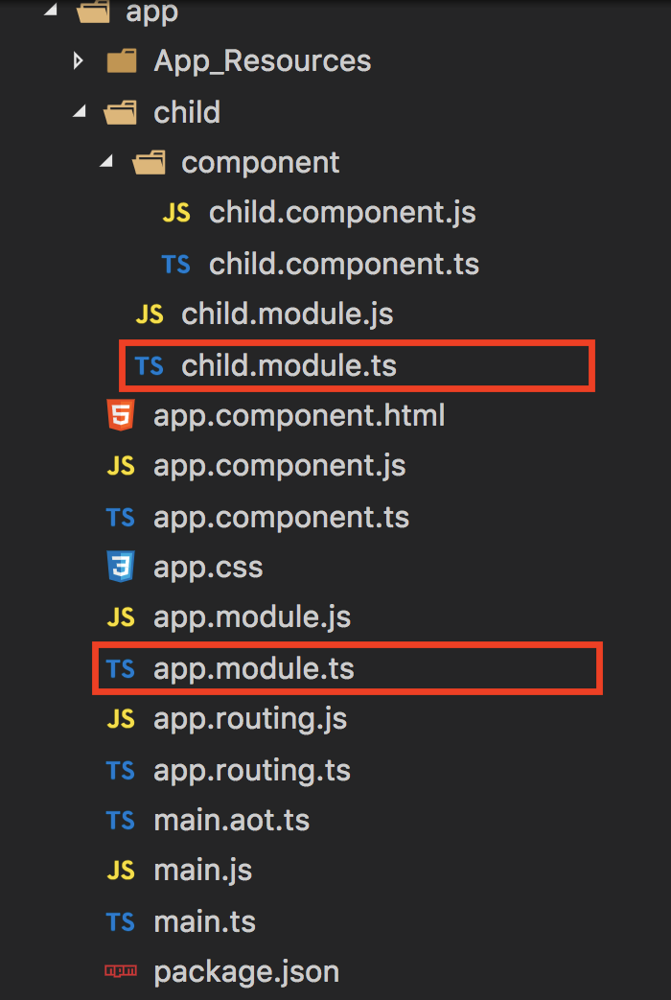
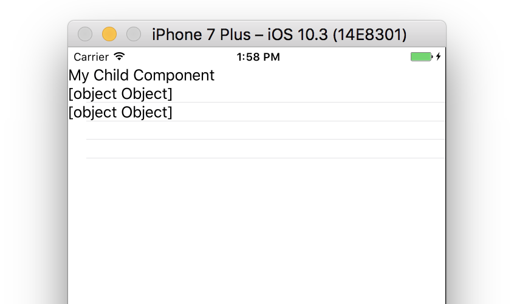
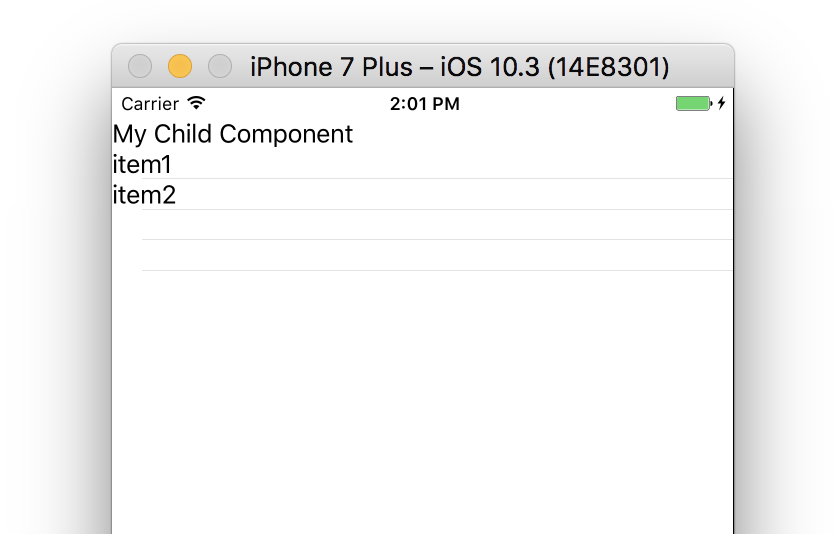

“Why is my ListView template binding not working?!!” You’re frustrated and you’re tearing your hair out. “It works on the web, but it doesn’t work here, in my NativeScript app! Why? I’ve gone over it with a fine-tooth comb, but still nothing!” If you’re using a `ListView` with a template and instead of nicely meaningful properties being displayed, all you’re seeing is the dreaded [`object Object]` in your list, this one simple trick can solve your problem. See what I did there? Now you HAVE to read this…

I’ve run into this problem time and time again in my NativeScript with Angular apps and it gets me every time. It’s very frustrating. Let’s say I’m following an Angular tutorial and trying to reproduce functionality in NativeScript (you can do that you know), but when I have a list of items, I don’t see the same thing as the pretty tutorials show me.

Remember that NativeScript has a very helpful module that translates all your Angular goodness into NativeScript goodness and it’s called `nativescript-angular`. When you create a new NativeScript with Angular project using the `—ng` flag like this:

```
tns create myproject —ng
```

You automatically get the `nativescript-angular` included in your `package.json` file and it has a handy-dandy module in it. You’ve already imported this module in the main `app.module.ts` file at the root of the app:

```
import { NativeScriptModule } from “nativescript-angular/nativescript.module”;
```

This is most likely happening because you decided to be a good citizen and you are following best practices in your Angular apps by separating out features into their own folders, with their own NgModules. So might have a project set up where you have a child module that is imported my the main app module. This is what your files might looks like, and this is exactly what causes you to run into our awful snag.



You can take a look at the [project here](https://github.com/alexziskind1/blog-demos/tree/master/tns-why-bindings-dont-work/) for an example. This project will give you a problem like the one I’m describing. It looks like this:
  


So what’s going on here?
  
Remember that NativeScriptModule you imported in the root `app.module.ts` file? You need to do the same for all the child modules as well. Once you add the import statement to the `child.module.ts` file, everything works as expected.

```
import { NgModule } from ‘@angular/core’;
import { NativeScriptModule } from “nativescript-angular/nativescript.module”;
import { ChildComponent } from ‘./component/child.component’;
@NgModule({
    imports: [NativeScriptModule],
    exports: [ChildComponent],
    declarations: [ChildComponent],
    providers: []
})
export class ChildModule {}
```

Don’t forget to add it to the imports array of the module.
  
Suddenly everything starts to work as expected.



And all is fine with the world again.
  
If this post helped you out, then you might be interested in the free course called [NativeScript with Angular Getting Started Guide](https://nativescripting.com/course/nativescript-with-angular-getting-started-guide), or if you’re ready for something more advanced, you can pick up the [NativeScript with Angular Pro course](https://nativescripting.com/course/nativescript-with-angular-pro), or [grab a bundle](https://nativescripting.com/#specials) to save some bucks.
