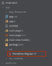

Did you know that you could use your own fonts in NativeScript? You're not stuck with the default Helvetica that you see every label and button use out of the box. This post show you how to see what fonts are available on iOS devices, how to use these fonts, and how to use your own custom fonts. Finally, you'll see a helper app that samples all the fonts for you. 

#### Versions used in this post 

* NativeScript: 1.0.1

#### Related optional downloads

1. [Font usage app code](https://github.com/alexziskind1/nativescript-fonts-demoapp)
2. [Font Sampler App (aka "KEEP CALM")](https://github.com/alexziskind1/nativescript-font-sampler-app)

I've seen quite a bit of questions on how to use other fonts in NativeScript. Since at the time of this writing you can't set anything font related through CSS except the font size, you have to do this programmatically. Below you'll find some techniques for accomplishing just that.

* * *

#### [Listing Available Fonts](#ListingAvailableFonts)

#### [Setting a Font on a UI Element on Element Load](#SettingaFontonaUIElementonElementLoad)

#### [Setting a Font on a UI Element by Extending the UI Element](#SettingaFontonaUIElementbyExtendingtheUIElement)

#### [Using Your Own Custom Fonts](#UsingYourOwnCustomFonts)

#### [Font Sampler Demo App](#FontSamplerDemoApp)

* * *

<h2 id="ListingAvailableFonts">Listing Available Fonts</h2>

Fonts are grouped together into font families. To get a list of all fonts, first we iterate through all the font families, and then we iterate all the fonts in each family. In iOS, we query the font families and fonts from the UIFont class. In NativeScript this can be done with a simple JavaScript function 

```
function getFonts() {
    var retFonts = [];
    var familyNames = UIFont.familyNames();
    for (var i = 0; i < familyNames.count; ++i) {
        var famName = familyNames[i];
        var fontNamesForFamily = UIFont.fontNamesForFamilyName(famName);
        for (var k = 0; k < fontNamesForFamily.count; ++k) {
            var fontName = fontNamesForFamily[k];
            retFonts.push(fontName);
        }
    }
    return retFonts.sort();
}
```

Once you get the returned array from this function, you can do what you like with the fonts. I will use these later to create a font picker. See the Demo app section below.

<h2 id="SettingaFontonaUIElementonElementLoad">Setting a Font on a UI Element on Element Load</h2>

Every UI element in NativeScript, from Pages to Layouts to Buttons have a `loaded` handler. One way to hook into the elements and alter their appearance is to specify the `loaded` handler.

You've probably seen the `loaded` attribute on the `Page` element before if you've ever used NativeScript and looked at the page xml file. If you haven't [start here](http://docs.nativescript.org/setup/ns-cli-setup). 

> **Note**: Always check for the platform if you're going to run this on anything else besides iOS. Make sure you're not calling iOS specific code on an Android device.

Just like you can add a handler to the `loaded` event on the `Page`, you can add one to a Label, for example. Here is a snippet from the _main-page.xml_ file

```
<label text="{{ message }}" cssclass="title" loaded="labelLoaded">
</label>
```

In the _main-page.js_ file, you provide the implementation of the `loaded` handler.

```
function labelLoaded(args) {
    var myLabel = args.object;
}
exports.labelLoaded = labelLoaded;
```

Now that you've got the label in your code, you can do what you please with it, including setting the font like the highlighted line below shows. Make sure you're using the actual NAME of the font here and not the file name. See the section on Listing Available Fonts above, which shows you how to get the names of fonts. 

```
function labelLoaded(args) {
    var myLabel = args.object;
    myLabel.ios.font = UIFont.fontWithNameSize(“Verdana-Italic”, 30);
}
exports.labelLoaded = labelLoaded;
```

<h2 id="SettingaFontonaUIElementbyExtendingtheUIElement">Setting a Font on a UI Element by Extending the UI Element</h2>

I've shown how to extend a UI element in my post on creating a scaling label, you can find it here (link). The concept here is pretty much the same. Once you have a hold of the native object, you can go ahead and set the font on it. Here is the code that you can use to extend a Label and assign a font to it.

```
var label = require( "ui/label/label" );
 
var LabelWithFont = (function (_super) {
    __extends(LabelWithFont, _super);
    function LabelWithFont () {
        _super.call(this);
        this.mylabel = UILabel.alloc().init();
        this.ios.font = UIFont.fontWithNameSize("HelveticaNeue-Thin", 80);
        this.ios.addSubview( this. mylabel);
    }
    return LabelWithFont;
})(label.Label);
 
exports. LabelWithFont = LabelWithFont;
```

To use this extended label, you add a namespace to the `Page` element in your XML file. Then use the new `LabelWithFont` element as highlighted.

```
<page xmlns="http://www.nativescript.org/tns.xsd" xmlns:cc="components/mycomponents" loaded="pageLoaded">
<stacklayout cssclass="label-back">
            <cc:labelwithfont text="{{ mainLabelText }}">
 </cc:labelwithfont></stacklayout>
</page>
```

Presto! Your new label will have the font that you picked.

<h2 id="UsingYourOwnCustomFonts">Using Your Own Custom Fonts</h2>

Traditionally, you would specify the custom font as a resource to load in Xcode by editing the project's plist file. Who's got time for all that? You can also dynamically load your own custom font at runtime in your NativeScript project without touching Xcode. 

I am assuming you have a legally obtained font or a font that's free to use; a font like Poiret One. The file containing the font is called _PoiretOne-Regular.ttf_. In your NativeScript project, create a folder for resources called _res_ and place the font file in that folder as shown below.



We are going to use this font for a label that's in your XML with the technique described in the section above called _Setting a Font on a UI Element on Element Load_ . Add the `loaded` handler to your label and the following code in the JavaScript code file.

```
function labelLoaded(args) {
    //Get font from deployed file
    var fontPath = NSBundle.mainBundle().pathForResourceOfType("app/res/PoiretOne-Regular", "ttf");
    var fontUrl = NSURL.fileURLWithPath(fontPath);
    var fontData = NSData.dataWithContentsOfURL(fontUrl);
     
    var provider = CGDataProviderCreateWithCFData(fontData);
    var font = CGFontCreateWithDataProvider(provider);
 
    var error = NSError.alloc().init();
    //This line will load the font to be available for UI elements
    CTFontManagerRegisterGraphicsFont(font, error);
    //Set the label’s font to the loaded font by NAME
    args.object.ios.font = UIFont.fontWithNameSize("PoiretOne-Regular", 30);
}
exports.labelLoaded = labelLoaded;
```

<h2 id="FontSamplerDemoApp">Font Sampler Demo App</h2>

It's not enough to just talk about fonts and how they can totally change the user experience, so I thought to do something cool to show off the fonts that come with iOS. The Font Sampler app is available on GitHub [here](https://github.com/alexziskind1/nativescript-font-sampler-app) so feel free to grab it and check it out.

The app lets you scroll through all the fonts available on your system (iOS only at this time) and dynamically change the label to use the selected font. The animated GIF below shows the Font Sampler in action. 


