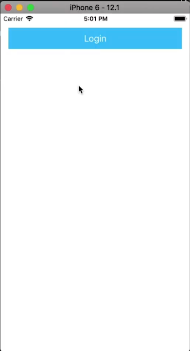
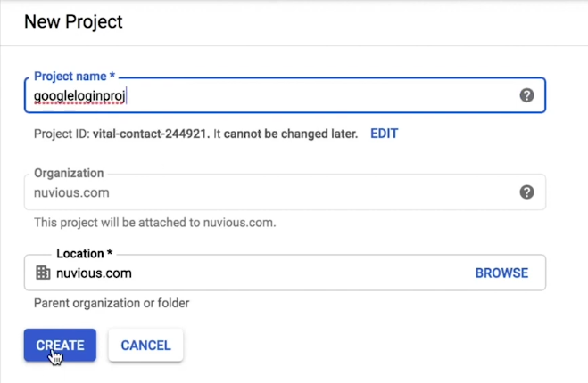
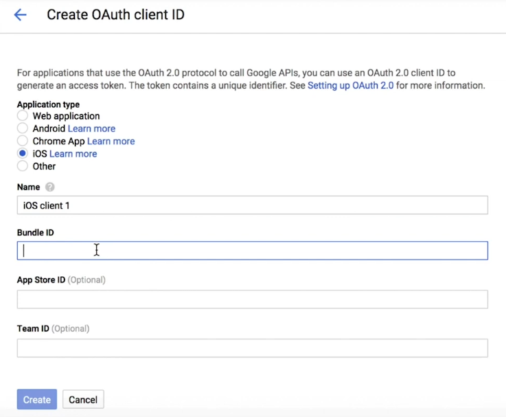
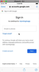

Do you need to include social authentication in your mobile apps? In this NativeScript tutorial, we're using OAuth2 and adding Google login to a simple app.

## TL;DR

Here's a video version of this tutorial on my YouTube channel.

<br>

<div class="videoWrapper">
    <iframe width="560" height="315" src="https://www.youtube.com/embed/Ix0bXZeyhK0" frameborder="0" allowfullscreen></iframe>
</div>

<br/>

You can find a lot more NativeScript Tutorials on my YouTube channel: https://www.youtube.com/channel/UCajiMK_CY9icRhLepS8_3ug

## Introduction

In this tutorial, we'll show you how to set up Google authentication in a NativeScript application. We'll be using the [nativescript-oauth2](https://market.nativescript.org/plugins/nativescript-oauth2) package, which is an OAuth2 authorization plugin for NativeScript.

## Getting Started

We start with a simple app containing a single button:

<br>



<br>

```xml
<!-- main-page.xml -->

<Page xmlns="http://schemas.nativescript.org/tns.xsd" navigatingTo="navigatingTo" class="page">

  <StackLayout>
    <Button text="Login" tap="onLoginTap" class="btn btn-primary"/>
  </StackLayout>
  
</Page>
```

<br>

```typescript
// main-page.ts

import { EventData } from "tns-core-modules/data/observable";
import { Page } from "tns-core-modules/ui/page";
import { HelloWorldModel } from "./main-view-model";

export function navigatingTo(args: EventData) {
  const page = <Page>args.object;
  page.bindingContext = new HelloWorldModel();
}

export function onLoginTap() {
  // trigger our login
}
```

<br>

Before proceeding, let's first install the plugin:

<br>

```
$ tns plugin add nativescript-oauth2
```

<br>

Before the plugin can be used, you first need to configure it. Create a file named `auth-service.ts` and add the following to it:

<br>

```typescript
// auth-service.ts

import { configureTnsOAuth, TnsOAuthClient, ITnsOAuthTokenResult } from "nativescript-oauth2";
 
import {
  TnsOaProvider,
  TnsOaProviderOptionsGoogle,
  TnsOaProviderGoogle
} from "nativescript-oauth2/providers";

let client: TnsOAuthClient = null;

export function configureOAuthProviders() {
  const googleProvider = configureOAuthProviderGoogle();
  configureTnsOAuth([googleProvider]);
}

function configureOAuthProviderGoogle() {
  const googleProviderOptions: TnsOaProviderOptionsGoogle = {
    openIdSupport: 'oid-full',
    clientId: '',
    redirectUri: '',
    urlScheme: '',
    scopes: ['email']
  };
  
  const googleProvider = new TnsOaProviderGoogle(googleProviderOptions);
  
  return googleProvider;
}

export function tnsOauthLogin(providerType) {
  client = new TnsOAuthClient(providerType);
  
  client.loginWithCompletion((tokenResult: ITnsOAuthTokenResult, error) => {
    if (error) {
      console.error('there was an error logging in.');
      console.error(error);
    } else {
      console.log('logged in sucessfully.');
      console.log(tokenResult);
    }
  });
}
```

<br>

In the code above, we configure the Google provider and pass it to `configureTnsOAuth()` which takes an array of providers and registers them as available for use. We'll talk more about the `googleProviderOptions: TnsOaProviderOptionsGoogle` later on and show you how to generate them.

<br>

`tnsOauthLogin()` will be called to log in the user (as a response to a tap event on a Login button). Here, we create a new instance of `TnsOAuthClient` and call `loginWithCompletion()` on the instance, passing in the provider we want to login with. The provider can be of type `TnsOaProviderType`, or it can be a string e.g. 'google', 'facebook', 'microsoft', etc. After login is done, the completion handler will be called with the results.

<br>

You have to register one or more auth providers to use with the nativescript-oauth2 plugin when the app starts. In the above code, we registered the Google provider. We execute this code by calling `configureOAuthProviders()` in `app.ts` before `application.run()` is called.

<br>

```typescript
// app.ts

import * as application from "tns-core-modules/application";
import { configureOAuthProviders } from "./auth-service";

configureOAuthProviders();

application.run({ moduleName: "app-root" });
```

<br>

With that set up, let's now log in the user when they tap the Login button:

<br>

```typescript
// main-page.ts

import { EventData } from "tns-core-modules/data/observable";
import { Page } from "tns-core-modules/ui/page";
import { HelloWorldModel } from "./main-view-model";
import { tnsOauthLogin } from "./auth-service";

export function navigatingTo(args: EventData) {
  const page = <Page>args.object;
  page.bindingContext = new HelloWorldModel();
}

export function onLoginTap() {
  // trigger our login
  tnsOauthLogin('google');
}
```

### Provider Options
Before we can complete the login process, let's first revisit the code block shown below and take a look at what all those provider options are for.

<br>

```typescript
const googleProviderOptions: TnsOaProviderOptionsGoogle = {
  openIdSupport: 'oid-full',
  clientId: '',
  redirectUri: '',
  urlScheme: '',
  scopes: ['email']
};
```

<br>

`openIdSupport` indicates whether the provider supports OpenId or not. Some providers are [OpenId certified](https://openid.net/certification/) (e.g. Google and Microsoft) and so we use `oid-full` for them, others like Facebook don't support OpenId and for these, we would use `oid-none`.

<br>

We'll get the `clientId`, `redirectUri` and `urlScheme` after we register an app with Google. OpenId certified providers require authentication to be done via an out-of-app browser. For this to work, we need to register a custom URL scheme with the app (`urlScheme`) as well as supply a local redirect URI (`redirectUri`) to handle responses from Google's authorization server.

<br>

[Scopes](https://developers.google.com/identity/protocols/googlescopes) (`scopes`) enable your application to only request access to the resources that it needs while also enabling users to control the amount of access that they grant to your application. We ask the user for permission to view their email address.

#### Register an App with Google

To enable Google login, you need a [developer account](https://developers.google.com/). If you have one, then head over to the [developer console](https://console.developers.google.com) to register an application.

<br>

First, create a project by clicking on the Projects dropdown menu shown below and selecting **Create Project** on the window that pops up.

<br>


<br>

Give your project a name and then create it.

<br>



<br>

From the Projects dropdown menu, select your created project. Then select **Credentials** on the left panel. On the right panel, select **OAuth client ID** from the **Create credentials** dropdown menu. On the page that appears, click on **Configure consent screen** then fill in details regarding your application (at minimum, add the application's name).

<br>

Next, create an OAuth client ID. Select iOS as the **Application type**, give it a name and add in your app's **Bundle ID**. Your app's Bundle Id can be seen in the `package.json` file. It is the `id` value of the `nativescript` object.

<br>



<br>

On clicking **Create** a client ID will be generated for you. Paste it into `clientId` of the `googleProviderOptions` object. For the `urlScheme`, you take the `clientId` and reverse it e.g. if the `clientId` was `43244757-fd8787df8a.apps.googleusercontent.com`, then the `urlScheme` would be `com.googleusercontent.apps.43244757-fd8787df8a`. For the `redirectUri`, you add `:/auth` at the end of the `urlScheme` e.g. `com.googleusercontent.apps.43244757-fd8787df8a:/auth`.

<br>

As mentioned earlier, we need to register a custom URL scheme with the app so that the system knows which app to call after the user logs in using an out-of-app browser.

#### Registering a Custom URL Scheme on iOS

To register a custom URL scheme for iOS, open your iOS app resources, which are in `app/App_Resources/iOS/Info.plist`. In the key/value dictionary in this file, add a key for `CFBundleURLTypes`, if it's not already there, then add the value for that key as an array:

<br>

```xml
<key>CFBundleURLTypes</key>
<array>
  <dict>
    <key>CFBundleURLSchemes</key>
    <array>
      <string>com.googleusercontent.apps.43244757-fd8787df8a</string>
    </array>
  </dict>
</array>
```

<br>

You can now run the app and test it out. On tapping the Login button, a browser will open up asking you to sign in via Google as well as let you know the information you will be allowing the app to access. After login, you will be taken back to the app and you will now be authenticated.

<br>



<br>

In our code, we logged out the `tokenResult` which is an `ITnsOAuthTokenResult` object that holds the authentication response from Google. If you take a look at your console, you will see the `accessToken`, `refreshToken` and `idToken`, which you can use to manage user sessions.

#### Registering a Custom URL Scheme on Android

To register a custom URL scheme for Android, open your Android app resources, which are in `app/App_Resources/Android/src/main/AndroidManifest.xml`.

<br>

Then, inside the activity, add a new `<intent-filter>` section with your custom URL scheme(s).

<br>

```xml
<intent-filter>
  <action android:name="android.intent.action.VIEW"/>
  <category android:name="android.intent.category.DEFAULT" />
  <category android:name="android.intent.category.BROWSABLE" />
  <!-- Custom URL Schemes -->
  <data android:path="/auth"
    android:scheme="com.googleusercontent.apps.43244757-fd8787df8a"/>
</intent-filter>
```

<br>

Now you should also be able to login with Google on Android.

<br>

We've covered how you can enable authentication via Google in your app. However, we haven't covered all there is to know about authentication, that will take more than a single article. If you want to dive deeper into security, we have a [Securing NativeScript Applications](https://nativescripting.com/course/securing-nativescript-applications) course that covers protecting resources with authentication and authorization, keeping passwords safe with hashing and salting, JSON web token, server-side auth middleware, controlling the user login lifetime, etc.

<br>

Let me know what you thought of this tutorial on Twitter: [@digitalix](https://twitter.com/digitalix) or leave a comment down below. You can also send me your NativeScript related questions that I can answer in video form. If I select your question to make a video answer, I'll send you swag. Use the #iScriptNative hashtag.
