NativeScript supported TypeScript since the early days. However, it is not until recently that the CLI-centric development experience allowed a smooth transition into TypeScript development of your mobile apps. Several clunky attempts have been made to introduce TypeScript into the NativeScript CLI story, but they were headache prone. This post will show you how much easier it is now to work with TypeScript by converting the basic Hello World template project into it’s TypeScript equivalent.

I am using Visual Studio Code as my editor because it has amazing support for TypeScript. This post will focus on showing you how to get started with TypeScript with NativeScript by simply converting the Hello World template that you get when running `tns create`. It does not provide any guidance on good project organization. Keep watching this and the [NativeScript docs](http://docs.nativescript.org/) for best practices on good project structure.

#### Versions used in this post 

* NativeScript: 1.5.1

#### Related Resources

* [GitHub repository with the TypeScript Hello World project](https://github.com/alexziskind1/hello_tns_ts)
* [Video Tutorial](https://youtu.be/2JDXnduTlgs)

<div class="videoWrapper">
    <iframe width="560" height="315" src="https://www.youtube.com/embed/2JDXnduTlgs" frameborder="0" allowfullscreen></iframe>
</div>

## Setting Up Your NativeScript Project with TypeScript

Create our project using the Hello World template

```
tns create hello-tns-ts
```

Change your directory to the newly created project

```
cd hello-tns-ts
```

You will see a familiar project structure

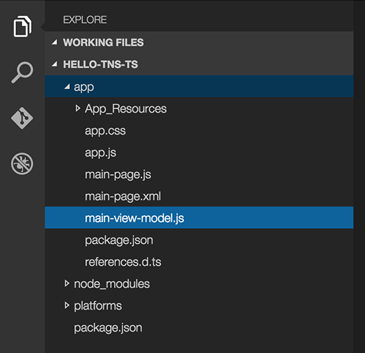

Notice all the _.js_ files in the _app_ directory. All these will soon be _.ts_ files. One other very important thing to notice is the recently new _reference.d.ts_ file right there in your app folder. This is a very important TypeScript definitions file that references all of NativeScript modules.

Now all we need to do is add TypeScript to our NativeScript project. Back on the command line, run the command to add TypeScript

```
tns install typescript
```

This installs and configures TypeScript in your project. You don’t have to do anything else at this point to start writing TypeScript files and referencing NativeScript modules. But since we are converting the Hello World template to TypeScript, I will guide you through the rest of the steps.

By the way, after you’ve executed the last command and added TypeScript to your project, you might have noticed that there are some new files and folders visible at the project root.

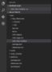

I won’t go into details about what each new file and folder does, but the important thing to note is that now you will have intellisense in your TypeScript files which will make writing new code a breeze. TypeScript compilation is automagically configured to run as part of your regular NativeScript build workflow as well. So when you’re ready to run the app, you don’t have to perform any extra steps such as building the TypeScript files into JavaScript files, this is done for you!

## JavaScript to TypeScript Reverse Conversion

You can see three JavaScript files generated by the Hello World template.

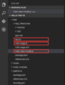

Let’s begin by ranaming _app.js_ to _app.ts_.

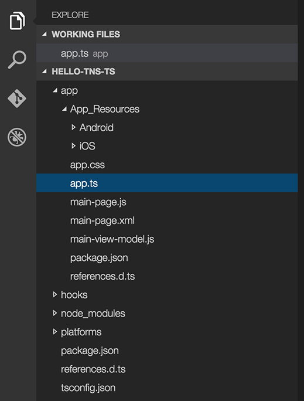

Your app is perfectly legal still and will run. There are two reasons for this: 1. JavaScript is valid TypeScript 1. NativeScript will automatically compile your _app.ts_ file into _app.js_ and everything will work as before.

Don’t believe me? Let’s try running the app

```
tns run ios —emulator
```
 
And we have everything running as usual. You should have believed me.


Now if you take a look at the project directory structure in your editor, you will see both _app.ts_ and _app.js_ files.

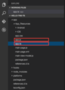

Everything works, yes, but we’re not quite done. The best practice with TypeScript is to use the `import` statement when requiring other modules. So we’re going to change `var` to `import` in this file. Now we’re done.

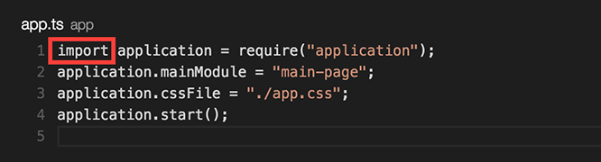

_app.ts_ references _main-page_ as the main module to load in the application. Let’s go ahead and convert _main-page.js_. Start by renaming it to _main-page.ts_.

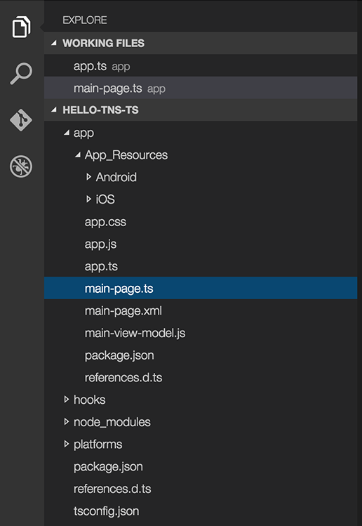

Open _main-page.ts_ and start by changing the `var` on the first line to `import`. You will notice that this wasn’t as clean as last time because we still have a red squiggly line under the require statement and maybe even an error that says “cannot find module ‘./main-view-model’”.

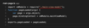

This will be resolved once we convert the _main-view-model.js_ file into TypeScript.

Next, your module will export the `pageLoaded` function, but using TypeScript’s export notation. We can `export` the function directly

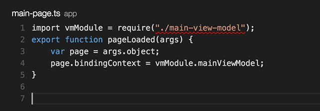

Finally, we will convert _main-view-model.js_ to TypeScript. Rename the file to _main-view-model.ts_ and open it up.

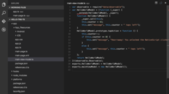

What you see is JavaScript that was compiled from a TypeScript class. We will just reverse that process and convert it back. Don’t let the crazy `__extends` syntax scare you, this is just a simple class that inherits from NativeScript’s `Observable` class in the _observable_ module. Since I know I want the `Observable` class, I will use the dereferencing syntax to grab the `Observable` class from the _observable_ module that is provided by NativeScript. Thus the first line becomes

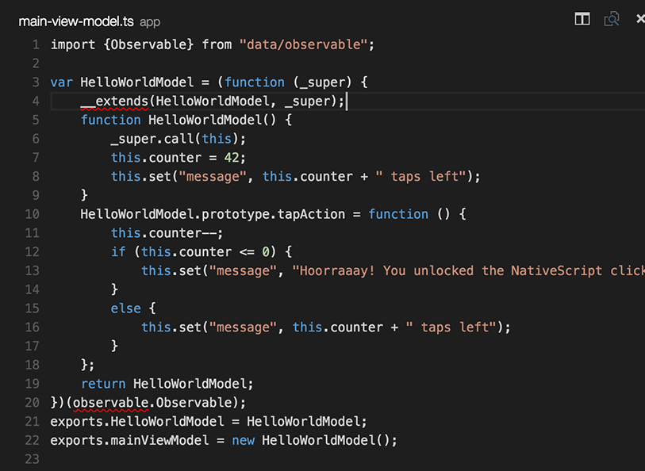

Now we change the messy JavaScript class to TypeScript and marvel in its beauty and simplicity.

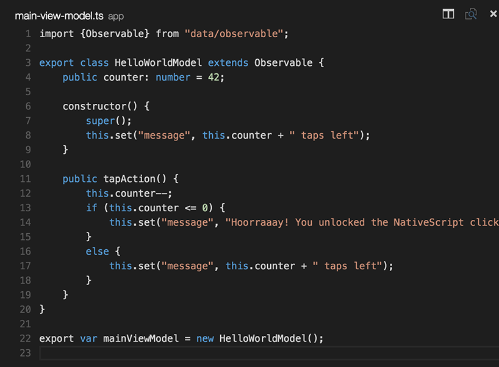

Notice that we are exporting the class as well as the free variable `mainViewModel` that is expected by the _main-page_ module and holds a reference to a new `HelloWorldModel` object.

Note: We could have used the “import” and “require” combination also

```
import observableModule = require(“data/observable”);
```

Then we would just need to reference the “Observable” class by specifying the module name as well 

```
export class HelloWorldModel extends observableModule.Observable { … }
```

At this point, we’ve converted all three files to TypeScript. Go ahead and run the app in a simulator or emulator and it should behave the same way. After you’ve built the app, notice that we now have a _.js_ file for every _.ts_ file. This could get confusing and messy on a larger app so keep in mind that this is not the best way to organize your project. A better way would be to separate your modules into folders. Keep an eye out for a blog post on project organization.

## Conclusion

Hopefully now you can feel at ease when trying to use TypeScript in your NativeScript apps and avoid all the headaches that I went through. There are still a few kinks for the team to work out to make things even simpler in the future, but this is definitely much friendlier than it used to be.
