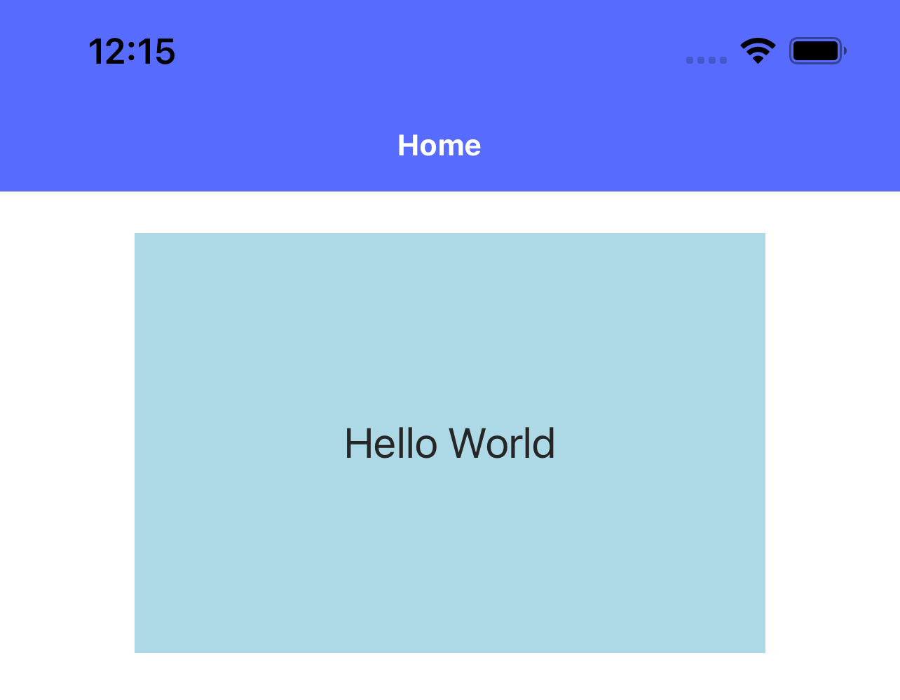
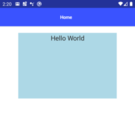

A while go I've finished one more project with NativeScript. During the period of work with this framework I've
accumulated some amount of solutions which are quite steadily used in almost every project I had worked on and allow to
quickly solve different typical tasks. In this article, I would like to share some Angular directives that I use in my
NativeScript projects.

## Centered Text label

Sometimes when you have a `Label` of specific size with some text on it, you expect
this text to be vertically centered. And it really works this way on iOS. Unfortunately, on Android the result looks not so
promising

|||
|:---:|:---:|
|iOS default text alignment in Labels|Android default text alignment in Labels|

This can be easily changed by setting a ["gravity"][Android Gravity Docs] on the label which determines the object
placement within a potentially larger container. So it could look something like this

```typescript
label.android.setGravity(android.view.Gravity.CENTER);
```
and we will have text centered both vertically and horizontally.

However, in this case we do not take into account the horizontal text alignment which in general case can be different.
So the full implementation of this directive could look as follows

```typescript
import {Directive, HostListener} from '@angular/core';
import {isAndroid, Label} from '@nativescript/core';

@Directive({
    selector: 'Label[centerVertically]'
})
export class VerticalAlignDirective {

    @HostListener('loaded', ['$event.object'])
    labelLoaded(label: Label): void {
        if (isAndroid) {
            const textAlignment = this.getTextAlignment(label);
            label.android.setGravity(android.view.Gravity.CENTER_VERTICAL | textAlignment);
        }
    }

    private getTextAlignment(label: Label): number {
        switch (label.textAlignment) {
            case 'center':
                return android.view.Gravity.CENTER_HORIZONTAL;
            case 'right':
                return android.view.Gravity.RIGHT;
            case 'initial':
            case 'left':
            default:
                return android.view.Gravity.LEFT
        }
    }
}
```
Reading the `textAlignment` property of the label we define the horizontal text position also using "gravity".

Actually, the initial idea was to create this directive even more general with the ability to fully control the vertical
positioning of the text, however it is not possible for iOS unless we change label's frame. You can read more about
it [here][iOS UILabel Vertical Alignment] but since it's not the flow we expect to get and setting vertical alignment
different from the central positioning is a very rare case I've left the implementation of the directive as it is shown
above.

## Touch responsive

Another quite common case is when you need to handle tap actions not only on buttons but on some layouts. In order to provide
good user experience these areas should be responsive and behave to some extent similar to the buttons. For such cases
I've created a simple directive which allows to put an iOS similar effect to any Layout you want.

```typescript
import {Directive, HostListener} from '@angular/core';
import {View} from '@nativescript/core';
import {AnimationCurve} from '@nativescript/core/ui/enums';

@Directive({
    selector: '[touchResponsive]',
})
export class TouchResponsiveDirective {
    @HostListener('touch', ['$event'])
    onTouchHandler(args) {
        switch (args.action) {
            case 'move':
                break;
            case 'down':
                this.touchStartAnimation(args.object);
                break;
            case 'cancel':
            case 'up':
                this.touchEndAnimation(args.object);
                break;
        }
    }

    private touchStartAnimation(host: View) {
        host.eachChild((child) => {
            (<View>child)
                .animate({
                    opacity: 0.3,
                    duration: 100,
                    curve: AnimationCurve.easeOut,
                })
                .catch(() => null);
            return true;
        });
    }

    private touchEndAnimation(host: View) {
        host.eachChild((child) => {
            (<View>child)
                .animate({
                    opacity: 1,
                    duration: 200,
                    curve: AnimationCurve.easeInOut,
                })
                .catch(() => null);
            return true;
        });
    }
}
```
As you can see, it handles touch action and animates opacity of each child of the container it is applied to.
Here you can find how it looks in action


Actually I use it for Android also since in most of my projects ripple effect was removed by design.
However, if you need it - take a look at Alexander Ziskind's [example][Ripple Effect] of setting a
Material Design Ripple Effect to your Views.

### Tappable icon

Do you often use images as tappable elements? Pretty often, I think. So do I. Despite, images can be of different size
we have to stick to the Touch target guidelines. They state that target size should be 
at least [48x48dp for Android][Android Touch Area Guideline] and [44x44dp for iOS][iOS Touch Area Guideline].

So for such cases I've created a simple component
(yeah, yeah, I know, we've talked about directives. I hope you'll forgive me this small deviation) which allows me to use images as
clickable elements and guarantee the touchable area size

```typescript
import {Component, EventEmitter, Input, Output} from '@angular/core';
import {EventData} from '@nativescript/core';

@Component({
    selector: 'TappableIcon',
    template: `
        <AbsoluteLayout [width]="width" [height]="height"
                        iosOverflowSafeAreaEnabled="false" touchResponsive
                        (tap)="tapHandler($event)">

            <SVGImage [src]="imgSrc" [width]="imgWidth" [height]="imgHeight"
                      [left]="(width - imgWidth) / 2" [top]="(height - imgHeight) / 2">
            </SVGImage>

        </AbsoluteLayout>
    `,
})
export class TappableIconComponent {
    @Input() width = 48;
    @Input() height = 48;

    @Input() imgWidth: number;
    @Input() imgHeight: number;
    @Input() imgSrc: string;

    @Output() onButtonTap = new EventEmitter();

    tapHandler(event: EventData) {
        this.onButtonTap.next(event);
    }
}
```
I prefer using svg icons for images so here I've used `SVGImage` component from 
the [`nativescript-svg` plugin][NativeScript SVG Plugin], however 
you can slightly change the code to use simple `Image`s.

Please note the `iosOverflowSafeAreaEnabled="false"` property which is required to not break the icon layout if it
is used close to the screen edges. Otherwise, it can be stretched which is not the behavior we expect.

After you have such component you can simply use it wherever you need like

```html
<TappableIcon imgSrc="~/assets/todos/ic-plus-gray.svg" imgWidth="16" imgHeight="16"
              (onButtonTap)="createTaskForToday()">
</TappableIcon>
```

and be sure that your users have enough space to tap on your icon. Additionally, you have `width` and `height` params
that allow you to manage your touch area size directly.

## Searchbar without autofocus

`SearchBar` is a big headache for me and usually I prefer to use some custom-composed element instead of a native `SearchBar`
since it is difficult to stylize. However, it has an interesting feature which can be useful in some cases and useless in the others.
What feature am I talking about? If your page contains `SearchBar` on Android it will automatically
be focused and keyboard will be triggered. In some of my projects such behavior provided not so good user experience, so I had to find the way
to disable it. Actually, it can be disabled very easily by calling `clearFocus` on the android `SearchView` after it was loaded. Thus, I implemented 
a directive, so this logic could be effectively applied in places where it is required.

```typescript
import {Directive, HostListener} from '@angular/core';
import {isAndroid, SearchBar} from '@nativescript/core';

@Directive({
    selector: '[clearFocus]',
})
export class SearchbarClearFocusDirective {
    @HostListener('loaded', ['$event.object'])
    searchBarLoaded(searchBar: SearchBar) {
        if (isAndroid) {
            searchBar.android.clearFocus();
        }
    }
}
```
## Afterwords

In this article I've shared several examples of solutions that I move from one NativeScript project to another since
they solve some commonly arising tasks. I want to emphasize that each of them was based on the Angular techniques,
so they are not straightforwardly applicable i.e. for the NativeScript Vue project. However, the general ideas shared between
frameworks are usually very similar, so I think the information from the article was helpful for you in any case.

I've optimistically added #1 to the article title since I think I have more similar solutions to share and new ones
will appear, so I'm going to continue this series. I appreciate if you share your feedback and suggestions in comments under the article.

In addition, I'd kindly ask you to vote which topic from the listed below would be the most interesting for you, so I could share it first.

<iframe src="https://linkto.run/p/Q7M5NWBI" width="100%"></iframe>

Follow me on [Twitter][My Twitter] or [GitHub][My GitHub], send your thoughts, ideas, share feedback and suggestions.
Looking forward to hearing from you.

[Android Gravity Docs]: https://developer.android.com/reference/android/view/Gravity
[iOS UILabel Vertical Alignment]: https://medium.com/@javedmultani16/vertically-align-text-to-top-within-a-uilabel-d12139e16a24
[Ripple Effect]: https://www.youtube.com/watch?v=Pt71TCUxHVI
[Android Touch Area Guideline]: https://support.google.com/accessibility/android/answer/7101858
[iOS Touch Area Guideline]: https://developer.apple.com/design/human-interface-guidelines/ios/visual-design/adaptivity-and-layout
[NativeScript SVG Plugin]: https://www.npmjs.com/package/@sergeymell/nativescript-svg
[My Twitter]: https://twitter.com/SergeyMell
[My GitHub]: https://github.com/SergeyMell

