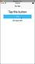
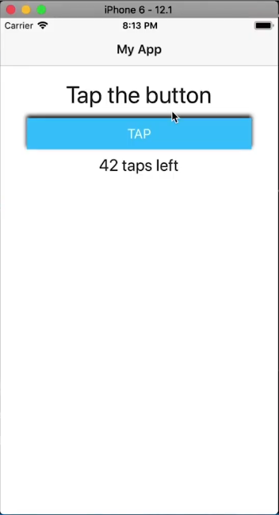
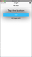
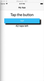
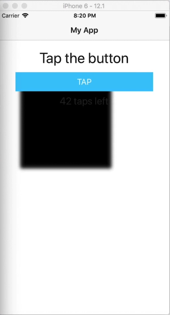
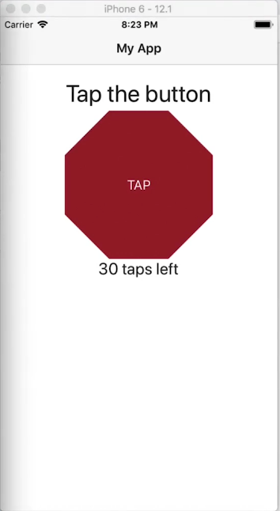
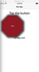

In this NativeScript tutorial, I'll show you five native iOS properties you can alter to create any kind of shadow in your iOS NativeScript apps.

## TL;DR

If you prefer a video of the tutorial, here it is:

<br>

<div class="videoWrapper">
    <iframe width="560" height="315" src="https://www.youtube.com/embed/DBqMv4urH5E" frameborder="0" allowfullscreen></iframe>
</div>

<br/>

## Introduction

In NativeScript 6, elevation for Android was enabled but this is still not supported in iOS. In this article, we'll show you a way in which you can create shadows in your NativeScript iOS applications. We'll look at 5 properties that you can use to create Native shadows for any view on iOS. We'll also see how you can create custom shapes from shadows. With these techniques, you'll be able to create shadows of any shape, size and depth.

## Let's Get Right to It!

Starting out, we have the following simple app containing a button and two labels.

<br>



<br>

The code:

<br>

```xml
<!-- main-page.xml -->

<Page xmlns="http://schemas.nativescript.org/tns.xsd" navigatingTo="navigatingTo" class="page">
  <Page.actionBar>
    <ActionBar title="My App" icon="" class="action-bar">
    </ActionBar>
  </Page.actionBar>
  
  <StackLayout class="p-20">
    <Label text="Tap the button" class="h1 text-center"/>
    <Button text="TAP" tap="{{ onTap }}" class="btn btn-primary btn-active"/>
    <Label text="{{ message }}" class="h2 text-center" textWrap="true"/>
  </StackLayout>
</Page>
```

<br>

```typescript
// main-page.ts

import { EventData } from "tns-core-modules/data/observable";
import { Page } from "tns-core-modules/ui/page";
import { HelloWorldModel } from "./main-view-model";

export function navigatingTo(args: EventData) {
  const page = <Page>args.object;
  page.bindingContext = new HelloWorldModel();
}
```

<br>

```css
// app.css

@import '~nativescript-theme-core/css/core.light.css';

.btn {
  font-size: 18;
}
```

<br>

We'll add a shadow to the button.

<br>

Let's start by adding a `loaded` event to our button:

<br>

```xml
<Button loaded="onBtnLoaded" text="TAP" tap="{{ onTap }}" class="btn btn-primary btn-active"/>
```

<br>

Next, install the following plugin. It contains type information about the native platforms as exposed by the NativeScript framework.

<br>

```
$ npm i tns-platform-declarations --save-dev
```

<br>

Before you can use the plugin, create a `reference.d.ts` file in the root directory of your project and add the following references:

<br>

```typescript
// references.d.ts

/// <reference path="./node_modules/tns-platform-declarations/ios.d.ts" />
/// <reference path="./node_modules/tns-platform-declarations/android.d.ts" />
```

<br>

Then add the following settings to your `tsconfig.json` file. We want to skip type checking of the declaration files since they are huge files and so will slow down builds.

<br>

```json
// tsconfig.json

"compilerOptions": {
  ...
  "skipLibCheck": true
  ...
}
```

<br>

Now we can get started with adding a shadow for the button. We'll do it by manipulating the following 5 properties:

### 1 of 5: Color

Let's start with setting the shadow's color. There are different ways that we can set the color. We can use the `Color` module from the NativeScript framework as shown below.

<br>

```typescript
// main-page.ts

import { EventData } from "tns-core-modules/data/observable";
import { Page, View } from "tns-core-modules/ui/page";
import { HelloWorldModel } from "./main-view-model";
import { isIOS } from "tns-core-modules/platform";
import { Color } from "tns-core-modules/color";

export function navigatingTo(args: EventData) {
  const page = <Page>args.object;
  page.bindingContext = new HelloWorldModel();
}

export function onBtnLoaded(args: EventData) {
  const view = args.object as View;
  
  if (isIOS) {
    const iosUIView = view.ios as UIView;
    iosUIView.layer.shadowColor = new Color('black').ios.CGColor;
  }
}
```

<br>

We use `isIOS` to ensure the code doesn't crash on Android since we are executing code that is specific to the iOS platform. After getting the NativeScript color, we convert it to an iOS color.

<br>

You can also get an iOS color using [UIColor](https://developer.apple.com/documentation/uikit/uicolor) as shown below.

<br>

```typescript
export function onBtnLoaded(args: EventData) {
  const view = args.object as View;
  
  if (isIOS) {
    const iosUIView = view.ios as UIView;
    iosUIView.layer.shadowColor = UIColor.blackColor.CGColor;
  }
}
```

### 2 of 5: Opacity

Next, let's set an opacity for the shadow.

<br>

```typescript
export function onBtnLoaded(args: EventData) {
  const view = args.object as View;
  
  if (isIOS) {
    const iosUIView = view.ios as UIView;
    iosUIView.layer.shadowColor = UIColor.blackColor.CGColor;
    iosUIView.layer.shadowOpacity = .5;
  }
}
```

<br>

Setting the color and opacity are the minimum requirements needed to create a shadow. Let's see what we have so far:

<br>


<br>

Let's make the shadow a bit more visible:

<br>

```typescript
iosUIView.layer.shadowOpacity = 1;
```

<br>



### 3 of 5: Radius

Next, let's add a radius to the shadow. A large value gives a more diffused shadow:

<br>

```typescript
export function onBtnLoaded(args: EventData) {
  const view = args.object as View;
  
  if (isIOS) {
    const iosUIView = view.ios as UIView;
    iosUIView.layer.shadowColor = UIColor.blackColor.CGColor;
    iosUIView.layer.shadowOpacity = 1;
    iosUIView.layer.shadowRadius = 40;
  }
}
```

<br>



<br>

A smaller radius gives a tighter shadow:

<br>

```typescript
iosUIView.layer.shadowRadius = 4;
```

<br>


### 4 of 5: Offset

Below, we set an offset on the shadow. This moves the shadow some distance away from the view.

<br>

```typescript
export function onBtnLoaded(args: EventData) {
  const view = args.object as View;
  
  if (isIOS) {
    const iosUIView = view.ios as UIView;
    iosUIView.layer.shadowColor = UIColor.blackColor.CGColor;
    iosUIView.layer.shadowOpacity = 1;
    iosUIView.layer.shadowRadius = 4;
    iosUIView.layer.shadowOffset = CGSizeMake(10, 10);
  }
}
```

<br>



### 5 of 5: Path

To finish off, let's look at the shadow path. We can use this to draw different shapes.

<br>

```typescript
export function onBtnLoaded(args: EventData) {
  const view = args.object as View;
  
  if (isIOS) {
    const iosUIView = view.ios as UIView;
    iosUIView.layer.shadowColor = UIColor.blackColor.CGColor;
    iosUIView.layer.shadowOpacity = 1;
    iosUIView.layer.shadowRadius = 4;
    iosUIView.layer.shadowOffset = CGSizeMake(10, 10);
    iosUIView.layer.shadowPath = UIBezierPath.bezierPathWithRect(CGRectMake(1, 1, 200, 200)).CGPath;
  }
}
```

<br>

The above code creates a square shadow.

<br>



<br>

As you can see, the shadow is a different shape from the button.

<br>

Let's see how we can create a different shaped view that has a shadow shaped in the same way. Modify the code as shown:

<br>

We start off by turning the button into an octagon:

<br>

```xml
<!-- main-page.xml -->

<Page xmlns="http://schemas.nativescript.org/tns.xsd" navigatingTo="navigatingTo" class="page">
  <Page.actionBar>
    <ActionBar title="My App" icon="" class="action-bar">
    </ActionBar>
  </Page.actionBar>
  
  <StackLayout class="p-20">
    <Label text="Tap the button" class="h1 text-center"/>
    <Button text="TAP" tap="{{ onTap }}" class="button"/>
    <Label text="{{ message }}" class="h2 text-center" textWrap="true"/>
  </StackLayout>
</Page>
```

<br>

```css
// app.css

@import '~nativescript-theme-core/css/core.light.css';

.button {
  font-size: 18;
  clip-path: polygon(30% 0%, 70% 0%, 100% 30%, 100% 70%, 70% 100%, 30% 100%, 0% 70%, 0% 30%);
  background-color: brown;
  height: 200;
  weight: 200;
  color: white;
}
```

<br>

We set a polygon clip-path on the button that gives it an octagon shape.

<br>



<br>

To add a similarly shaped shadow to the view, modify the code as shown.

<br>

```xml
<!-- main-page.xml -->

<Page xmlns="http://schemas.nativescript.org/tns.xsd" navigatingTo="navigatingTo" class="page">
  <Page.actionBar>
    <ActionBar title="My App" icon="" class="action-bar">
    </ActionBar>
  </Page.actionBar>
  
  <StackLayout class="p-20">
    <Label text="Tap the button" class="h1 text-center"/>
    <AbsoluteLayout>
      <Label loaded="onShadowLoaded" class="shadow"/>
      <Button text="TAP" tap="{{ onTap }}" class="button"/>
    </AbsoluteLayout>
    <Label text="{{ message }}" class="h2 text-center" textWrap="true"/>
  </StackLayout>
</Page>
```

<br>

```css
// app.css

@import '~nativescript-theme-core/css/core.light.css';

.shadow {
  height: 1;
  width: 1;
  background-color: white;
}

.button {
  font-size: 18;
  clip-path: polygon(30% 0%, 70% 0%, 100% 30%, 100% 70%, 70% 100%, 30% 100%, 0% 70%, 0% 30%);
  background-color: brown;
  height: 200;
  weight: 200;
  color: white;
}
```

<br>

```typescript
// main-page.ts

import { EventData } from "tns-core-modules/data/observable";
import { Page, View } from "tns-core-modules/ui/page";
import { HelloWorldModel } from "./main-view-model";
import { isIOS } from "tns-core-modules/platform";
import { Color } from "tns-core-modules/color";

export function navigatingTo(args: EventData) {
  const page = <Page>args.object;
  page.bindingContext = new HelloWorldModel();
}

export function onShadowLoaded(args: EventData) {
  const view = args.object as View;
  
  if (isIOS) {
    const iosUIView = view.ios as UIView;
    iosUIView.layer.shadowColor = UIColor.blackColor.CGColor;
    iosUIView.layer.shadowOpacity = .7;
    iosUIView.layer.shadowRadius = 8;
    iosUIView.layer.shadowOffset = CGSizeMake(2, 2);
    iosUIView.layer.shadowPath = UIBezierPath.bezierPathWithCGPath(polygonPath(100, 100, 120, 8, 22)).CGPath;
  }
}

function radians(a) {
  let b = Math.PI * a / 180;
  return b;
}

function polygonPointArray(sides: number, x: number, y: number, radius: number, offset: number): CGPoint[] {
  let angleT = (360 / sides);
  let angle = radians(angleT);
  let cx = x; // x origin
  let cy = y; // y origin
  let r = radius; // radius of circle
  var i = 0;
  var points: CGPoint[] = [];
  while (i <= sides) {
    let xpo = cx + r * cos(angle * i - radians(offset));
    let ypo = cy + r * sin(angle * i - radians(offset));
    points.push(CGPointMake(xpo, ypo));
    i++;
  }
  return points;
}
```

<br>

We place the button inside an absolute layout and also add a Label. We'll create a shadow on this label, so we removed the `loaded` event from the button and put one on the label, then in `main-page.ts`, we implement the event handler.

<br>

If you run the app, you'll see the octagonal view with a similarly shaped shadow.

<br>



<br>

We hope you've enjoyed this short tutorial. We are creating a series of iOS-focused NativeScript tutorials, so look out for those. Here are some of the posts in the series. We'll be adding to the collection in the coming weeks.

<br>

- How to Add SHADOWS in iOS
- [How to Use iOS Large Titles](/posts/how-to-use-ios-large-titles)
- [How to Create iOS Podcast Cover Art Animation with Inheriting Shadow Color](/posts/how-to-create-ios-podcast-cover-art-animation-with-inheriting-shadow-color)
- [How to Use iOS Collapsing SearchBar](/posts/how-to-use-ios-collapsing-searchbar)
- [Translucent Tabs in iOS](/posts/translucent-tabs-in-ios)

<br>

Let me know what you thought of this tutorial on Twitter: [@digitalix](https://twitter.com/digitalix) or leave a comment down below. You can also send me your NativeScript related questions that I can answer in video form. If I select your question to make a video answer, I'll send you swag. Use the #iScriptNative hashtag.

<br>

For more tutorials on NativeScript, check out our courses on [NativeScripting.com](https://nativescripting.com). We have a [NativeScript Hands-On UI course](https://nativescripting.com/course/nativescript-hands-on-ui) that covers NativeScript user interface, views and components. You might also be interested in the following two courses on styling NativeScript applications: [Styling NativeScript Core Applications](https://nativescripting.com/course/styling-nativescript-core-applications) and [Styling NativeScript with Angular Applications](https://nativescripting.com/course/styling-nativescript-with-angular-applications).
