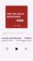
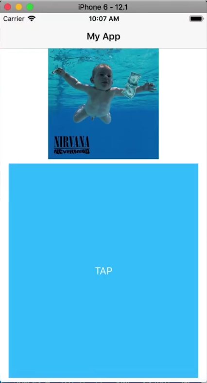
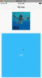
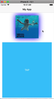
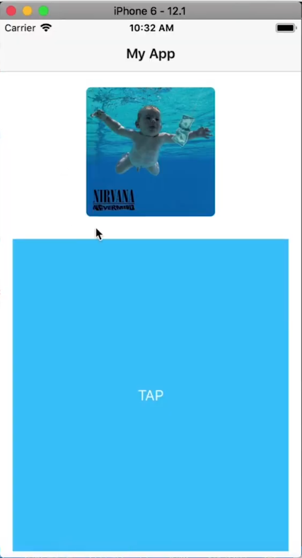
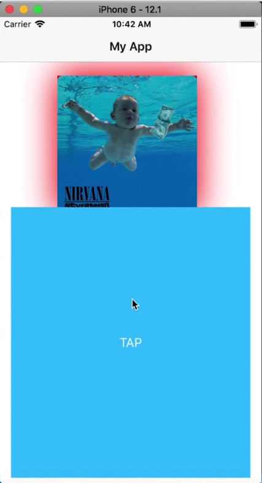
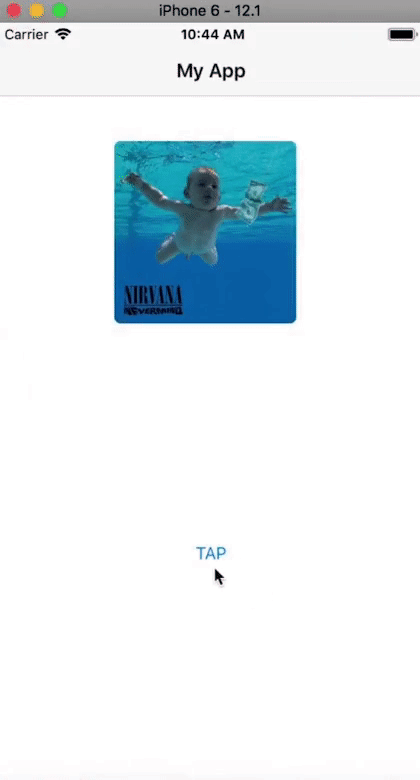
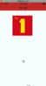

In this NativeScript tutorial, we are going to recreate the play/pause animation used in the iOS podcast app. Other than the animation, we'll also see how to add a shadow to an image that takes up the color of the image.

<br>

If you prefer watching a video of the tutorial, here you go:

<br><br>


<div class="videoWrapper">
    <iframe width="560" height="315" src="https://www.youtube.com/embed/CVZDURL8HWs" frameborder="0" allowfullscreen></iframe>
</div>

<br><br>


## Introduction

The iOS Podcast app has this cool animation when you play or pause a podcast. When playing a podcast, the podcast's cover art is displayed above the player control buttons. When you press play, the cover art pops up revealing a shadow underneath it that is the same color as the average color in the image, and when you press Pause, the image animates back down and lies flat on the page. We'll see how to create a similar effect.

<br>



<br>

This will be an iOS-only tutorial as we'll be using some of the native iOS APIs in our JavaScript code. We'll use techniques we've covered previously on the blog like [How to Add SHADOWS in iOS](https://www.youtube.com/watch?v=DBqMv4urH5E), [2 Methods for Creating Shapes in NativeScript](https://nativescripting.com/posts/nativescript-shapes-2-methods-for-creating-shape-views) and [Animated Loading Spinner with CSS in NativeScript](https://nativescripting.com/posts/animated-loading-spinner-with-css-in-nativeScript).

## Okay. Let's Do This!

For the demo app, we started off with the basic Hello World app and made the following few changes.

<br>

```xml
<!-- main-page.xml -->

<Page xmlns="http://schemas.nativescript.org/tns.xsd" navigatingTo="navigatingTo" class="page">
  <Page.actionBar>
    <ActionBar id="actionBar" title="My App" icon="" class="action-bar">
    </ActionBar>
  </Page.actionBar>
  
  <GridLayout rows="200, *">
    <Image id="img" src="~/cover1.jpg" width="200" height="200" loaded="imgLoaded" />
    
    <Button row="1" text="TAP" tap="onTap" class="btn btn-primary btn-active" />
  </GridLayout>
</Page>
```

<br>

```typescript
// main-page.ts

import { EventData } from "tns-core-modules/data/observable";
import { Page } from "tns-core-modules/ui/page";

export function navigatingTo(args: EventData) {
  const page = <Page>args.object;
}
```

<br>

Here is what the app looks like so far:

<br>



<br>

We are going to create the animation in the following 3 steps:

<br>

1. Animate the size of the image when the button is tapped.
2. Create a shadow behind the image.
3. Make the shadow inherit its color from the image.

## Animate the Size of the Image on Tap

Let's start by making the image expand and shrink when the button is tapped.

<br>

```typescript
// main-page.ts

import { EventData } from "tns-core-modules/data/observable";
import { Page } from "tns-core-modules/ui/page";
import { Animation, CubicBezierAnimationCurve, AnimationDefinition } from "tns-core-modules/ui/animation";
import { Image } from "tns-core-modules/ui/image";

let img: Image = null;

const scaleStartImg = 0.8;

export function navigatingTo(args: EventData) {
  const page = <Page>args.object;
}

export function imgLoaded(args: EventData) {
  img = args.object as Image;
  img.scaleX = scaleStartImg;
  img.scaleY = scaleStartImg;
}

let rev = false;

export function onTap(args: EventData) {
  const def1: AnimationDefinition = {
    target: img,
    duration: 600,
    scale: rev ? { x: scaleStartImg, y: scaleStartImg } : { x: 1, y: 1 },
    curve: new CubicBezierAnimationCurve(.6, .62, .29, 1.51)
  };
  
  const ani = new Animation([def1]).play();
  
  rev = !rev;
}
```

<br>

In the layout file, we added a `loaded` event to the Image and a `tap` one to the button. Here, we implement their handlers. After the image loads, we scale down its size to `0.8`. We use `rev` to check if the image should pop up or go back down when the button is tapped. If you run the app, you should be able to toggle between scaling the image up and down. We add a `CubicBezierAnimationCurve` to the `AnimationDefinition` to make the animation a bit more interesting. Below, you can see it has a bit of a pop/bounce at the end.

<br>



## Add a Shadow Behind the Image

For the image to look like it's popping up from the surface, we need to give it a shadow. On Android, this would have been easy to achieve with `androidElevation`, but NativeScript doesn't come with support for iOS elevation, so we'll have to create the effect ourselves. To do this, we'll use the native iOS APIs to set some properties on the image's `CALayer`.

<br>

Modify `imgLoaded` as shown.

<br>

```typescript
// main-page.ts

import { Page, isIOS } from "tns-core-modules/ui/page";

...

export function imgLoaded(args: EventData) {
  img = args.object as Image;
  img.scaleX = scaleStartImg;
  img.scaleY = scaleStartImg;
  
  if (!isIOS) {
    return;
  }
  
  img.ios.layer.masksToBounds = false;
  img.ios.layer.shadowOpacity = 1;
  img.ios.layer.shadowRadius = 25;
  img.ios.layer.shadowColor = UIColor.blueColor.CGColor;
}

...

```

<br>

We set `masksToBounds` to `false` to ensure that the layer's sublayers aren't clipped to its bounds. We then set the opacity, radius and color of the layer's shadow. You can see the shadow below:

<br>



<br>

By the way, if you want to have IntelliSense when using native APIs, you should add [tns-platform-declarations](https://www.npmjs.com/package/tns-platform-declarations) to your project. Let's quickly cover how that's done before moving on.

### Detour: How to set up NativeScript platform declarations

Install the following plugin. It contains type information about the native platforms as exposed by the NativeScript framework.

<br>

```
$ npm i tns-platform-declarations --save-dev
```

<br>

Before you can use the plugin, create a `reference.d.ts` file in the root directory of your project and add the following references:

<br>

```typescript
// references.d.ts

/// <reference path="./node_modules/tns-platform-declarations/ios.d.ts" />
/// <reference path="./node_modules/tns-platform-declarations/android.d.ts" />
```

<br>

Then add the following settings to your `tsconfig.json` file. We want to skip type checking of the declaration files since they are huge and thus will slow down builds.

<br>

```json
// tsconfig.json

"compilerOptions": {
  ...
  "skipLibCheck": true
  ...
}
```

### Okay, back to the tutorial...

We now have a shadow on our Image, but there is something we need to address before moving on to the third step.

<br>

If you take a look at the iOS podcast app, you'll notice that the cover art image has a border radius set on it. We can add this to our image as shown:

<br>

```xml
<Image id="img" src="~/cover1.jpg" width="200" height="200" loaded="imgLoaded" borderRadius="7" />
```

<br>

If you now run the app, you'll see that the image now has a border radius, but its shadow isn't showing.

<br>



<br>

To remedy this, we'll instead place a Label behind the image and add the shadow to the Label instead of the image. To be able to place the image on top of the label, we'll wrap both of them in an AbsoluteLayout.

<br>

First, let's make the changes to the layout file.

<br>

```xml
<!-- main-page.xml -->

<Page xmlns="http://schemas.nativescript.org/tns.xsd" navigatingTo="navigatingTo" class="page">
  <Page.actionBar>
    <ActionBar id="actionBar" title="My App" icon="" class="action-bar">
    </ActionBar>
  </Page.actionBar>
  
  <GridLayout rows="200, *">
    <AbsoluteLayout id="layout" width="250" height="250" padding="20">
      <Label id="lbl" />
      <Image id="img" src="~/cover1.jpg" width="200" height="200" loaded="imgLoaded" borderRadius="7" />
    </AbsoluteLayout>
    
    <Button row="1" text="TAP" tap="onTap" class="btn btn-primary btn-active" />
  </GridLayout>
</Page>
```

<br>

Next, modify the code file:

<br>

```typescript
// main-page.ts

import { EventData } from "tns-core-modules/data/observable";
import { Page, isIOS } from "tns-core-modules/ui/page";
import { Animation, CubicBezierAnimationCurve, AnimationDefinition } from "tns-core-modules/ui/animation";
import { Image } from "tns-core-modules/ui/image";
import { Label } from "tns-core-modules/ui/label";

let img: Image = null;
let lbl: Label = null;

const scaleStartImg = 0.8;
const scaleStartLbl = 0.5;

export function navigatingTo(args: EventData) {
  const page = <Page>args.object;
  
  lbl = page.getViewById('lbl') as Label;
  
  lbl.height = 200;
  lbl.width = 200;
  lbl.backgroundColor = 'red';
  lbl.scaleX = scaleStartLbl;
  lbl.scaleY = scaleStartLbl;
}

export function imgLoaded(args: EventData) {
  img = args.object as Image;
  img.scaleX = scaleStartImg;
  img.scaleY = scaleStartImg;
  
  if (!isIOS) {
    return;
  }
  
  lbl.ios.layer.masksToBounds = false;
  lbl.ios.layer.shadowOpacity = 1;
  lbl.ios.layer.shadowRadius = 25;
  lbl.ios.layer.shadowColor = UIColor.blueColor.CGColor;
}

let rev = false;

export function onTap(args: EventData) {
  const def1: AnimationDefinition = {
    target: img,
    duration: 600,
    scale: rev ? { x: scaleStartImg, y: scaleStartImg } : { x: 1, y: 1 },
    curve: new CubicBezierAnimationCurve(.6, .62, .29, 1.51)
  };
  
  const def2: AnimationDefinition = {
    target: lbl,
    duration: 400,
    scale: rev ? { x: scaleStartLbl, y: scaleStartLbl } : { x: 1, y: 1 },
    curve: new CubicBezierAnimationCurve(.6, .62, .52, .8)
  };
  
  const ani = new Animation([def1, def2]).play();
  
  rev = !rev;
}
```

<br>

We instantiate the label we added in `navigatingTo()`, set its dimensions and give it a background color of Red. Without a background color, it won't be visible. We also scale it down to half its size so that it's smaller than the image on top of it and thus remains hidden behind the image. In `imgLoaded()` we set properties for the label's `CALayer` instead of the image's. We then add an `AnimationDefinition` that scales the label up or down depending on the value of `rev`, then add it to the Animation set. We use a different animation duration for the label for a better effect. On running the app, you should see the shadow pop up with the image.

<br>

Our image now has a shadow when it pops up, but there is something else we have to address. If you take a close look at the expanded image, you'll notice the corners of the label underneath the image.

<br>



<br>

To fix this, we need to reduce the size of the label.

<br>

```typescript
// main-page.ts

...

export function navigatingTo(args: EventData) {
  const page = <Page>args.object;
  
  lbl = page.getViewById('lbl') as Label;
  
  lbl.translateX = 6;
  lbl.translateY = 6;
  lbl.height = 200 - 12;
  lbl.width = 200 - 12;
  lbl.backgroundColor = 'red';
  lbl.scaleX = scaleStartLbl;
  lbl.scaleY = scaleStartLbl;
}

...

export function onTap(args: EventData) {
  ...
  
  const def2: AnimationDefinition = {
    target: lbl,
    duration: 400,
    scale: rev ? { x: scaleStartLbl, y: scaleStartLbl } : { x: 1, y: 1 },
    translate: { x: 6, y: 6 },
    curve: new CubicBezierAnimationCurve(.6, .62, .52, .8)
  };
  
  ...
}
```

<br>

We reduce the label's width and height by `12` and use `translateX` and `translateX` to reposition it to account for the change in size. This way, it will still be centered behind the image. We also add a `translate` to the `def2` AnimationDefinition so that it remains centered after the animation runs.

<br>

We now have a nice animation effect and a shadow that makes the image appear to be elevated on the page when it pops up.

<br>



<br>

BTW: We removed the classes from the button for the cleaner appearance above.

<br>

```xml
<Button row="1" text="TAP" tap="onTap" />
```

## Inherit Shadow Color from Image

Now for the last step, where we will calculate the average color of the image and use that for its shadow.

<br>

```typescript
// main-page.ts

import { EventData } from "tns-core-modules/data/observable";
import { Page, isIOS, Color } from "tns-core-modules/ui/page";
import { Animation, CubicBezierAnimationCurve, AnimationDefinition } from "tns-core-modules/ui/animation";
import { Image } from "tns-core-modules/ui/image";
import { Label } from "tns-core-modules/ui/label";

let img: Image = null;
let lbl: Label = null;
let actionBar = null;

const scaleStartImg = 0.8;
const scaleStartLbl = 0.5;

export function navigatingTo(args: EventData) {
  const page = <Page>args.object;
  
  lbl = page.getViewById('lbl') as Label;
  actionBar = page.getViewById('actionBar');
  
  lbl.translateX = 6;
  lbl.translateY = 6;
  lbl.height = 200 - 12;
  lbl.width = 200 - 12;
  lbl.backgroundColor = 'red';
  lbl.scaleX = scaleStartLbl;
  lbl.scaleY = scaleStartLbl;
}

export function imgLoaded(args: EventData) {
  img = args.object as Image;
  img.scaleX = scaleStartImg;
  img.scaleY = scaleStartImg;
  
  if (!isIOS) {
    return;
  }
  
  let color = averageColor(img.imageSource.ios);
  const nsColor = uiColorToNsColor(color);
  
  lbl.backgroundColor = nsColor;
  actionBar.backgroundColor = nsColor;
  
  lbl.ios.layer.masksToBounds = false;
  lbl.ios.layer.shadowOpacity = 1;
  lbl.ios.layer.shadowRadius = 25;
  lbl.ios.layer.shadowColor = nsColor.ios.CGColor;
}

let rev = false;

export function onTap(args: EventData) {
  const def1: AnimationDefinition = {
    target: img,
    duration: 600,
    scale: rev ? { x: scaleStartImg, y: scaleStartImg } : { x: 1, y: 1 },
    curve: new CubicBezierAnimationCurve(.6, .62, .29, 1.51)
  };
  
  const def2: AnimationDefinition = {
    target: lbl,
    duration: 400,
    scale: rev ? { x: scaleStartLbl, y: scaleStartLbl } : { x: 1, y: 1 },
    translate: { x: 6, y: 6 },
    curve: new CubicBezierAnimationCurve(.6, .62, .52, .8)
  };
  
  const ani = new Animation([def1, def2]).play();
  
  rev = !rev;
}

function uiColorToNsColor(color: UIColor): Color {
  let r = new interop.Reference(0);
  let g = new interop.Reference(0);
  let b = new interop.Reference(0);
  let a = new interop.Reference(0);
  
  let result = color.getRedGreenBlueAlpha(r, g, b, a);
  
  return new Color(255, r.value * 255, g.value * 255, b.value * 255);
}

function averageColor(img: UIImage): UIColor {
  let inputImage = CIImage.new().initWithImage(img);
  let extentVector = CIVector.vectorWithXYZW(inputImage.extent.origin.x,
  inputImage.extent.origin.y, inputImage.extent.size.width,
  inputImage.extent.size.height);
  
  let d = NSDictionary.dictionaryWithObjectsForKeys([inputImage,
  extentVector], [kCIInputImageKey, kCIInputExtentKey]);
  let filter = CIFilter.filterWithNameWithInputParameters('CIAreaAverage', d);
  
  let outputImage = filter.outputImage;
  
  let buffer = interop.alloc(4);
  
  let bitmap = new interop.Reference(interop.types.uint8, buffer);
  
  let context = CIContext.contextWithOptions(NSDictionary.dictionaryWithObjectsAndKeys(kCFNull));
  context.renderToBitmapRowBytesBoundsFormatColorSpace(outputImage, bitmap, 4, CGRectMake(0, 0, 1, 1), kCIFormatRGBA8, null);
  
  let color = UIColor.new().initWithRedGreenBlueAlpha(bitmap[0] / 255, bitmap[1] / 255, bitmap[2] / 255, bitmap[3] / 255);
  
  return color;
}
```

<br>

We calculate the average color of the image in `averageColor()`. The function returns a `UIColor`. Before we can use the color, we need to change it into a NativeScript `Color`. We do this in `uiColorToNsColor()`.

<br>

In `imgLoaded()` we call these functions to get the average color of the loaded image and then set it as the label's shadow and background color. We also get a reference to the Action Bar and set its background color to this same color.

<br>



<br>

We hope you've enjoyed this tutorial. We are creating a series of iOS-focused NativeScript tutorials, so look out for those. Here are some of the posts in the series. We'll be adding to the collection in the coming weeks.

<br>

- [How to Add SHADOWS in iOS]()
- [How to Use iOS Large Titles]()
- How to Create iOS Podcast Cover Art Animation with Inheriting Shadow Color
- [How to Use iOS Collapsing SearchBar]()
- [Translucent Tabs in iOS]()
- [Recreating the Spotify App Artist Page in NativeScript]()

<br>

Let me know what you thought of this tutorial on Twitter: [@digitalix](https://twitter.com/digitalix) or leave a comment down below. You can also send me your NativeScript related questions that I can answer in video form. If I select your question to make a video answer, I'll send you swag. Use the #iScriptNative hashtag.

<br>

For more tutorials on NativeScript, check out our courses on [NativeScripting.com](https://nativescripting.com). We have a [NativeScript Hands-On UI course](https://nativescripting.com/course/nativescript-hands-on-ui) that covers NativeScript user interface, views and components. You might also be interested in the following two courses on styling NativeScript applications: [Styling NativeScript Core Applications](https://nativescripting.com/course/styling-nativescript-core-applications) and [Styling NativeScript with Angular Applications](https://nativescripting.com/course/styling-nativescript-with-angular-applications).
