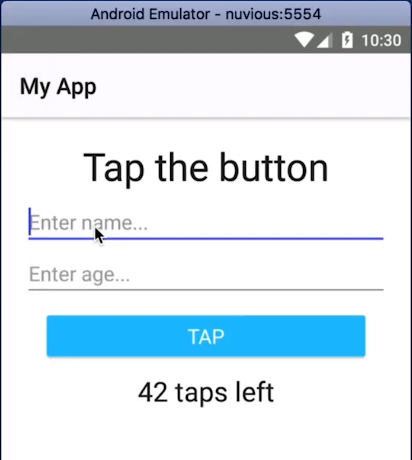

Want to make your TextFields look more or less the same on iOS and Android? This tutorial will show you how to get rid of the bottom border of a TextField in a NativeScript Android application.

<br/>

## TL;DR

Here's a video for you if you prefer watching the tutorial:

<br>


<div class="videoWrapper">
    <iframe width="560" height="315" src="https://www.youtube.com/embed/p68WkRwieKo" frameborder="0" allowfullscreen></iframe>
</div>


## Let's Dive In

When you add a TextField in your NativeScript app, by default it has no border on iOS, but on Android, there is a persistent border at the bottom. This is part of material design and it comes out of the box in NativeScript. You might find that you prefer a TextField without a border on Android as well, but getting rid of it is not so straightforward. We'll soon see how you can achieve that. The solution works in NativeScript Core, NativeScript Angular and NativeScript Vue.

<br>

First, let's take a quick look at the demo app we'll be working with:

<br>



<br>

The app contains two TextFields and as you can see both the focused and unfocused TextFields have a bottom border.

<br>

Here's the code for the Page:

<br>

```xml
<Page class="page" xmlns="http://www.nativescript.org/tns.xsd">
  <StackLayout class="p-20">
    <Label text="Tap the button" class="h1 text-center" />
    
    <TextField hint="Enter name..." />
    <TextField hint="Enter age..." />
    
    <Button text="TAP" tap="{{ onTap }}" class="btn btn-primary btn-active" />
    <Label text="{{ message }}" class="h2 text-center" textWrap="true" />
  </StackLayout
</Page>
```

<br>

Now, let's go to the CSS file and change the styling of the TextFields.

<br>

Intuitively, you might think that setting the width of the bottom border to `0` might work (with `border-bottom-width: 0` or `border-width: 0`), but that doesn't get rid of the border. To get rid of the border, add the following styling:

<br>

```css
TextField {
  border-bottom-width: 1
  border-bottom-color: transparent;
}
```

<br>

For it to work, you need both rules and the border width can't be set to `0`. The solution is a bit strange and not intuitive, but it works. As you can see below our app now has borderless TextFields:

<br>


<br>

Hopefully, you found that useful. If you have any questions or comments about the tutorial, leave them in the comments below, or get in touch with me on Twitter [@digitalix](https://twitter.com/digitalix?lang=en). You can also send me your NativeScript related questions that I can answer in video form. Use the #iScriptNative hashtag on Twitter so I can find you.

<br>

For more video tutorials about NativeScript, check out our courses on [NativeScripting.com](https://nativescripting.com/). We have courses that cover all flavors of NativeScript (Core, Angular and Vue) and that cater to different levels of experience, whether you are just beginning your journey in the NativeScript world or you have some experience with NativeScript and are looking to level up.
