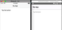
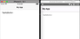
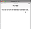
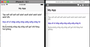

Whether you're using NativeScript Core, NativeScript Vue, or NativeScript Angular, some core widget tricks are the same, including using a `FormattedString` to separate out the sections of text in your Labels and Buttons. In this short NativeScript tutorial, we'll show you how to use a `FormattedString`, and also how to insert a newline (aka line break) in that string.

## TL;DR

For those of you that like videos, here's one for you:

<br>

<div class="videoWrapper">
    <iframe width="560" height="315" src="https://www.youtube.com/embed/evRUaPtg4TE" frameborder="0" allowfullscreen></iframe>
</div>


<br>

## Let's Get Started


This is the demo app that we'll start with: pretty simple, yes? It's just a `Label` inside a layout.

<br>



<br>

And here's the code for that:

<br>

```
<!-- main-page.xml -->

<Page xmlns="http://schemas.nativescript.org/tns.xsd" navigatingTo="navigatingTo" class="page">

  <Page.actionBar>
    <ActionBar title="My App" icon="" class="action-bar">
    </ActionBar>
  <Page.actionBar>

  <StackLayout class="p-20">
    <Label text="Tap the button" />
  </StackLayout>
</Page>
```

<br>

Now let's split up the Label text to multiple formatted strings:

<br>

```
<!-- main-page.xml -->

<Page xmlns="http://schemas.nativescript.org/tns.xsd" navigatingTo="navigatingTo" class="page">

  <Page.actionBar>
    <ActionBar title="My App" icon="" class="action-bar">
    </ActionBar>
  <Page.actionBar>

  <StackLayout class="p-20">
    <Label>
      <Label.formattedText>
        <FormattedString>
          <FormattedString.spans>
            <Span text="Tap" />
            <Span text="My" />
            <Span text="Button" />
          </FormattedString.spans>
        </FormattedString>
      </Label.formattedText>
    </Label>
  </StackLayout>
</Page>
```

<br>

If you look at the running app, the three strings will appear as the text of the label.

<br>



<br>

The advantage of separating the label's text into different sections is that each section can now be styled differently. For example, you can change the color of one of the strings:

<br>

```
<FormattedString.spans>
  <Span text="Tap" />
  <Span text="My" style="color: blue;" />
  <Span text="Button" />
</FormattedString.spans>
```

## Adding a new line to the formatted string

So far, each of the sections of the formatted string in our app appears on a single line. If we wanted a line break separating each one, how would we go about it?

<br>

Before we tackle that, let's look at the result of having a long string for each section:

<br>

```
<FormattedString.spans>
  <Span text="Tap sdf sdf adf adf adsf asdf adsf adsf adsf adsf adsf dfs" />
  <Span text="Mys df sf sfdg sdfg sfdg sdfg sdfg sfdg fd" style="color: blue;" />
  <Span text="Buttondsfg sfdg sfg sfdg sdf gsf sfd fdsg fsd gfdsg" />
</FormattedString.spans>
```

<br>

If you run the app, you will see that the long label text doesn't wrap around to a new line:

<br>



<br>

To make long label text wrap to new lines, you set `textWrap="true"` on the Label:

<br>

```
<Label textWrap="true">
  ...
</Label>
```

<br>

Now the long text wraps around:

<br>


<br>

Now, how do we get the three sections onto separate lines? Adding a newline escape character `\n` at the end of each string doesn't work. The character will appear in the running app as part of the string.

<br>

To create a newline, you have to use its hex value `&#xa;`. Below, we add two newline characters to the first two Spans:

<br>

```
<FormattedString.spans>
  <Span text="Tap sdf sdf adf adf adsf asdf adsf adsf adsf adsf adsf dfs &#xa; &#xa;" />
  <Span text="Mys df sf sfdg sdfg sfdg sdfg sdfg sfdg fd &#xa; &#xa;" style="color: blue;" />
  <Span text="Buttondsfg sfdg sfg sfdg sdf gsf sfd fdsg fsd gfdsg" />
</FormattedString.spans>
```

<br>

Now if you run the app, the different sections of the Label's text will be on different lines.

<br>



<br>

That's it, folks. That's how you add linebreaks to a formatted string. You can do this not just for labels but for any view that can use formatted strings, like buttons, for instance.

<br>

For more video tutorials about NativeScript, check out our courses on [NativeScripting.com](https://nativescripting.com). For an in-depth look at styling NativeScript applications, check out our two courses on [Styling NativeScript Core Applications](https://nativescripting.com/course/styling-nativescript-core-applications) and [Styling NativeScript with Angular Applications](https://nativescripting.com/course/styling-nativescript-with-angular-applications). You might also be interested in our [NativeScript Hands-On UI course](https://nativescripting.com/course/nativescript-hands-on-ui) that covers NativeScript user interface views and components.

<br>

Let me know what you thought of this tutorial on Twitter: [@digitalix](https://twitter.com/digitalix) or leave a comment down below. You can also send me your NativeScript related questions that I can answer in video form. If I select your question to make a video answer, I'll send you swag. Use the #iScriptNative hashtag.
