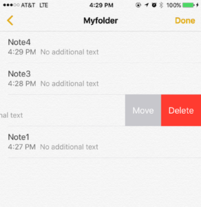

If you use or develop for iOS, you are very familiar with the swipe-to-delete move. Several built in iOS applications have this including email, notes, and reminders. The NativeScript ListView uses the iOS UITableView in the background, but it doesn’t yet let us program this maneuver. That is until you watch this tutorial…

#### Related Resources

* [NativeScript Editable ListView Video Tutorial](https://youtu.be/u-ZmCZPEIwY)

<div class="videoWrapper">
    <iframe width="560" height="315" src="https://www.youtube.com/embed/u-ZmCZPEIwY" frameborder="0" allowfullscreen></iframe>
</div>

This video tutorial shows you how to easily add ‘editability’ to the ListView component, like the iOS Notes app screenshot below demonstrates (minus the ‘move’ option).



The key code from the video is listed below.

**_myds.ts_**

```
import {ListView} from “ui/list-view”;
export class MyDataSource extends NSObject implements UITableViewDataSource {
    public static ObjCProtocols = [UITableViewDataSource];
    private owner: WeakRef<ListView>;
    private oldDataSource;
    public static initWithOwner(owner: WeakRef<ListView>): MyDataSource {
        let dataSource = new MyDataSource();
        dataSource.owner = owner;
        dataSource.oldDataSource = owner.get().ios.dataSource;
        return dataSource;
    }
    public tableViewNumberOfRowsInSection(tableView, section: number) {
        return this.oldDataSource.tableViewNumberOfRowsInSection(tableView, section);
    }
   public tableViewCellForRowAtIndexPath(tableView, indexPath) {
        return this.oldDataSource.tableViewCellForRowAtIndexPath(tableView, indexPath);
    }
    public tableViewCommitEditingStyleForRowAtIndexPath(tableView, editingStyle, indexPath) {
        if (typeof (this.oldDataSource.tableViewCommitEditingStyleForRowAtIndexPath) != ‘undefined’) {
            return this.oldDataSource.tableViewCommitEditingStyleForRowAtIndexPath(tableView, editingStyle, indexPath);
        }
        if (editingStyle == UITableViewCellEditingStyle.UITableViewCellEditingStyleDelete) {
            var owner = this.owner.get();
            if (owner) {
                owner.items.splice(indexPath.row, 1);
                tableView.deleteRowsAtIndexPathsWithRowAnimation([indexPath], UITableViewRowAnimation.UITableViewRowAnimationFade);
            }
        }
    };
}
```

**_main-page.ts (partial)_**

```
export function navigatingTo(args: EventData) {
    var page = <Page>args.object;
    page.bindingContext = this;
    listView = <ListView> page.getViewById(“myListView”);
    if (listView.ios)
        listView.ios.dataSource = MyDataSource.initWithOwner(new WeakRef(listView));
}
```

Happy Coding!
