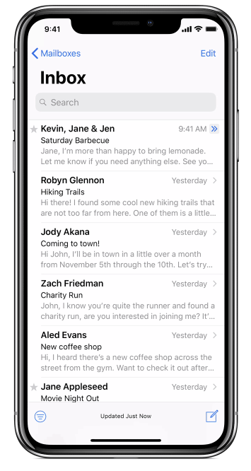
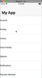
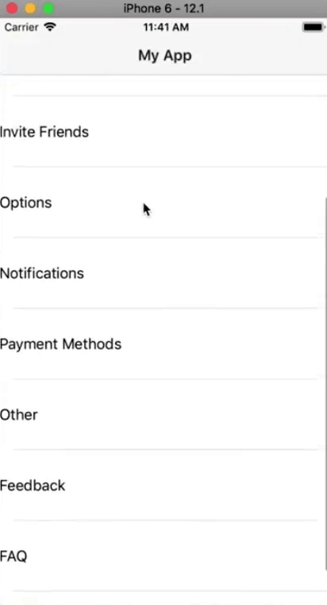

In this NativeScript tutorial, we'll show you how to add a collapsible Search Bar to your iOS app's Navigation Bar.

<br>

Here's a video of the tutorial if you prefer a more visual medium:

<br>

<div class="videoWrapper">
    <iframe width="560" height="315" src="https://www.youtube.com/embed/-LDDFh7EQOo" frameborder="0" allowfullscreen></iframe>
</div>

<br><br>


## Introduction

In a previous article, we showed you [how to add large collapsible titles](https://nativescripting.com/posts/how-to-use-ios-large-titles) to your iOS Navigation Bar. This is a UI feature that was introduced in iOS 11. Other than the large title, some apps come with a Search Bar that is part of the collapsible Navigation Bar. You can see this in the mail app:

<br>



<br>

This feature isn't yet supported out-of-the-box in NativeScript, but we can use JavaScript to control the native iOS APIs and thus get the collapsible Search Bar.

The collapsing Search Bar is an iOS-specific design pattern. You can certainly use code to get the same effect on Android, but if you want a simple search bar, you can use the Android scoped NativeScript SearchBar instead. We'll show you how to add one to your app. The tutorial only covers adding a search bar to your app's UI and not making it fully functional so that it returns search results.

## Adding the Search Bar

We made a few changes to the demo app from the [previously mentioned article](https://nativescripting.com/posts/how-to-use-ios-large-titles). It still has the collapsible large title that we added, but we removed the ScrollView and added a ListView instead. You can see the app and its code below:

<br>



<br>

```xml
<!-- main-page.xml -->

<Page xmlns="http://schemas.nativescript.org/tns.xsd" navigatingTo="navigatingTo" class="page" loaded="onLoaded">
  <Page.actionBar>
    <ActionBar title="My App" icon="" class="action-bar">
    </ActionBar>
  </Page.actionBar>
  
  <ListView items="{{ items }}" height="100%">
    <ListView.itemTemplate>
      <Label text="{{ text }}" height="80"/>
    </ListView.itemTemplate>
  </ListView>
</Page>
```

<br>

```typescript
// main-view-model.ts

import { Observable } from "tns-core-modules/data/observable";

interface Item {
  itemType: string;
  icon: string;
  text: string;
}

export class HelloWorldModel extends Observable {
  public items: Array<Item> = require('./settings.json');
  
  constructor() {
    super();
  }
}
```

<br>

```typescript
// main-page.ts

import { EventData } from "tns-core-modules/data/observable";
import { Page } from "tns-core-modules/ui/page";
import { HelloWorldModel } from "./main-view-model";
import { isIOS } from "tns-core-modules/platform";

// Event handler for Page "navigatingTo" event attached in main-page.xml
export function navigatingTo(args: EventData) {
  const page = <Page>args.object;
  page.bindingContext = new HelloWorldModel();
}

export function onLoaded(args: EventData) {
  const page = <Page>args.object;
  
  if (isIOS) {
    page.frame.ios.controller.navigationBar.prefersLargeTitles = true;
  }
}
```

### On Android

We'll only add a collapsing Search bar on iOS since that is mostly an iOS-specific design pattern. On Android, if you wanted to add a Search Bar to your UI, you would do it as shown below:

<br>

```xml
<!-- main-page.xml -->

<Page xmlns="http://schemas.nativescript.org/tns.xsd" navigatingTo="navigatingTo" class="page" loaded="onLoaded">
  <Page.actionBar>
    <ActionBar title="My App" icon="" class="action-bar">
    </ActionBar>
  </Page.actionBar>
  
  <StackLayout>
    <android>
      <SearchBar id="searchBar" />
    </android>
    <ListView items="{{ items }}" height="100%">
      <ListView.itemTemplate>
        <Label text="{{ text }}" height="80"/>
      </ListView.itemTemplate>
    </ListView>
  </StackLayout>
</Page>
```

<br>

We add the SearchBar widget and ensure that it only appears on Android by placing it inside `android` tags.

### On iOS

Now, let's add the Search Bar on iOS.

<br>

```typescript
// main-page.ts

import { EventData } from "tns-core-modules/data/observable";
import { Page } from "tns-core-modules/ui/page";
import { HelloWorldModel } from "./main-view-model";
import { isIOS } from "tns-core-modules/platform";

// Event handler for Page "navigatingTo" event attached in main-page.xml
export function navigatingTo(args: EventData) {
  const page = <Page>args.object;
  page.bindingContext = new HelloWorldModel();
}

export function onLoaded(args: EventData) {
  const page = <Page>args.object;
  
  if (isIOS) {
    const navCtrl = page.frame.ios.controller as UINavigationController;
    navCtrl.navigationBar.prefersLargeTitles = true;
    
    const sC = UISearchController.alloc().initWithSearchResultsController(null);
    
    const ctrl = navCtrl.topViewController;
    ctrl.navigationItem.searchController = sC;
  }
}
```

<br>

We've modified the previous statement `page.frame.ios.controller.navigationBar.prefersLargeTitles = true;` and are now first saving the `UINavigationController` into a variable before using it to enable large titles. By the way, if you want to have IntelliSense when using native APIs, you should add [tns-platform-declarations](https://www.npmjs.com/package/tns-platform-declarations) to your project. [Here is a tutorial](https://www.youtube.com/watch?v=vz7qfpeghFs) on how to do that.

<br>

Next, we create an instance of `UISearchController` and use `topViewController` to grab the view controller at the top of the navigation stack. We then get its navigation item and set its search controller to the `UISearchController` that we had created.

<br>

If you run the app, you'll see the Search Bar appear when you scroll downward and collapse when you scroll upward.

<br>



<br>

You can also choose to have the Search Bar on the screen at all times by adding the following statement:

<br>

```typescript
ctrl.navigationItem.hidesSearchBarWhenScrolling = false;
```

<br>

We hope you've enjoyed this short tutorial. We are creating a series of iOS-focused NativeScript tutorials, so look out for those. Here are some of the posts in the series. We'll be adding to the collection in the coming weeks.

<br>

- [How to Add SHADOWS in iOS](/posts/how-to-add-shadows-in-ios)
- [How to Use iOS Large Titles](/posts/how-to-use-ios-large-titles)
- [How to Create iOS Podcast Cover Art Animation with Inheriting Shadow Color](/posts/how-to-create-ios-podcast-cover-art-animation-with-inheriting-shadow-color)
- How to Use iOS Collapsing SearchBar
- [Translucent Tabs in iOS](/posts/translucent-tabs-in-ios)

<br>

Let me know what you thought of this tutorial on Twitter: [@digitalix](https://twitter.com/digitalix) or leave a comment down below. You can also send me your NativeScript related questions that I can answer in video form. If I select your question to make a video answer, I'll send you swag. Use the #iScriptNative hashtag.

<br>

For more tutorials on NativeScript, check out our courses on [NativeScripting.com](https://nativescripting.com). We have a [NativeScript Hands-On UI course](https://nativescripting.com/course/nativescript-hands-on-ui) that covers NativeScript user interface, views and components. You might also be interested in the following two courses on styling NativeScript applications: [Styling NativeScript Core Applications](https://nativescripting.com/course/styling-nativescript-core-applications) and [Styling NativeScript with Angular Applications](https://nativescripting.com/course/styling-nativescript-with-angular-applications).
