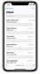
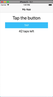
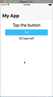
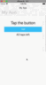

In this tutorial, you will learn how to create a large collapsible animated title on iOS — a native platform effect introduced in iOS 11.

<br>

If you prefer a video tutorial, here's one for you:

<br>

<div class="videoWrapper">
    <iframe width="560" height="315" src="https://www.youtube.com/embed/N9TjpXxf_lw" frameborder="0" allowfullscreen></iframe>
</div>

<br><br>

## Introduction

When iOS 11 came out, some of the apps that come with iOS had this large animated title that's part of the collapsible action bar.

<br>



<br>

This feature isn't yet supported out-of-the-box in NativeScript, but luckily, we can use JavaScript to control the native iOS APIs and thus get our large titles on. We'll do exactly this in this NativeScript tutorial.

## Adding a Large Title in a NativeScript iOS App

We'll start off with the usual starter app:

<br>



<br>

First add a `loaded="onLoaded"` event to the page.

<br>

```xml
<!-- main-page.xml -->

<Page xmlns="http://schemas.nativescript.org/tns.xsd" navigatingTo="navigatingTo" class="page" loaded="onLoaded">
  <Page.actionBar>
    <ActionBar title="My App" icon="" class="action-bar">
    </ActionBar>
  </Page.actionBar>
  
  <StackLayout class="p-20">
    <Label text="Tap the button" class="h1 text-center"/>
    <Button text="TAP" tap="{{ onTap }} class="btn btn-primary btn-active"/>
    <Label text="{{ message }}" class="h2 text-center" textWrap="true"/>
  </StackLayout>
</Page>
```

<br>

In the page's code file, we implement the `onLoaded` handler.

<br>

```typescript
// main-page.ts

import { EventData } from "tns-core-modules/data/observable";
import { Page } from "tns-core-modules/ui/page";
import { HelloWorldModel } from "./main-view-model";
import { isIOS } from "tns-core-modules/platform";

// Event handler for Page "navigatingTo" event attached in main-page.xml
export function navigatingTo(args: EventData) {
  const page = <Page>args.object;
  page.bindingContext = new HelloWorldModel();
}

export function onLoaded(args: EventData) {
  const page = <Page>args.object;
  
  if (isIOS) {
    page.frame.ios.controller.navigationBar.prefersLargeTitles = true;
  }
}
```

<br>

We first ensure that the code to enable large titles only runs on iOS with `isIOS` to prevent it from crashing on Android.

<br>

You might be wondering why we didn't enable the large title in `navigatingTo`. Here, the Page object would have no frame, therefore running `page.frame` would return `null`. We can get a reference to a Frame only for a frame that has already been loaded in the visual tree.

<br>

We then grab the Navigation Bar and set its `navigationBar` property to `true`.

<br>

Voila! We have a large title:

<br>



<br>

With the above code, we also get the collapsing effect on the title. Let's add a ScrollView to the page to test this out.

<br>

```xml
<!-- main-page.xml -->

<Page xmlns="http://schemas.nativescript.org/tns.xsd" navigatingTo="navigatingTo" class="page" loaded="onLoaded">
  <Page.actionBar>
    <ActionBar title="My App" icon="" class="action-bar">
    </ActionBar>
  </Page.actionBar>
  
  <ScrollView>
    <StackLayout class="p-20" height="1000">
      <Label text="Tap the button" class="h1 text-center"/>
      <Button text="TAP" tap="{{ onTap }} class="btn btn-primary btn-active"/>
      <Label text="{{ message }}" class="h2 text-center" textWrap="true"/>
    </StackLayout>
  </ScrollView>
</Page>
```

<br>

We give the almost empty ScrollView some `height` so that we are able to scroll.

<br>

On scrolling, you can see the title expand and collapse.

<br>



<br>

And that's it! With a single line of code, we've added a large title that collapses and expands on scrolling, with a nice smooth animation to boot.

<br>

We hope you've enjoyed this short tutorial. We are creating a series of iOS-focused NativeScript tutorials, so look out for those. Here are some of the posts in the series. We'll be adding to the collection in the coming weeks.

<br>

- [How to Add SHADOWS in iOS](/posts/how-to-add-shadows-in-ios)
- How to Use iOS Large Titles
- [How to Create iOS Podcast Cover Art Animation with Inheriting Shadow Color](/posts/how-to-create-ios-podcast-cover-art-animation-with-inheriting-shadow-color)
- [How to Use iOS Collapsing SearchBar](/posts/how-to-use-ios-collapsing-searchbar)
- [Translucent Tabs in iOS](/posts/translucent-tabs-in-ios)


<br>

Let me know what you thought of this tutorial on Twitter: [@digitalix](https://twitter.com/digitalix) or leave a comment down below. You can also send me your NativeScript related questions that I can answer in video form. If I select your question to make a video answer, I'll send you swag. Use the #iScriptNative hashtag.

<br>

For more tutorials on NativeScript, check out our courses on [NativeScripting.com](https://nativescripting.com). We have a [NativeScript Hands-On UI course](https://nativescripting.com/course/nativescript-hands-on-ui) that covers NativeScript user interface, views and components. You might also be interested in the following two courses on styling NativeScript applications: [Styling NativeScript Core Applications](https://nativescripting.com/course/styling-nativescript-core-applications) and [Styling NativeScript with Angular Applications](https://nativescripting.com/course/styling-nativescript-with-angular-applications).
