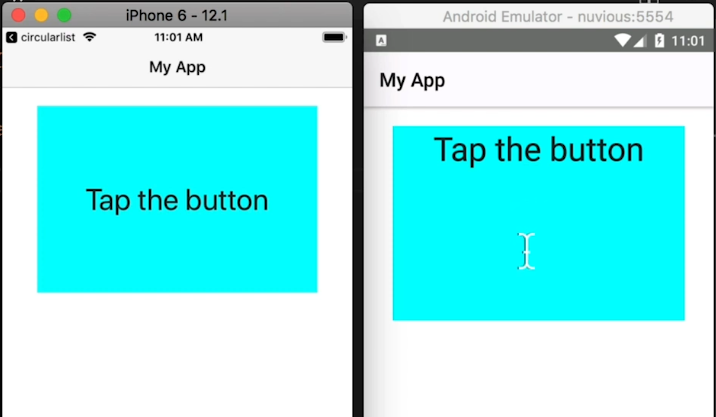
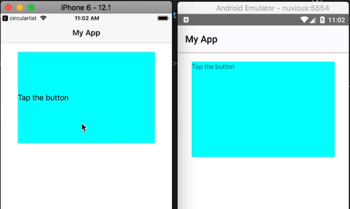
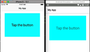

The <code>verticalAlignment</code> property doesn't work with Label text in Android in your NativeScript apps. So how do you vertically center text in a NativeScript Label on Android? This short tutorial will show you a workaround that will accomplish this.

## TL;DR

If you prefer watching a video of this tip, here it is:

<br>

<div class="videoWrapper">
    <iframe width="560" height="315" src="https://www.youtube.com/embed/ozhOETzdTgw" frameborder="0" allowfullscreen></iframe>
</div>


## Okay, Let's Do This

On Android, the `vertical-align` CSS property doesn't quite work for NativeScript Labels when it comes to centering text. This is really annoying, especially because it DOES work on iOS. Let's see how we can resolve this to get a consistent look across the two platforms.

<br>

First, let's look at the demo app.

<br>

Here's the code:

<br>

```xml
<!-- main-page.xml -->

<Page xmlns="http://schemas.nativescript.org/tns.xsd" navigatingTo="navigatingTo" class="page">

  <Page.actionBar>
    <ActionBar title="My App" icon="" class="action-bar">
    </ActionBar>
  <Page.actionBar>

  <StackLayout class="p-20">
    <Label text="Tap the button" class="h1 text-center" />
  </StackLayout>
</Page>
```

<br>

Notice we are using NativeScript theme classes here (`h1 text-center`).

<br>

And the styling:

<br>

```css
// app.css

import '~nativescript-theme-core/css/core.light.css';

Label {
  background-color: aqua;
  height: 200;
  width: 300;
}
```

<br>

Here's the resulting app on iOS and Android:

<br>



<br>

As you can see, on iOS the label's text is centered vertically and horizontally while on Android it is centered horizontally but not vertically.

<br>

Let's try removing the `text-center` coming from the theme and see what we get.

<br>

```xml
<Label text="Tap the button" />
```

<br>



<br>

By removing `text-center` we've lost horizontal centering on both platforms. Let's try adding this back by using `text-align` in our styles:

<br>

```css
Label {
  background-color: aqua;
  height: 200;
  width: 300;
  text-align: center;
  font-size: 30
}
```

<br>

With that, we get the same result as before:

<br>


<br>

To center the Android text vertically, you might think that setting a `vertical-align: middle` rule might work, but it wont. Neither will applying `verticalAlign="middle"` or `verticalAlign="center"` or `verticalAlignment="middle"` or `verticalAlignment="center"` attributes to the label.

<br>

As you can see, it's not so straightforward to get the Android Label's text to align vertically. To work around this, first add a `loaded` event on the Label.

<br>

```xml
<Label text="Tap the button" class="h1 text-center" loaded="onLabelLoaded" />
```

<br>

Then add the following to the Page's code file:

<br>

```typescript
// main-page.ts

...
import { Label } from 'tns-core-modules/ui/label';
import { isAndroid } from 'tns-core-modules/platform';

...

export function onLabelLoaded(args: EventData) {
  const lbl = args.object as Label;
  if (isAndroid) {
    lbl.android.setGravity(17)
  }
}
```

<br>

In `onLabelLoaded()`, we first check to see if the code is running on Android and then set a gravity of `17` on the label (which we get from the event object that was passed into the function). `setGravity()` places an object within a potentially larger container, with the placement determined by the constant passed in. We pass the constant `17` into `setGravity()`, which will [center the text](https://developer.android.com/reference/android/view/Gravity.html#CENTER), both vertically and horizontally, in its container (i.e. the Label). You can [look at the documentation](https://developer.android.com/reference/android/view/Gravity#summary) for other constants you can use.

<br>

Now if you run the app, the label's text should be aligned both vertically and horizontally on the two platforms:

<br>



<br>

And that's it! Hope you found that useful.

<br>

For more NativeSript tutorials, be sure to check out [NativeScripting.com](https://nativescripting.com). We offer NativeScript courses for NativeScript Core, Angular and Vue.

<br>

Let me know if you enjoyed this tutorial on Twitter: [@digitalix](https://twitter.com/digitalix?lang=en) or comment down below. You can also send me your NativeScript related questions that I can answer in video form. If I select your question to make a video answer, I'll send you swag. Use the hashtag #iScriptNative.
