In iOS 7, we saw the introduction of the `topLayoutGuide` and `bottomLayoutGuide` UIViewController properties that described the screen area not covered by content (i.e. status bar, navigation bar, toolbar, tab bar, etc.). These were deprecated in iOS 11 and in their place, Apple introduced safe areas. Safe areas help you place your views within the visible portion of the overall interface, unobscured by bars, the notch and other content.

<br>

**Note:** If you want to see a video of this tutorial, you can watch it on YouTube here:

<div class="videoWrapper">
    <iframe width="560" height="315" src="https://www.youtube.com/embed/XC4Z5r_z7W0" frameborder="0" allowfullscreen></iframe>
</div>

<br>

In this tutorial, we are going to look at how to work with safe areas in a NativeScript app. You'll learn how to use safe areas in layouts as well as with regular views and you'll see the attributes you need to apply to stretch or not stretch your views beyond the safe areas of iOS devices.

## iOS Safe Areas

Safe areas were introduced to deal with the fact that your UI can now extend to all areas of a full-screen device and thus be possibly obscured by the notch or interfere with the home status indicator or the status bar.

<br>

Safe area margins depend on the device and the orientation the device is in. Below, you can see the safe area of an iPhone in portrait mode. The light red portion is considered safe, while the darker areas at the top and bottom are considered unsafe. The safe area is the area you can place content and be confident that it won't interfere with the rounded corners, the notch, the status bar or the home indicator.

<br>

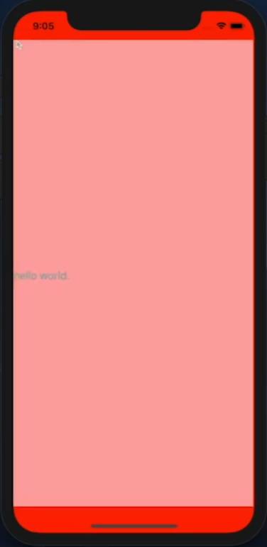

<br>

In the demo app shown below, the GridLayout extends into the unsafe areas (we'll explore this later when we add an image to the view).

<br>

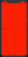

<br>

Here's the code for that page:

<br>

```xml
<GridLayout class="page" backgroundColor="red">
  <Label text="hello world."></Label>
</GridLayout>
```

<br>

Starting from NativeScript 5, some views were designated as layouts and others as content. Layout views (like the GridLayout in our example), extend to the unsafe areas, while content views do not. If we switch from using a GridLayout to using a StackLayout in our app, the `hello world.` text will be positioned at the top-left of the view, just below the safe/unsafe area margin.

<br>

```xml
<StackLayout class="page" backgroundColor="red">
  <Label text="hello world."></Label>
</StackLayout>
```

<br>

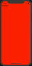

## Working with Unsafe Areas

To explore how we can work with Unsafe areas, let's switch back to the GridLayout and add an image background to the app.

<br>

```xml
<GridLayout class="page" backgroundColor="red">
  <Image stretch="aspectFill" src="https://thumbor.forbes.com/thumbor/711x533/https://blogs-images.forbes.com/laurabegleybloom/files/2018/06/Bali-Sunset-JetsetChristina-Single-Fin-Uluwatu-Bali-1200x900.jpg?width=960"></Image>
  <Label text="hello world."></Label>
</GridLayout>
```

<br>

We set `stretch="aspectFill"` to make the image stretch to the edges of the device.

<br>

Below, you can see the app so far. Notice that the image doesn't stretch to the unsafe areas. This is because images are considered content.

<br>

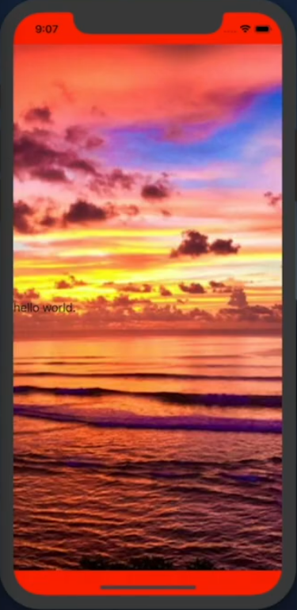

<br>

Below, you can see what the unsafe areas look like in landscape:

<br>

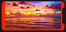

<br>

Since we are using the image as a background in the app, we want it to overflow the safe area and fill the whole screen. We do this by setting `iosOverflowSafeArea` to `true`.

<br>

```xml
<Image stretch="aspectFill" iosOverflowSafeArea="true" src="https://thumbor.forbes.com/thumbor/711x533/https://blogs-images.forbes.com/laurabegleybloom/files/2018/06/Bali-Sunset-JetsetChristina-Single-Fin-Uluwatu-Bali-1200x900.jpg?width=960"></Image>
```

<br>

Now the image extends to the edges of the device.

<br>

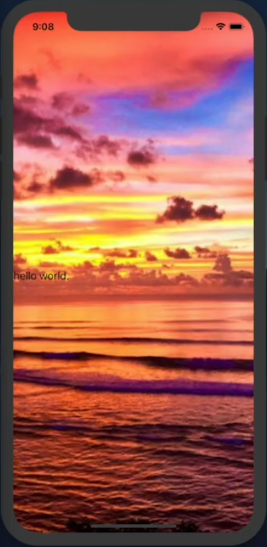

<br>

You get the same effect in landscape:

<br>

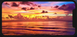

<br>

Now let's look at how a ListView behaves with unsafe areas.

<br>

```xml
<GridLayout class="page" backgroundColor="red">
  <Image stretch="aspectFill" iosOverflowSafeArea="true" src="https://thumbor.forbes.com/thumbor/711x533/https://blogs-images.forbes.com/laurabegleybloom/files/2018/06/Bali-Sunset-JetsetChristina-Single-Fin-Uluwatu-Bali-1200x900.jpg?width=960"></Image>
  
  <ListView height="100%" [items]="items" class="list-group">
    <ng-template let-item="item">
      <Label [nsRouterLink]="['/item', item.id]" [text] = "item.name">
        class="list-group-item"></Label>
    </ng-template>
  </ListView>
</GridLayout>
```

<br>

If you run the above code, you will notice that the ListView extends to the unsafe areas.

<br>

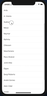

<br>

That is not ideal as you will sometimes get the ListView text overlapping with the status bar text. There are a number of ways you could fix this. You could, for instance, place the ListView in a GridLayout and set its height explicitly. We are going to do it differently, as shown below:

<br>

```xml
<GridLayout class="page" backgroundColor="red">
  <Image stretch="aspectFill" iosOverflowSafeArea="true" src="https://thumbor.forbes.com/thumbor/711x533/https://blogs-images.forbes.com/laurabegleybloom/files/2018/06/Bali-Sunset-JetsetChristina-Single-Fin-Uluwatu-Bali-1200x900.jpg?width=960"></Image>
  
  <StackLayout>
    <StackLayout style="background-color: blue;" height="1"></StackLayout>
    <ListView height="100%" [items]="items" class="list-group">
      <ng-template let-item="item">
        <Label [nsRouterLink]="['/item', item.id]" [text] = "item.name">
          class="list-group-item"></Label>
      </ng-template>
    </ListView>
  </StackLayout>
</GridLayout>
```

<br>

In the above code, we placed the ListView inside a StackLayout and added another StackLayout above it with a height of `1`. Any view that touches the safe area will automatically be extended to the edges of the device. We add a `blue` color to the view just so you can see this. As you can see below, the ListView no longer extends to the top edges of the device.

<br>

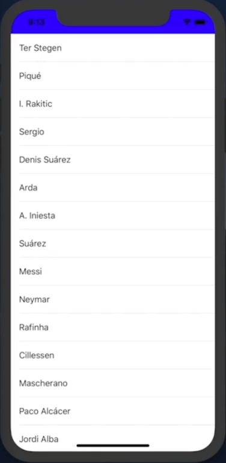

<br>

Let's try a final UI experiment.

<br>

```xml
<GridLayout class="page" backgroundColor="red">
  <Image stretch="aspectFill" iosOverflowSafeArea="true" src="https://thumbor.forbes.com/thumbor/711x533/https://blogs-images.forbes.com/laurabegleybloom/files/2018/06/Bali-Sunset-JetsetChristina-Single-Fin-Uluwatu-Bali-1200x900.jpg?width=960"></Image>
  
  <StackLayout>
    <GridLayout rows="*, auto" columns="">
      <Button text="Done" iosOverflowSafeArea="true" style="padding-bottom: 20; background-color: red;">
    </GridLayout>
  </StackLayout>
</GridLayout>
```

<br>

The above creates a button that always sits at the bottom of the UI and extends to the edges.

<br>

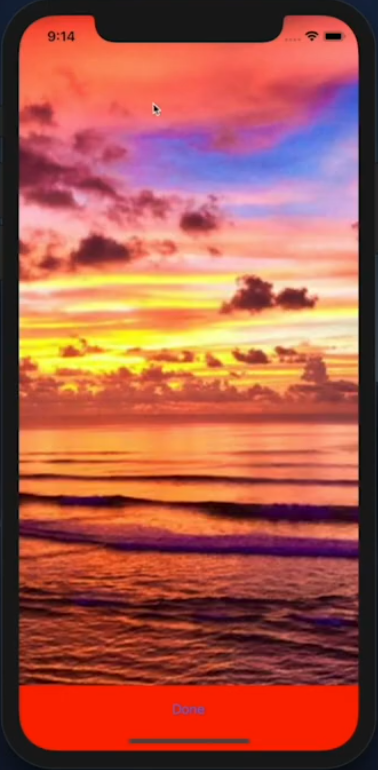

<br>

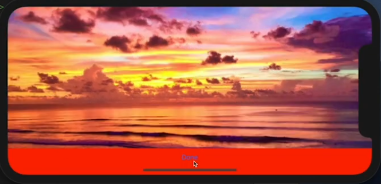

<br>

I hoped you learned from this brief overview of the way NativeScript handles the safe areas in iOS.

<br>

If you have any questions or comments about the tutorial, leave them in the comments below, or get in touch with me on Twitter [@davecoffin](https://twitter.com/davecoffin) or Alex [@digitalix](https://twitter.com/digitalix?lang=en).

<br>

For more video tutorials about NativeScript, check out the courses on [NativeScripting.com](https://nativescripting.com). You'll find courses that cover all flavors of NativeScript (Core, Angular and Vue) and that cater to different levels of experience, whether you are just beginning your journey in the NativeScript world or you have some experience with NativeScript and are looking to level up.
