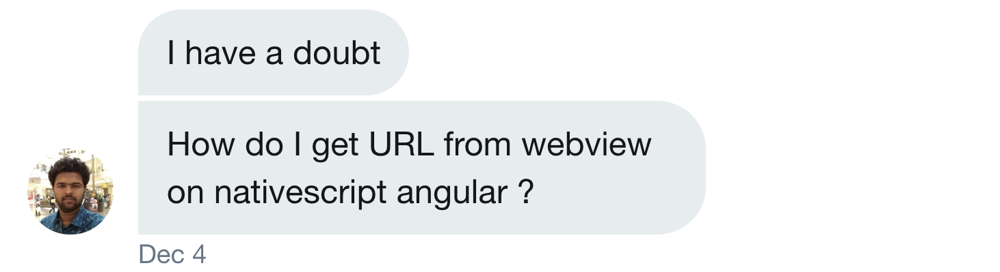

In this issue of _I Script Native_, Gokul, a NativeScripting student, asked how to detect and respond to URLs being loaded in a WebView component in NativeScript with Angular.

  

  

As it happens, I've also recently been using these techniques myself when I was working on the new [NativeScript OAuth2 plugin](https://market.nativescript.org/plugins/nativescript-oauth2) that needs URL detection when loading a page in a WebView. The [NativeScript docs](https://docs.nativescript.org/ui/ns-ui-widgets/web-view) also go into this, but I think it's really helpful to actually **see** how someone does this in a real app.

  

So to answer this question, and as the inaugural video answer in the _I Script Native_ series, I've posted up a YouTube video showing exactly how to get this done in a NativeScript with Angular app.

  

    <iframe width="560" height="315" src="https://www.youtube.com/embed/e5IxqIazEuY" frameborder="0" allowfullscreen></iframe>

  

I show more details about the WebView and the HtmlView, and when to use each one of these in my [NativeScript Hands-On UI course](https://nativescripting.com/course/nativescript-hands-on-ui/) that's available here.

  

For more video tutorials about NativeScript, look at our courses on [NativeScripting.com](https://nativescripting.com).

  

You can ask me questions on Twitter with the #iscriptnative tag, or by tweeting at me: <a href="https://twitter.com/digitalix" target="_blank">@digitalix</a>, or comment here. If I select your question to make a video answer, I'll send you swag.

  
