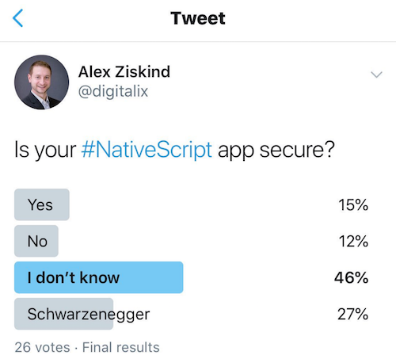

You've built a mobile app. But is it secure?
  

There are many resources out there for learning how to do great things with NativeScript, whether it's UI, or animations, or performance. These are all important things to know.

 

There is one are that's often left out in the cold when it comes time to build and release an mobile app - and that's **Security**.

 

## Problem? What problem?

I recently ran a simple Twitter poll that showed me not most folks **don't know** or don't care whether their apps are secure or not. I chuckle to myself when I think about asking each of these folks whether they think security is *important* and I can pretty much say with certainty that their answer would be "Yes".

  

  

So how do we fill the huge gap in knowledge between developers that admit to not knowing how to secure their apps and knowing that they need to secure their apps?

  

Well, I thought a video course is a good place to start, so I'm totally thrilled to announce that after a year in the making, I've just published [Securing NativeScript Applications](https://nativescripting.com/course/securing-nativescript-applications).

  

## What's in the course?

This course is a practical guide on how to accomplish certain security related tasks in the NativeScript framework. Here are some topics that are covered.

> _Click on the overviews for each chapter to see a preview of each._

### Introduction

- OWASP Mobile Top 10
- Client and Server Security
- Terminology
- Code Files

### Basic Login and Registration

- App Auth Page
- Logging In
- Maintaining Auth State

### Backend Setup

- About HTTPS
- Building a Backend
- Serving API Data
- Auth API Routes
- Auth Client Setup

### Resource Protection with JWT

- Hashing and Salting
- Generating JWT
- Storing JWT on the Client
- Protecting Data with JWT
- Token Expiration

### HTTPS with SSL Pinning

- Server Side Certificate
- Installing Cert on the Client
- Enabling SSL Pinning

### Auth with External Providers

- OpenId Connect and OAuth2
- Authorization Code
- OAuth2 in Native Mobile Apps
- App UI Prep
- NativeScript OAuth2 Setup
- Register App and Activate Login
- Fetching Third Party Resources
- Azure AD OAuth2 Example

### Securing with Auth0

- Domain Setup
- Registration
- Configuration
- Authorizing
- Activating Provider
- Auth0 as Identity Provider

### Client Data Protection

- Serverless Proxy: Local Setup
- Serverless Proxy: Client Setup
- Serverless Proxy: Example
- Serverless Proxy: Local Settings
- Serverless Proxy: Deployment
- Token Storage: App Settings
- Token Storage: Local Storage and Session Storage
- Token Storage: Secure Storage

### Code Protection

- Deobfuscation
- Uglify
- Jscrambler Introduction
- Webpack Obfuscator
- Jscrambler Options

### Other Security Considerations

- NPM Package Vulnerabilities
- Snyk

 

This course is meant to show you some available options when it comes to securing your Nativescript apps, but it’s by far not an exhaustive set of guidelines.
Using this course, you can cherry pick which security-related tasks you will implement for your own projects in your organizations, and always consult with a security expert to ensure your app scenario is well covered.
  

## Do I need your help?

I've been making video courses on NativeScripting for just over a year and I've created a few free courses and a few paid ones. There are a ton of folks taking the free courses all over the world. I'm just starting my Twitter following, and I don't really use Facebook so I can only share this important message with a limited number of people by myself.

 

It would be really awesome and would help me a lot if you share this announcement on social media, especially since being secure is a really good for your friends too! 

<a href="https://twitter.com/home?status=Securing%20NativeScript%20Applications%20is%20a%20new%20course%20from%20%40digitalix,%20OAuth2,%20JWT,%20SSL,%20and%20scrambling.%20Check%20it%20out!%20%E2%86%92%20https%3A//nativescripting.com/course/securing-nativescript-applications">Tweet </a>&nbsp;<a href="https://www.facebook.com/sharer/sharer.php?u=https%3A%2F%2Fnativescripting.com/course/securing-nativescript-applications">Facebook Share</a>&nbsp;or send a friend or colleague over to learn <a href="https://nativescripting.com/course/securing-nativescript-applications">Securing NativeScript Applications</a>.

  

This course, [that can be found here on NativeScripting](https://nativescripting.com/course/nativescript-hands-on-ui), landed on January 10, 2019 with all the lessons available immediately, so you can binge it.
  

So go grab it while it's hot.
  

## Is there a Security Webinar coming up?

If you want to know more about best practices for securing your mobile apps, and you're reading this before January 23, 2019, then come join the webinar on the subject. You can register <a href="https://www.progress.com/campaigns/kinvey/best-practices-for-securing-your-mobile-apps?utm_medium=listings&utm_source=nativescripting&utm_campaign=kinvey-webinar-secureapps" target="_blank">right here</a>.

  

Let me know about your experience with NativeScripting, or if you have any questions. Usually you'll find me hanging out on Twitter, I'm [@digitalix](https://twitter.com/intent/user?screen_name=digitalix).
