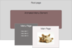
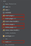
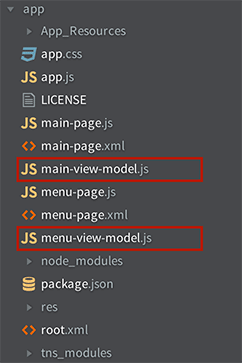

A navigation pattern for mobile apps that is still pretty hot at the time of this writing is a side drawer that playfully slides out like the one in the [Telerik NEXT app](https://github.com/NativeScript/sample-TelerikNEXT). Or a navigation page that gets revealed as main content slides out of the way, like the Facebook and Spotify apps. This allows many more options to be shown than would fit on a tab bar. 

Since this UI element is not available out of the box yet, I decided to take a stab at building one. This post will show you how I've done it. 


#### Versions used in this post 

* NativeScript: 1.0.1

#### Related Resources

* [NativeScript Animated Menu NPM Module](https://www.npmjs.com/package/nativescript-animated-menu)
* [GitHub repository with the animated menu module code](https://github.com/alexziskind1/nativescript-animated-menu-demoapp)
* [GitHub repository with the demo app that uses the animated menu](https://github.com/alexziskind1/nativescript-animated-menu-demoapp)

#### Update December 28, 2017

This article, while great, is a bit outdated. The NativeScript team has since released a really nice alternative to this menu that is also cross-platform. It is part of the free NativeScript Pro UI plugin, and soon will be available as a stand-alone menu plugin. [Here is the NPM package](https://www.npmjs.com/package/nativescript-pro-ui) with documentation. 

If you have a Pluralsight subscription, then you can check out the [NativeScript course](https://www.pluralsight.com/courses/nativescript-cross-platform-native-mobile-apps) to see how to implement the menu. 

My [NativeScript with Angular Pro course](https://nativescripting.com/course/nativescript-with-angular-pro) and [NativeScript Core Pro course](https://nativescripting.com/course/nativescript-core-pro) on NativeScripting.com also show how to implement this menu, as well as many other techniques using NativeScript.

This article is still useful to show you how to do some advanced customizations in iOS, so feel free to come back here and use it as an advanced reference once you've already picked up some knowledge at the places mentioned above.

> **Note:** There are some animation pieces in the module that are iOS only, but they can easily be augmented with their Android equivalents and since this [project is open sourced on GitHub](https://github.com/alexziskind1/nativescript-animated-menu-demoapp), I hope someone will make those Android additions. 

> The key to making this work is being able to dynamically load pages that are automatically bound to their code by NativeScript

I tried several configurations before deciding on a method that offers the most flexibility. There are a few things that I thought were necessary.

* Smooth animation to reveal the menu
* Give the developer the ability to use already proven and familiar steps to design each page. 
    1. Use XML to layout the main content and navigation pages
    2. Allow separate CSS styling for the main and menu pages
    3. Allow the same MVVM pattern that we've seen since the NativeScript Hello World days, where a separate view model can be bound to the main and menu pages individually
* Abstract all the dirty details into a NativeScript module and make it available as an NPM package

## Animated Menu in Action

You can [download the demo app](https://github.com/alexziskind1/nativescript-animated-menu-demoapp) that shows this animated menu in action. Or you can attempt to build an app yourself following the steps below. 

**Note:** Make sure you have NativeScript installed. If you don't, follow the [steps here](http://docs.nativescript.org/setup/ns-cli-setup/ns-setup-os-x.html). 

### The Setup

Create a new NativeScript project from a directory of your choice, this will create a directory called _animatedmenudemo_ and populate some NativeScript related base code and directory structure.

```
tns create animatedmenudemo
```

Change directory to your new project

```
cd animatedmenudemo
```

Add the iOS platform to your project

```
tns platform add ios
```

Install the nativescript-animated-menu module via NPM

```
npm install nativescript-animated-menu --save-dev
```

### The Page Structure

The key to making this work is being able to dynamically load pages that are automatically bound to their code by NativeScript. The animated menu module will dynamically load the menu and main pages specified by its attributes.

The minimum required structure has three pages: 

1. **_root_** – this is the host page for the animated menu
2. **_menu-page_** – this is the page that defines the menu and it's functions
3. **_main-page_** – this is the main content that slides out of the way to reveal the menu

Conceptual structure of the pages:



Create the XML and corresponding JavaScript files for these three pages. You will end up with the following files:



> **Note:** the root.js file is optional. Use it only if you want to introduce higher-level logic. I decided to omit this file because I don't need it for this sample. 

Add any view models that you deem necessary. In this case I've added a view model for the main page to bind the menu trigger button text, and a view model for the menu page to handle menu button clicks.



### The Code

There really is only one part that is out of the ordinary here as far as your standard NativeScript development goes and that's the way the main and menu pages are loaded with the help of the animated menu element (AniMenu) placed on the root page. But let's start at the beginning.

Change the _app.js_ file to set it's `mainModule` property to the root page.

**_app.js_**

```
var application = require("application");
application.mainModule = "root";
application.cssFile = "./app.css";
application.start();
```

The _root.xml_ file hosts the `AniMenu` element that's included in the NPM module downloaded earlier. I cover loading custom UI elements in [my post on the topic](https://nativescripting.com/posts/creating-a-scalable-label-in-nativescript). 

**_root.xml_**

```
<page xmlns="http://www.nativescript.org/tns.xsd" xmlns:nu="node_modules/nativescript-animated-menu/animatedmenu">
     
    <nu:animenu main="main-page" menu="menu-page"></nu:animenu>
   
</page>
```

> **Note:** Pay close attention to the attributes on the `AniMenu` custom element. It has two important attributes; main and menu. The values of these elements represent the pages that should be loaded that have the main content and menu content. 

You're going to put a menu trigger button on the main page in this example. Add the button element to the _main-page.xml_ file along with any other content that your beautiful main content page deserves. The important thing here is that the button indicated a `loaded` handler in the code.

**_main-page.xml_**

```
<page>
…
<button loaded="menuBtnLoaded" text="{{ menuText }}"></button>
…
</page>
```

In the main page JavaScript code, handle the `loaded` event for the button. The handler attaches a tap event to the button by delegating it to the animated menu module. Whenever the menu trigger button is tapped, the animated menu will be notified and handle the tap appropriately.

**_main-page.js_**

```
var vmModule = require("./main-view-model");
var aniMenu = require( "./node_modules/nativescript-animated-menu/animatedmenu" );
 
function mainContentLoaded(args) {
    var page = args.object;
    page.bindingContext = vmModule.mainViewModel;
}
 
function menuBtnLoaded(args) {
    var btn = args.object;
    btn.on('tap', aniMenu.menuTriggerAction);
}
 
exports.mainContentLoaded = mainContentLoaded;
exports.menuBtnLoaded = menuBtnLoaded;
```

> **Note:** You must `require` the animated menu module in the _main-page.js_ file so you can reference it's trigger button handler. 

 

Your menu page will be a simple collection of buttons that can perform different actions, based on what you need. For now, they will all just pop up an alert.

**_menu-page.xml_**

```
<page xmlns="http://www.nativescript.org/tns.xsd">
    <stacklayout cssclass="menu" loaded="menuLoaded">
        <label text="Menu" cssclass="menutitle"></label>
        <button text="PROFILE" tap="{{ tapMenuItem }}" cssclass="menu-button"></button>
        <button text="ACCOUNT" tap="{{ tapMenuItem }}" cssclass="menu-button"></button>
        <button text="LOG OUT" tap="{{ tapMenuItem }}" cssclass="menu-button"></button>
    </stacklayout>
</page>
```

Menu page JavaScript will just bind our menu view model to the page.

**_menu-page.js_**

```
var vmModule = require("./menu-view-model");
 
function menuLoaded(args) {
    var page = args.object;
    page.bindingContext = vmModule.menuViewModel;
}
exports.menuLoaded = menuLoaded;
```

And although pretty self explanatory, I'm including the view models here for the sake of completion.

**_main-view-model.js_**

```
var __extends = this.__extends || function (d, b) {
    for (var p in b) if (b.hasOwnProperty(p)) d[p] = b[p];
    function __() { this.constructor = d; }
    __.prototype = b.prototype;
    d.prototype = new __();
};
var observable = require("data/observable");
var MainViewModel = (function (_super) {
    __extends(MainViewModel, _super);
    function MainViewModel() {
        _super.call(this);
        this.set("menuText", "\u2630");
    }
    return MainViewModel;
})(observable.Observable);
exports.MainViewModel = MainViewModel;
exports.mainViewModel = new MainViewModel();
```

**_menu-view-model.js_**

```
var __extends = this.__extends || function (d, b) {
    for (var p in b) if (b.hasOwnProperty(p)) d[p] = b[p];
    function __() { this.constructor = d; }
    __.prototype = b.prototype;
    d.prototype = new __();
};
var observable = require("data/observable");
var MenuViewModel = (function (_super) {
    __extends(MenuViewModel, _super);
    function MenuViewModel() {
        _super.call(this);
    }
    MenuViewModel.prototype.tapMenuItem = function() {
        alert('menu tap');
    };
    return MenuViewModel;
})(observable.Observable);
exports.MenuViewModel = MenuViewModel;
exports.menuViewModel = new MenuViewModel();
```

I hope you enjoy!
