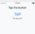
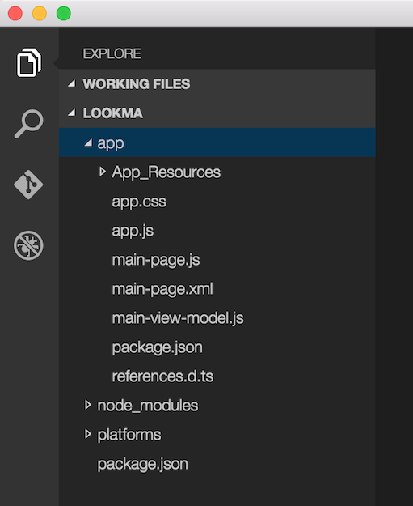
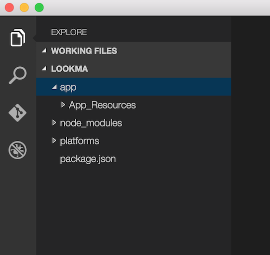
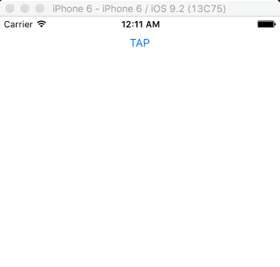

## or: How I learned to stop worrying and love writing NativeScript apps from scratch

Our baby is all grown up and s/he wants to write nativescript apps without using the template! How does our baby do that and where does s/he start? Read on…

#### Versions used in this post 

* NativeScript: 1.5.1

#### Related Resources

* [Starting from Scratch Video Tutorial](https://youtu.be/PdFgnTmSwn0)

<div class="videoWrapper">
    <iframe width="560" height="315" src="https://www.youtube.com/embed/PdFgnTmSwn0" frameborder="0" allowfullscreen></iframe>
</div>

Worrying? Who’s worrying? Well, when I first saw the NativeScript hello world template, I was a little taken aback by its verbosity. Why should I have so many files just to show a button and a label counting down every time the button is clicked. Here is what it looks like..



I don’t even want to mention all the extra gunk that TypeScript spit out. I love TypeScript, so long as I don’t have to look at the JavaScript that it generates. Yuk!

Let’s start completely from scratch and create a simple one page app demo.

At the terminal, create your NativeScript project and go to the folder

```
tns create lookma
```

```
cd lookma
```

Open this folder in your favorite code editor, I’ll be using [Visual Studio Code](https://code.visualstudio.com/).



Now, comes the fun part. Delete all files in the _app_ directory. Don’t delete the _App_Resources_ folder.

> Don’t worry!

Admire for a minutes how clean things are
  


Ok now what? Will my app still run? **No!** Your app needs a starting point, and you’ve just deleted it. We’re going to build it up from scratch like I promised.

> We’re going to build it up from scratch

The starting point of your app has to be indicated to node through a _package.json_ file. Create the _package.json_ file and add the following JSON to it

```
{
    “name”:“lookma-no-hands”,
    “main”:“app.js”
}
```

This is pretty simple to understand. You indicate a name for your app and the app starting point is _app.js_. This tells node to execute _app.js_. Wait a minute, we don’t have that one. Let’s create it too. That file will get generated for us by it’s evil twin TypeScript file called _app.ts_. But first, we need to install TypeScript.

Run this on the command line to install TypeScript

```
tns install typescript
```

Then create a file called _app.ts_ and add this code to it.

```
import application = require(“application”);
application.mainModule = “pages/start/startpage”;
application.start();
```

This file points the application to the first page that will be shown called _startpage_. In this case I put my page in _app/pages/start/_ for better organization. A NativeScript page consists of a code file and an XML file for the declarative UI. Go ahead and create the following two files:

* app/pages/start/**startpage.xml**
* app/pages/start/**startpage.ts**

Open _startpage.xml_ and add the following

```
<Page loaded=“pageLoaded”>
  <StackLayout>
    <Button text=“TAP” tap=“tapAction” />
    <Label id=“lblCounter”/>
  </StackLayout>
</Page>
```

Open _startpage.ts_ and add the following

```
import {EventData} from “data/observable”;
import {Page} from “ui/page”;
import {Label} from “ui/label”;
 
class StartPageController {
    private counter: number = 42;
    private lblCounter: Label;
 
    public pageLoaded(args: EventData) {
        var page = <page>args.object;
        this.lblCounter = <label>page.getViewById(“lblCounter”);
    }
 
    public tapAction() {
        this.counter++;
        this.lblCounter.text = ${this.counter} taps;
    }
}
 
var spc = new StartPageController();
exports.pageLoaded = args => spc.pageLoaded(args);
exports.tapAction = () => spc.tapAction();//</label></page>
```

Notice that in the _startpage.ts_ file we are simply defining a class with two functions. When the app starts and runs this file, the last three lines of the file instantiate the class and expose to of its functions to the outside world. In this case the outside world is the mechanism reading the XML file. If you take a look at _startpage.xml_ you will see the same two functions _pageLoaded_ and _tapAction_ being declared as handlers for the `Page` and the `Button` respectively.

Run your app on whatever platform you want. Here I will use the iOS simulator.

```
tns run ios —emulator
```



At this point you have a functioning app. But should you stop there? Of course not! Have you heard of data binding in NativeScript? It’s one of the best things that’s happened to native development.

If you want to use data binding in your app, (and who the heck wouldn’t?), then here are some additions you make.

1. Make the `StartPageController` a subclass of NativeScript’s `Observable` class.
2. Set the `Page` instance’s `bindingContext` property to the instance itself, this way all the binding expressions in the XML will see the public functions and properties of the class.

Changes are highlighted in the code below. Commented out code is code to be removed.

```
import {Observable,EventData} from “data/observable”;
import {Page} from “ui/page”;
import {Label} from “ui/label”;
 
class StartPageController extends Observable {
    private counter: number = 42;
    private lblCounter: Label;
 
    public pageLoaded(args: EventData) {
        var page = <page>args.object;
        this.lblCounter = <label>page.getViewById(“lblCounter”);
        this.page.bindingContext = this;
    }
 
    public tapAction() {
        this.counter++;
        this.lblCounter.text = ${this.counter} taps;
    }
}
 
var spc = new StartPageController();
exports.pageLoaded = args => spc.pageLoaded(args);
//exports.tapAction = () => spc.tapAction();
//Since tapAction is now bound, we don’t need to export the function.</label></page>
```

In the XML, you can now use the binding syntax to bind the `tapAction` function.

```
<Page loaded=“pageLoaded”>
  <StackLayout>
    <Button text=“TAP” tap=“{{tapAction}}” />
    <Label class=“counter” id=“lblCounter”/>
  </StackLayout>
</Page>
```

Perhaps you want to also bind the text of the label so it magically updates by itself. Sure, no problem.

```
import {Observable,EventData} from “data/observable”;
import {Page} from “ui/page”;
//import {Label} from “ui/label”;
 
class StartPageController extends Observable {
    private counter: number = 42;
    //private lblCounter: Label;
 
    public pageLoaded(args: EventData) {
        var page = <page>args.object;
        //this.lblCounter = <label>page.getViewById(“lblCounter”);
        this.page.bindingContext = this;
    }
 
    public tapAction() {
        this.counter++;
        //this.lblCounter.text = ${this.counter} taps;
        this.set(“message”, ${this.counter} taps);
    }
}
 
var spc = new StartPageController();
exports.pageLoaded = args => spc.pageLoaded(args);//</label></page>
```

In the XML, you can now use the binding syntax to bind the `message` property to the `text` attribute of the label .

```
<Page loaded=“pageLoaded”>
  <StackLayout>
    <Button text=“TAP” tap=“{{tapAction}}” />
    <Label class=“counter” text=“{{message}}”/>
  </StackLayout>
</Page>
```

That’s really all you need to do to go all-no-template. Now you’re not worried about starting from scratch and piling on code.