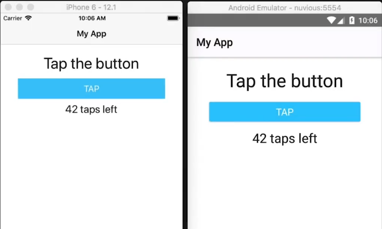
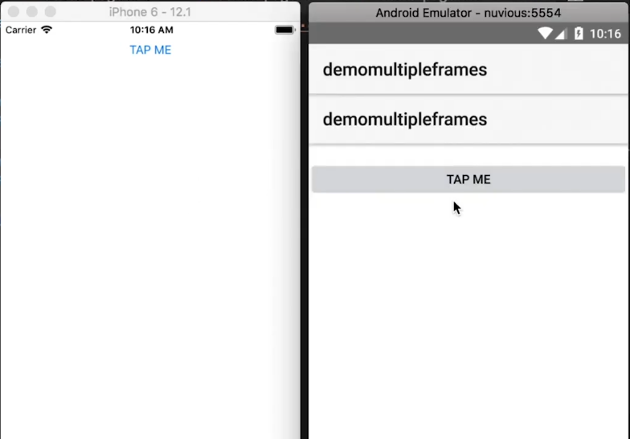
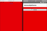
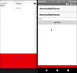
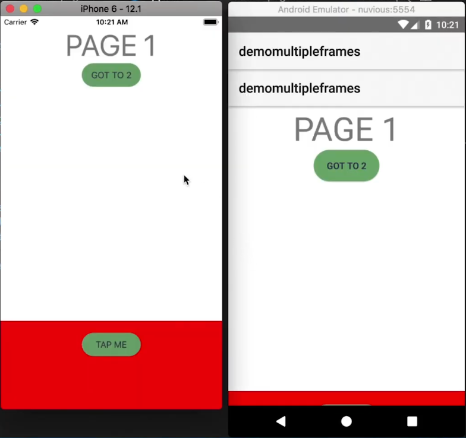
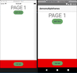
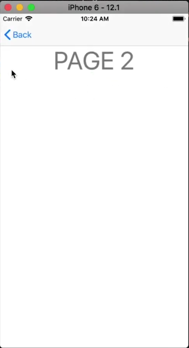
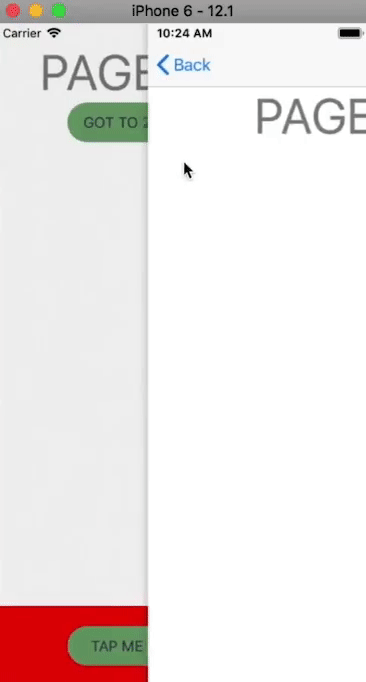
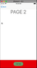
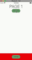

In this tutorial, you'll learn how to use multiple nested frames to separate your UI, enabling you to navigate one part of the screen while keeping another part of the screen always showing.

## TL;DR

If you'd rather watch a video of the tutorial, here you go.  Hurry up and click on it so you don't have to look at the creepy three-headed Alex!

<br/><br/>

<div class="videoWrapper">
    <iframe width="560" height="315" src="https://www.youtube.com/embed/lNbUD6ZDdgQ" frameborder="0" allowfullscreen></iframe>
</div>

<br><br>


## Introduction

It wasn't too long ago that NativeScript only had one Frame—the topmost/root frame—and you could only navigate the entire screen. Now, by using multiple nested Frames, you can navigate parts of the screen. This enables you to do all kinds of cool things like create reusable frames with pages, navigate one part of the screen while keeping the other one on the screen at all times (for instance, what you see with bottom sheets). 

<br/>

This article is part of a series of three articles that will cover using multiple frames. Here, we'll introduce multiple frames and show you how to use them in your app, then the second article will cover creating custom events. The third article will take what we've learned in the previous two and show you how to create an animated bottom sheet that slides up and down.

<br/>

## Getting Started

To start with, we begin with the simple app shown below. It has two Labels and a Button that increments the number of taps shown in the bottom Label when tapped.

<br/>



<br/>

To make use of multiple frames on the page, we add two Frames wrapped inside a GridLayout as shown below.

<br/>

```xml
<!-- main-page.xml -->

<Page xmlns="http://schemas.nativescript.org/tns.xsd">
  <GridLayout>
    <Frame defaultPage="home-page">
    </Frame>
    
    <Frame defaultPage="action-page">
    </Frame>
  </GridLayout>
</Page>
```

<br/>

Usually, when using a GridLayout, you would specify rows and columns, but because we're using Frames, that would be redundant. The reason for this is that on iOS, Frames always take up the entire screen, so the layout system of the grid isn't going to override that by positioning the frames properly on the page. We'll take care of that in a different way.

<br/>

In the above code, notice we specify a `defaultPage` for each Frame. You have to specify default pages for your Frames. In the app, we'll navigate using the first/top Frame and the bottom Frame will always be on the screen displaying a button.

<br/>

Now let's create the two pages that our Frames point to.


We'll start with the `home-page.xml`:

<br/>

```xml
<!-- home-page.xml -->

<Page xmlns="http://schemas.nativescript.org/tns.xsd">
  <StackLayout>
    <Label text="Page 1" class="page-name" />
    <Button text="Go to 2" tap="page1BtnTap" />
  </StackLayout>
</Page>
```

<br/>

And its code:

<br/>

```typescript
// home-page.ts

import { EventData } from "tns-core-modules/ui/page/page";

export function page1BtnTap(args: EventData) {

}
```

<br/>

The code doesn't do much at the moment, so no explanation is needed. We'll continue working on the above files as we progress through the tutorial.

<br/>

Now for the `action-page.xml`:

<br/>

```xml
<!-- action-page.xml -->

<Page xmlns="http://schemas.nativescript.org/tns.xsd">
  <StackLayout height="60" verticalAlignment="top">
    <Button text="TAP ME" tap="tapMeTap" android:marginTop="20" />
  </StackLayout>
</Page>
```

<br/>

We add a `marginTop` to the Android version. By default, the UI would look a bit different on iOS and Android, so we add a bit of a margin on Android, to account for that.

<br/>

And its code:

<br/>

```typescript
// action-page.ts

export function tapMeTap() {
  alert('tap');
}
```

<br/>

On running the app, we get the following:

<br/>



<br/>

As you can see, the app looks different on the two platforms. On Android, we're getting two action bars. This is because, by default, every Frame on Android gets its own action bar.

<br/>

Let's fix this by hiding the action bar in `action-page.xml`. We also add a red background color to the page so that we'll be able to easily distinguish it from the `home-page.xml` page.

<br/>

```xml
<!-- action-page.xml -->

<Page xmlns="http://schemas.nativescript.org/tns.xsd" actionBarHidden="true" backgroundColor=Red">
  ...
</Page>
```

<br/>

Now we don't get two action bars:

<br/>



<br/>

The red screen (`action-page.xml`) takes up the entire view, but we want it to be positioned at the bottom, so let's take care fo that.

<br/>

In `main-page.xml`, we add a `loaded` event to the Frame we want to move.

<br/>

```xml
<!-- main-page.xml -->

<Frame defaultPage="action-page" loaded="actionFrameLoaded">
</Frame>
```

<br/>

We then handle the event in `main-page.ts`.

<br/>

```typescript
// main-page.ts

import { EventData } from "tns-core-modules/data/observable";
import { Page } from "tns-core-modules/ui/page";
import { HelloWorldModel } from "./main-view-model";
import { Frame } from "tns-core-modules/ui/frame/frame";
import { screen } from "tns-core-modules/platform";

export function actionFrameLoaded(args: EventData) {
  const frame = args.object as Frame;
  
  frame.translateY = screen.mainScreen.heightDIPs - 150;
}
```

<br/>

We get the frame from the EventData object and then translate it vertically, moving it to the bottom of the screen. Now when that frame loads, it's going to be shifted to the bottom of the screen. You can see the effect below.

<br/>



<br/>

Let's improve the app's look a bit by adding some styling to `app.css`.

<br/>

```css
// app.css

Button {
  background-color: rgb(110, 163, 110);
  color: rgb(48, 47, 79);
  width: 100;
  border-width: 1;
  border-color: transparent;
  padding: 10;
  border-radius: 30;
  text-transform: uppercase;
}

.page-name {
  vertical-align: top;
  text-align: center;
  font-size: 50;
  color: gray;
  text-transform: uppercase;
}
```

<br/>

Which gives us:

<br/>



<br/>

As you can see, the Frame is positioned differently on iOS and Android. To fix this, let's determine how much we should move the Frame depending on the platform the app is running on.

<br/>

```typescript
// main-page.ts

import { EventData } from "tns-core-modules/data/observable";
import { Page } from "tns-core-modules/ui/page";
import { HelloWorldModel } from "./main-view-model";
import { Frame } from "tns-core-modules/ui/frame/frame";
import { screen, isIOS } from "tns-core-modules/platform";

export function actionFrameLoaded(args: EventData) {
  const frame = args.object as Frame;
  
  if (isIOS) {
    frame.translateY = screen.mainScreen.heightDIPs - 80;
  } else {
    frame.translateY = screen.mainScreen.heightDIPs - 150;
  }
}
```

<br/>

Let's also hide the action bar of `main-page.xml` by setting `actionBarHidden` to `true`.

<br/>

```xml
<!-- main-page.xml -->

<Page xmlns="http://schemas.nativescript.org/tns.xsd" actionBarHidden="true">
  ...
</Page>
```

<br/>

Now if you run the app, the Frame is more visible on Android.

<br/>



<br/>

## Navigation

We now have the two frames visible on the screen. We'll now wire up the `GO TO 2` button so that we can navigate one of the frames while the other remains on the screen. To start off, let's first create the page we'll be navigating to:

<br/>

```xml
<!-- page2-page.xml -->

<Page xmlns="http://schemas.nativescript.org/tns.xsd">
  <Label text="Page 2" class="page-name" />
</Page>
```

<br/>

Usually, when you navigate, you use the Frame module, but we'll show you why that won't work here.

<br/>

```typescript
// home-page.ts

import { EventData } from "tns-core-modules/ui/page/page";
import * as frame from "tns-core-modules/ui/frame";

export function page1BtnTap(args: EventData) {
  frame.topmost().navigate('page2-page');
}
```

<br/>

With the above code, when the button is tapped, the whole page navigates to Page 2.

<br/>



<br/>



<br/>

On navigating to the second page, the bottom Frame was also left behind, but that's not the effect we are going for. We want it to remain on the screen.

<br/>

To get the desired effect, modify the code as shown.

<br/>

```typescript
// home-page.ts

import { EventData } from "tns-core-modules/ui/page/page";
import { Button } from "tns-core-modules/ui/button";
import * as frame from "tns-core-modules/ui/frame";

export function page1BtnTap(args: EventData) {
  const button = args.object as Button;
  button.page.frame.navigate('page2-page');
}
```

<br/>

Since we are dealing with multiple Frames, we don't use the topmost Frame to navigate as we did previously. Instead, we use the current Frame.

<br/>

We first get the button that was tapped and then get the Page and eventually the Frame it's on. We then navigate that to Page 2.

<br/>

Now when we run the app and navigate to Page 2, only the top Frame gets replaced by the new page while the bottom Frame stays put on the screen.

<br/>



<br/>



<br/>

That brings us to the end of the tutorial. We hope you learned a thing or two. Remember, we'll be posting two more tutorials that build on this one including one that shows you how to build an animated bottom sheet, so keep an eye out for those.

<br>

If you have any questions or comments about the tutorial, leave them in the comments below, or get in touch with me on Twitter [@digitalix](https://twitter.com/digitalix?lang=en). You can also send me your NativeScript related questions that I can answer in video form. If I select your question to make a video answer, I'll send you swag. Use the #iScriptNative hashtag.

<br>

For more video tutorials on NativeScript, check out our courses on [NativeScripting.com](https://nativescripting.com/). We have courses that cover all flavors of NativeScript (Core, Angular and Vue) and that cater to different levels of experience, whether you are just beginning your journey in the NativeScript world or you have some experience with NativeScript and are looking to level up.
