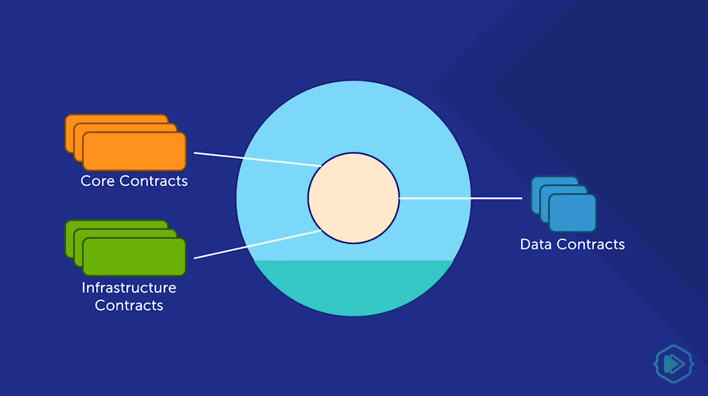
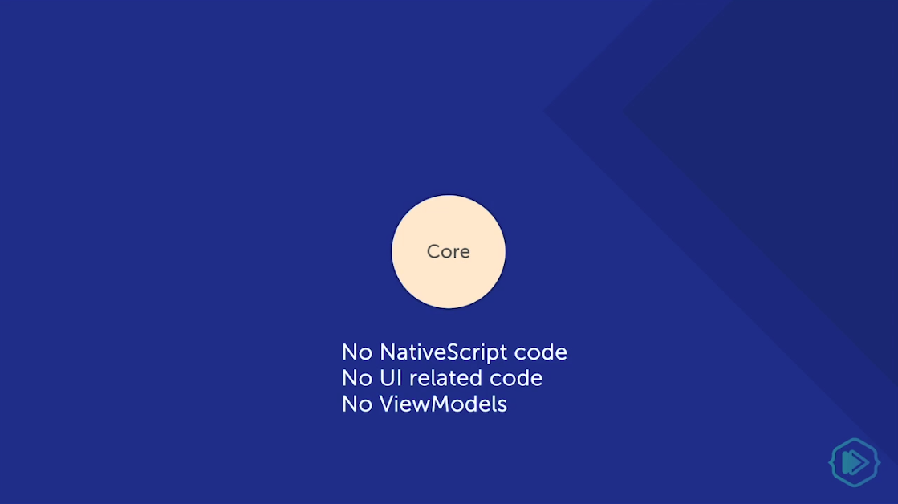
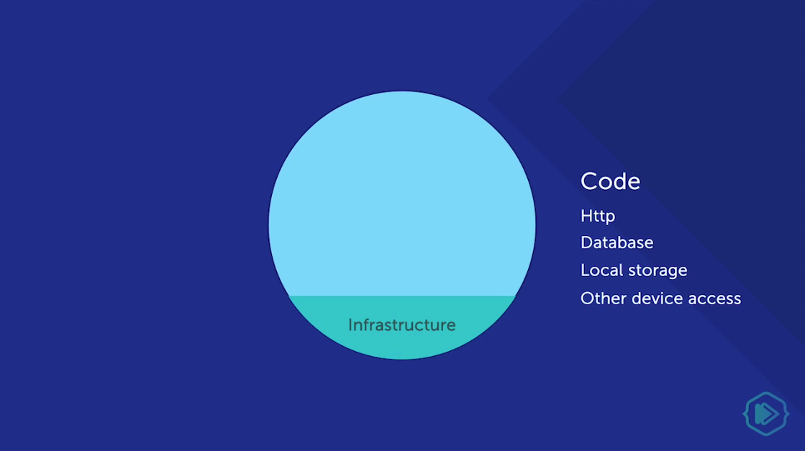

When it comes to writing code for your NativeScript application, there are different software architectures or design patterns that you can use to structure the code. In this article, we'll look at two of these: MVVM (Model-View-ViewModel) and Clean Architecture. Both of these facilitate the [separation of code](https://en.wikipedia.org/wiki/Separation_of_concerns) into different [concerns](https://en.wikipedia.org/wiki/Concern_(computer_science)).

 

The benefits of methodically separating out application concerns are many, but the major ones are improved testability and maintainability, which result in higher code quality and reduced maintenance costs.

## MVVM

Let's start by looking at the MVVM pattern. Model-View-ViewModel (MVVM) is a software design pattern that is structured to separate program logic and user interface controls. It is the base pattern on which the NativeScript framework is built.

 

The separation of the code in MVVM is divided into Model, View, ViewModel:

 

- **Model:** The Model defines and represents the data. It consists of the business logic, services, and repositories (basically anything that's not UI or framework related).
- **View:** The View represents the UI. In NativeScript, this includes the XML layout file and its associated code-behind file (the JavaScript file that shares the same name as the View, e.g. `login.xml` and `login.js`). The View consists of visible elements (user interface (UI), animations, text, etc.) and elements that receive user input. In NativeScript, when using the NativeScript Core UI modules (`tns-core-modules/ui`), you are working with the View.
- **ViewModel:** The ViewModel is located between the View and Model layers. Here, controls for interacting with the View are housed—binding is used to connect the UI elements in View to the controls in ViewModel. The View is data-bound to the ViewModel. Changes made in the ViewModel trigger visual changes in the UI components. NativeScript provides a module called Observable (`tns-core-modules/data/observable`) which facilitates creating a ViewModel object that can be bound to the View. The Observable is the ViewModel in the MVVM design pattern. It provides a mechanism used for two-way data-binding to enable direct communication between the UI and code-behind file.

### Benefits of MVVM

A huge benefit of separating Models, Views, and ViewModels is that you are able to use two-way data-binding (i.e. changes in data in the Model get instantly reflected in the View and vice versa).

 

Another benefit is that it enables code reuse as you are often able to reuse Models and ViewModels across Views.

## Clean Architecture

Clean Architecture is a software design philosophy that was [proposed by Robert C. Martin (a.k.a. Uncle Bob)](https://blog.cleancoder.com/uncle-bob/2012/08/13/the-clean-architecture.html). We'll discuss an architecture that is roughly based on the concepts he proposed.

 

Clean Architecture allows for a clean separation of concerns between the Application Core, and Frameworks and Drivers.

 

 

The Application Core consists of Services (e.g. enterprise and application business rules). The Framework includes the NativeScript framework as well as all the UI models that come with it.

 

We also keep our data access in a separate layer called Infrastructure. Infrastructure contains any local storage or back-end service calls that are needed by the application.

 

 

### The Core Layer

The Core layer defines all the contracts that the application needs. these are interfaces for the core services as well as interfaces for the infrastructure layer and for the data objects that are passed back and forth between the layers.

 

 

You can think of the Core as the application itself. It doesn't know about NativeScript or any other framework. This layer has no UI-related code or ViewModels. Even though the NativeScript modules are called **Core Modules**, this doesn't mean they are of this layer. The Application Core has no knowledge of NativeScript modules.

 

 

There are many ways to talk to the internet and Core shouldn't care about any of them. HTTP is an implementation detail based on the framework that you are using and Core is the application itself so it shouldn't know about how you are connected to the internet or databases. _Core should not know about anything other than itself._

 

You should be able to pick up the entire Core and plop it down into another framework and use it there. All the business logic and models and contracts come along, but none of the framework-specific stuff will. You should be able to use Core in an Angular web app or in an Electron desktop app. It is the core of the application and it is independent of the glue that binds it to a specific framework.

 

### The Infrastructure Layer

The Infrastructure is the layer that contains any code related to external communication, e.g. any time the app needs to use storage, call the back-end or access the device.

 

Infrastructure has nothing to do with the Core of the application. It is purely an implementation detail and can easily be replaced if needed. It should also not know anything about the UI or ViewModels.

 

The code in this layer could include HTTP calls, database calls, local storage and other types of communication that are not UI-related.

 

### The Framework Layer

If you've gone through any of the tutorials on [NativeScript.org](https://www.nativescript.org/) or taken any of the getting-started courses here on [NativeScripting](https://nativescripting.com), you've most likely focused on the NativeScript framework and what it can do, including all the UI modules. What those tutorials don't teach you is that if you want to have a clean separation of concerns and have your app be testable, then you need to keep your UI-module-related code separate from the Core and Infrastructure.

 

So, how is this related to MVVM? Although MVVM places equal importance on the M, V and VM, the focus is more on how the ViewModel interacts with the View and the Model. The View is part of the Framework layer since it only deals with UI. The ViewModel is also part of the Framework layer since it's basically a representation of the View, without being the View itself. The Model, however, is part of the Infrastructure and the Core layers. A more appropriate acronym that would contain all our layers would be **CIVVM** for Core-Infrastructure-View-ViewModel.

 

## Conclusion

By structuring your code according to these two software architectures, you will save yourself from a lot of headaches and hair-pulling moments going forward. By separating the software into layers, your code will be easily testable, reusable and maintainable. To learn more about Application Architecture, check out our [NativeScript Core Pro](https://nativescripting.com/course/nativescript-core-pro) course that goes deeper into this and uses what we've covered here in a NativeScript application.

 

Let us know what you thought of the article in the comment section down below or on Twitter [@digitalix](https://twitter.com/digitalix). You can also send me your NativeScript related questions that I can answer in video form. If I select your question to make a video answer, I'll send you swag. Use the #iScriptNative hashtag.
