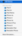
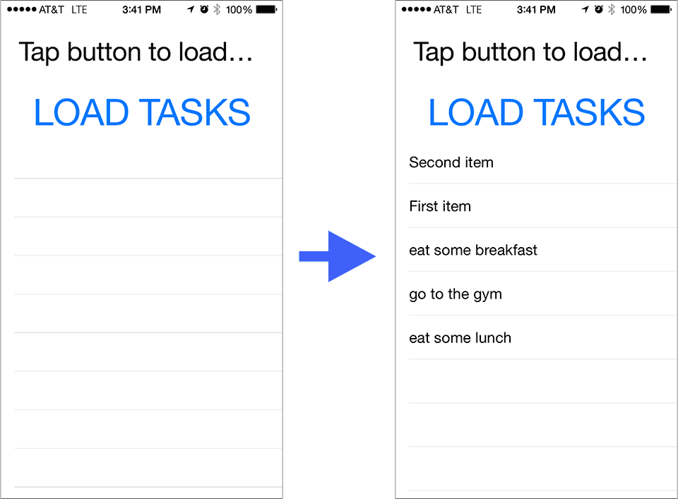

In this continuation of the topic of using [NativeScript](https://www.nativescript.org/) with [Azure Mobile Services](http://azure.microsoft.com/en-us/documentation/services/mobile-services), I show how you can use the open sourced iOS library that the Azure team has put together in your NativeScript apps to access the full gamut of functionality that the service offers. I will show a proof of concept here to use the full library to fetch some table data, but you can do much, much more.

See [this](https://nativescripting.com/posts/using-nativescript-with-azure-mobile-services) for the introduction post on using NativeScript with Azure Mobile Services. That post covers a very rudimentary method for accessing a Backend as a Service (BaaS), but it shows how to use npm modules with your NativeScript apps. For more on authoring your own npm modules for NativeScript, take a look at [TJ VanToll's detailed post on the topic](http://developer.telerik.com/featured/building-your-own-nativescript-modules-for-npm).

#### Versions used in this post 

* NativeScript: 0.9.4

#### Things you will need to try this out yourself

1. Azure subscription ([get one here for free](http://azure.microsoft.com/en-us/pricing/free-trial/))
2. Visual Studio 2013 ([grab a free community edition if you don’t have it](http://www.visualstudio.com/Free%E2%80%8E))
3. NativeScript
4. Download the code bases that go hand in hand with this post (see details later in the post)

#### Update

On March 24, 2015, Microsoft announced that [Azure Mobile **Apps**](http://azure.microsoft.com/en-us/services/app-service/mobile) are the preferred way going forward instead of Azure Mobile Services. The concepts presented in this post illustrate several methods that NativeScript developers can utilize regardless of what BaaS they choose.

There are also plenty of Azure Mobile Services apps running in the wild so Microsoft is not removing this service any time soon.

This post ties together two NativeScript concepts that I've covered in the past.

1. Using existing Native libraries in your apps – see [this](https://nativescripting.com/posts/using-native-libraries-in-your-nativescript-apps)
2. Using a BaaS with NativeScript, in this case Azure Mobile Services – see [this](https://nativescripting.com/posts/using-nativescript-with-azure-mobile-services)

## Getting the Code for the Samples

There are two download that are necessary for you to try this out for yourself. Download these from the links provided below and build them on your own Mac.

1. The iOS library that is an Xcode project based on the Azure Mobile Services open source project. This version is created as a Cocoa Touch framework so it's compatible with NativeScript and it offers all the capabilities that the service provides including authentication and CRUD operations on the BaaS data.

2. The [NativeScript app demo](https://github.com/alexziskind1/NativeScript-Demo-App-Using-Azure-Mobile-Services-Native-iOS-Library) that uses the native iOS library mentioned above. This sample code already has a pre-imported _lib_ folder from the built iOS framework so you could use just that. But for a full experience, delete this _lib_ folder and import the library into your NativeScript app after you've built it.

## Setting up and Running the Samples

Once you have the sample code bases on your Mac, you're ready to see the NativeScript app with the Azure Mobile Services backend in action. Do this…

1. Open the project AzureMobileServices in Xcode and build the product with generic iOS Device selected as the target. I've mentioned this before, make sure to build for the device with your actual physical device **disconnected** from your machine, or this will cause runtime errors later.



2. On the terminal, navigate to the NativeScript demo app folder you've downloaded. Make sure that you have your own Azure Mobile Service up and running with your own url and application key (don't use mine ☺ or it won't work). Follow this post on getting that set up and using your own url and key values. Change the following lines in the _app/app/tasks-view-model.js_ file to match your own url and key values.

```
var observable = require("data/observable");
var observableArray = require("data/observable-array");
var dialogs = require("ui/dialogs");
 
var url = "https://yourazuremobileapp.azure-mobile.net/";
var appKey = "yourMessyKeyetzHmpwJaHxhydbeOswM38";
 
var msc = MSClient.clientWithApplicationURLStringWithApplicationKey(url, appKey);
…
```

3. Add the iOS platform to your NativeScript app
    
```
tns platform add ios
```

4. I will assume you've deleted the _lib_ folder and you're going to import the iOS library you've built in step 1. Run the following command to import the built iOS library into your NativeScript app. Your path might be slightly different due to the randomly generated directory for he product build. Make sure to import the _Debug-iphoneos_ directory for running on a physical device.
    
```
tns library add ios /Users/alex//Library/Developer/Xcode/DerivedData/AzureMobileServices-cdsmnhqbfvykqmgslbcmpeauxkzs/Build/Products/Debug-iphoneos/AzureMobileServices.framework
```

5. Connect your iOS device to the Mac and run the app.
    
```
tns run ios
```

6. You'll see a big button that says "Load Tasks", click it and it will fetch whatever you have in your backend database.



## Summary

This post showed you how you can use a Native iOS library that abstracts away the Azure Mobile Services backend for you to call this BaaS with your NativeScript apps.
