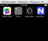
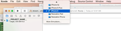

Have you been trying to run a NativeScript app in an iOS simulator other than iPhone 4s? There is a sorely missed parameter on the run and emulate commands that specifies what device to simulate. While the NativeScript team is busy working on more important features as they get closer and closer to version 1.0, here are some tips on how to get your app in an iOS simulator on any of the available simulated devices.

#### Update for version 1.5.2

The valid device names are iPhone 4s, iPhone 5, iPhone 5s, iPhone 6, iPhone 6 Plus, iPhone 6s, iPhone 6s Plus, iPad 2, iPad Retina, iPad Air, iPad Air 2, iPad Pro

To use these device names, wrap them in double quotes on the command line.

To run your app in the simulator

```
tns run ios --emulator --device "iPhone 6s Plus"
```

To debug your app in the simulator

```
tns debug ios --emulator --device "iPhone 6s Plus"
```

#### Update (outdated)

As of version 0.9.4 of the NativeScript CLI, there is an option to pass in the device to the simulator. They're moving quickly!

```
tns run ios --emulator --device iPhone-6
```

or

```
tns emulate ios --device iPhone-6
```

Valid device identifiers are iPhone-4s, iPhone-5, iPhone-5s, iPhone-6-Plus, iPhone-6, iPad-2, iPad-Retina, iPad-Air, Resizable-iPhone, Resizable-iPad.

If you're still interested in the commands executed behind the scenes, read on...
 
Let's say your project is named _showmeoniphone6_ and you've already added the iOS platform and built the project using the standard methods. See [here](http://docs.nativescript.org/hello-world/hello-world-ns-cli.html) if you're new to NativeScript or need a refresher. The command below are executed at the terminal on a Mac. When you run the iOS simulator on your app, you get the iPhone 4s simulator by default.

```
tns emulate ios
```

or

```
tns run ios --emulator
```

When switching the hardware device from the simulator menu, you get the new device, say iPhone 6, but it doesn't have your app deployed to it. What we want to be able to do is run the simulator with the hardware of our choice, say iPhone 6, with your app installed and launched. Here are two methods to accomplish this until the NativeScript CLI can accept a pass-through parameter to the simulator.

## Method 1

We will run a set of commands directly using the xcode command line for the simulator. Make sure that your NativeScript app is already built before running this step. If you already ran the app in a simulator using one of the commands above, the app is already built. Otherwise you can build the app using the following command: 

```
tns build ios
```

1. After the app is built, execute the following command to start the emulator of your choice (iPhone 6 is the example here)

```
xcrun instruments -w "iPhone 6 (8.2 Simulator)"
```

The iPhone 6 simulator should show up on your screen. If you want to see a listing of all the available devices, execute the following command:

```
xcrun simctl list
```

2. Install your app on this simulator with the following command. Replace the path shown with the path to your own built .app directory in the emulator directory

```
xcrun simctl install booted /Users/alex/Documents/VmShare/Code/nativescript/showmeoniphone6/platforms/ios/build/emulator/showmeoniphone6.app
```

Check the emulator for your installed app, it should be there on one of the screens. You might need to scroll through some screens, depending on what you have installed.



3. Launch the app either by clicking on it on the simulator, or by executing the following command:

```
xcrun simctl launch booted org.nativescript.showmeoniphone6
```

The parameter _org.nativescript.showmeoniphone6_ is the bundle id of your app, so replace it with the correct name.

> **Note:** you can combine all these commands into a script and save that in your project directory for easy execution whenever you need to run the simulator to test your app.

## Method 2

This method is not as interesting and requires you cracking open the old Xcode, but here you go. It's also quite a bit slower. 

1. Open Xcode and locate the xcode project file for your app.


2. Select the device you want to simulate and hit go.



## Summary

I'm sure that the NativeScript team will have this minor detail working in no time, but for now these steps should be helpful for anyone who's wondered how to simulate iOS devices other than iPhone 4s. 
