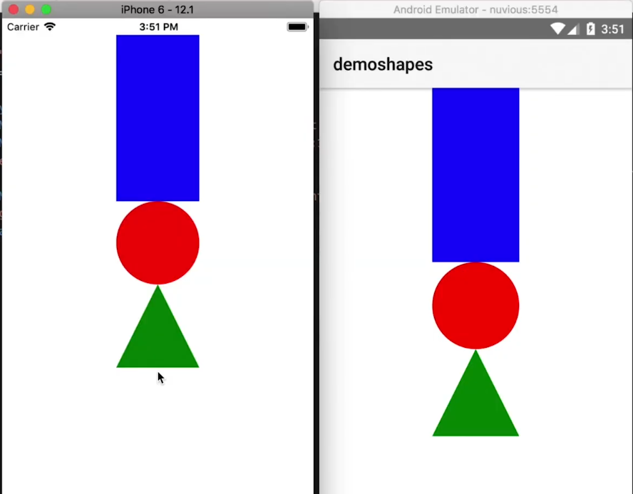
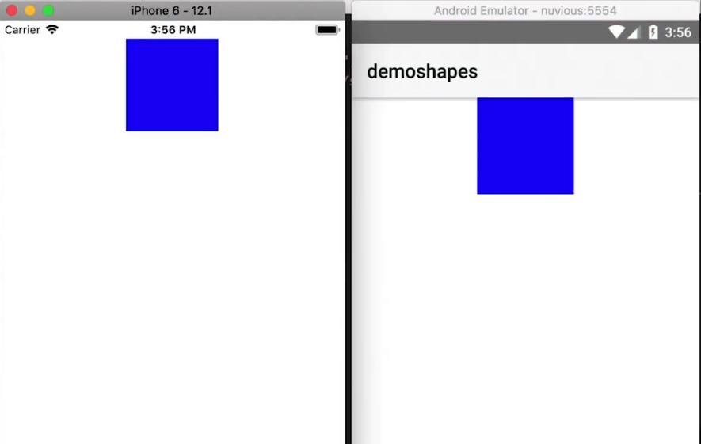
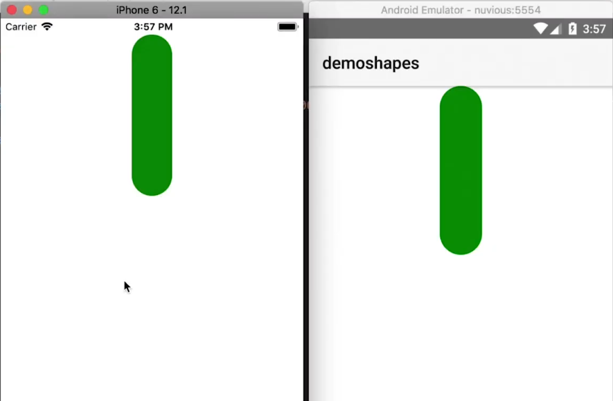

Have you always dreamed of being able to create shapes in NativeScript UIs? In this NativeScript tutorial, you'll learn 2 ways of creating shapes in NativeScript applications.

<br><br>

## TL;DR

Here's a video for you if you prefer watching the tutorial:

<br><br>


<div class="videoWrapper">
    <iframe width="560" height="315" src="https://www.youtube.com/embed/pW9X-ygrvEY" frameborder="0" allowfullscreen></iframe>
</div>

<br><br>

## Introduction

In this article, we'll cover two methods of creating custom shapes in your UI. We're going to be doing more NativeScript animation tutorials, so it's worth knowing the basics of shapes before you know how to animate them.

<br>

When it comes to creating shapes in NativeScript, there are two methods you can use: the first method is the "right way" to do it and the second is the easy way to do it. You can certainly always use the second quick and easy method, but learning the first method will teach you important concepts about NativeScript's inner workings.

<br>


## Method 1

For our demo app, we start off with a NativeScript Core (with TypeScript) application. We've gotten rid of the view model, cleared `main-page.ts` and only have the following in `main-page.xml`.

<br>

```xml
<!-- main-page.xml -->

<Page xmlns="http://schemas.nativescript.org/tns.xsd">

</Page>
```

<br>

To start off, install the following dependency which gives you TypeScript definitions for Android and iOS development platforms:

<br>

```
$ npm i tns-platform-declarations --save-dev
```

<br>

Then set `skipLibCheck` to `true` in `tsconfig.json` to ensure that compilation doesn't take too long since we are now using TypeScript definitions and those files can be pretty large.

<br>

```json
// tsconfig.json

{
  "compilerOptions": {
    ...
    "skipLibCheck": true
    ...
  }
}
```

<br>

Then create a file in the root directory of the project named `references.d.ts` and add the following to it:

<br>

```typescript
/// <reference path="./node_modules/tns-platform-declarations/ios.d.ts" />
/// <reference path="./node_modules/tns-platform-declarations/android.d.ts" />
```

<br>

The above declarations file points to our platform declarations for both iOS and Android.

<br>

To create a shape class, add the following to a file labeled `shapes/myshape.ts`.

<br>

```typescript
// shapes/myshape.ts

import { View, isIOS, isAndroid } from "tns-core-modules/ui/core/view";

export class MyShape extends View {
  public createNativeView() {
    let view = null;
    
    if (isIOS) {
      view = UIView.new();
    } else {
      view = new android.view.View(this._context);
    }
    
    return view;
  }
}
```

<br>

We override `createNativeView()` to create a native view. It returns `android.view.View` when running on Android and `UIView` on iOS.

<br>

There are two ways we can use the shape we just created above: programmatically and through XML. We'll go with the latter. Add the following to the `main-page.xml` file.

<br>

```xml
<!-- main-page.xml -->

<Page xmlns="http://schemas.nativescript.org/tns.xsd"
    xmlns:my="shapes/myshape">
  
  <StackLayout>
    <my:MyShape style="background-color: blue; height: 200; width: 100;" />
    <my:MyShape style="background-color: red; height: 100; width: 100; border-radius: 50%;" />
    
    <my:MyShape style="background-color: green; height: 100; width: 100; clip-path: polygon(50% 0%, 0% 100%, 100% 100%);" />
  </StackLayout>
</Page>
```

<br>

In the above, we use MyShape to add a rectangle, a circle and a triangle to the page. MyShape is generic—it has no styling associated with it—so we add styling whenever we use it to give it the shape we want. You can add the styling to the class or make it generic as we did and then add the styling when an instance of that class is created.

<br>

When you run the app, you should see the three shapes.

<br>



<br>

We mentioned that you could either use the shape in XML or programmatically. Let's now see how you would use it programmatically.

<br>

First, remove the shapes from `main-page.xml` and add a `loaded` event listener to the StackLayout.

<br>

```xml
<!-- main-page.xml -->

<Page xmlns="http://schemas.nativescript.org/tns.xsd">
  
  <StackLayout loaded="onLoaded">
  
  </StackLayout>
</Page>
```

<br>

Then add the following to handle the event in `main-page.ts`:

<br>

```typescript
// main-page.ts

import { EventData } from "tns-core-modules/ui/page/page";
import { StackLayout } from "tns-core-modules/ui/layouts/stack-layout";
import { MyShape } from "./shapes/myshape";

export function onLoaded(args: EventData) {
  const layout = <StackLayout>args.object;
  
  const shape = new MyShape();
  
  shape.width = 100;
  shape.height = 100;
  shape.backgroundColor = 'blue';
  
  layout.addChild(shape);
}
```

<br>

We grab the StackLayout in our layout file, create an instance of MyShape, style it and add it to the StackLayout. You can see the result below:

<br>



## Method 2

Now onto the second method of creating shapes. To create a shape, you can simply use a Label and style it:

<br>

```xml
<!-- main-page.xml -->

<Page xmlns="http://schemas.nativescript.org/tns.xsd">
  <StackLayout>
    <Label style="background-color: green; height: 200; width: 50; border-radius: 50%;" />
  </StackLayout>
</Page>
```

<br>

And that gives us:

<br>



<br>

As you can see, it is much easier and faster to use a label. A downside to this is that the Label comes with some added attributes that you don't really need, so if you need to keep your shape object lean, then you might consider creating a custom shape class.

<br>

That's it, folks! In upcoming tutorials, we'll be covering animations, and we'll use the knowledge you've gained from this tutorial. So stay tuned!

<br>

Hopefully, you found this useful. If you have any questions or comments about the tutorial, leave them in the comments below, or get in touch with me on Twitter [@digitalix](https://twitter.com/digitalix?lang=en). You can also send me your NativeScript related questions that I can answer in video form. If I select your question to make a video answer, I'll send you swag. Use the #iScriptNative hashtag.

<br>

For more video tutorials about NativeScript, check out our courses on [NativeScripting.com](https://nativescripting.com). We have courses that cover all flavors of NativeScript (Core, Angular and Vue) and that cater to different levels of experience, whether you are just beginning your journey in the NativeScript world or you have some experience with NativeScript and are looking to level up.
