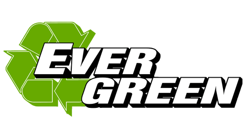

Folks learning NativeScript have historically had three places to get their learning – the docs section of NativeScript.org, community blog posts like this one, and big publishing houses, this includes printed books and video courses. NativeScript.org docs are great and they are updated, but you are left to find things yourself; there is nobody to guide you through it visually. Community blog posts are great for very specific topics, but lack a broad scope. Big publishers take a long time to publish courses or books, and once they are published, getting content updated is quite a tedious process as well. So you end up watching a video course recorded with NativeScript version 1 while trying to piece together a project with NativeScript version 3, for example.

You’ve been asking for NativeScript training that is both high quality and up to date. I'm proud to announce that It's finally here. Nativescripting.com is a new training platform that offers both. 

I've created this training platform as a result of the frustrations I had with big publishers when it came to need to get fresh video courses to students and keep that content up to date. Unlike typical video training platforms, courses on NativeScripting are called "evergreen" courses – they stay up to date as versions of NativeScript change. Enrolled students automatically get notified when courses they are taking get updated and they have access to their courses … forever.

The first free course, NativeScript and Angular Getting Started Guide, is available now and hundreds of students have already completed it. The NativeScript Core getting started guide is also free and will be available soon, but you can still sign up for it, even right now.

Go to [NativeScripting.com](https://nativescripting.com/), browse the courses and curriculums, and sign up for the free courses! It costs nothing. You can also take advantage of the limited quantity bundles that are currently drastically discounted only for early birds. You can also just subscribe to the newsletter to be notified when new stuff is out and get coupons right in your inbox.

I'm super excited about getting [NativeScripting.com](https://nativescripting.com/) launched and I can't wait to get you all the awesome fresh training content that you've been asking for.

Let's get nativescripting!
