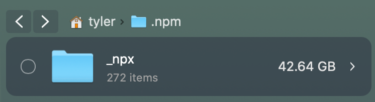

Hey Everybody! Have you been using `npx` to run multiple versions of NativeScript? Have you been running out of disk space?

Well today I’m going to show you something interesting I found if you use `npx` to run multiple versions of NativeScript as seen in [this video by Alex Ziskind](https://www.youtube.com/watch?v=wlRdGPAqWl8).

I recently got a notification that my MacBook was out of space and did the typical routine of emptying the trash bin, and cleaning up some clutter on my desktop. This didn't help so I investigated further and found this.

## The Problem

Inside of the `_npx` folder was 272 folders!! Each folder had a version of NativeScript in it with a lot of duplicates (A lot of folders had NS 5.2).

For me the `_npx` folder was inside of my `users/tyler/.npm` directory.

>**Note:** If you don't see the `.npm` folder, you can use `cmd` + `shift` + `.` to show/hide hidden files inside of the Finder window.

When I ran `npx nativescript@5.2 run ios` it was downloading version 5.2 of NativeScript and saving it on my device.

The problem arises when I run `npx nativescript@5.2 run ios` again ... it was downloading that version of NativeScript again.

This might be a bug with npx... it should be checking for that module locally before installing it.

According to the docs:
*Executes <command> either from a local node_modules/.bin, or from a central cache, installing any packages needed in order for <command> to run.*

## Possible Fixes

1.  Corect NPM Cache Path

If you suspect that there might be an issue with the path to your local npm cache you can use the `--cache <path>` argument to change the npm cache path.

2. Use the `--no-install` Command

You can use the `--no-install` argument for npx that will prevent it from downloading a new version if it is already stored locally on your device.

Run `npx --no-install nativescript@5.2 run ios|android`

This will prevent npx from installing that version again.

If this prevents your command from executing then you might need to update your npm cache path.

>**Note:** The `no-install` argument must be placed immediately after `npx` or else the command will fail!

I hope this helps give you some of your device storage back!

