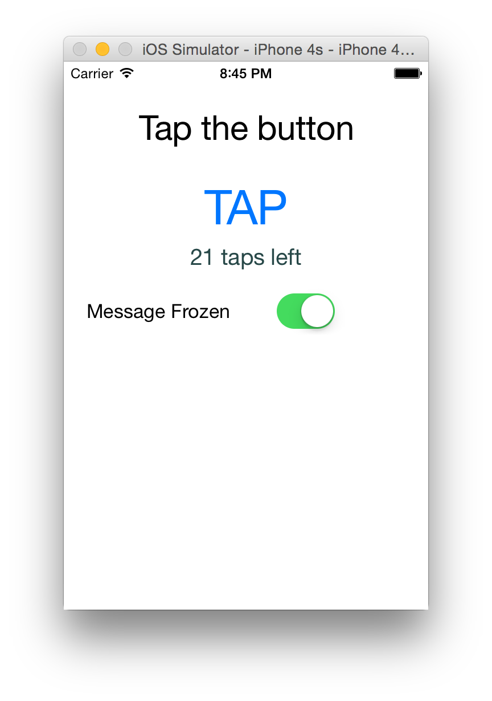

If you are coming from the web world, you'll find that NativeScript observables are a little different than the ES6 observables and observables found in pre ES6 day libraries like Knockout. The big difference is that instead of observing a property directly, you create an Observable object that will notify you of any changes to ANY of its properties. This post will cover some ways to work with observables as well as an npm module to subscribe to notifications about individual properties of the Observable object. 

#### Versions used in this post 

* NativeScript: 0.10.0

> We just love observables; they make things feel a little like magic.

In the examples below, I use observable notifications rather than click handlers to update the message in the _Hello World_ template that ships with NativeScript. First I will show you how to observe and react to general property notification changes using the methods that come out of the box with NativeScript. Then I will demonstrate a helper module (available via npm) that allows you to subscribe to individual property change events. You can download the demo to try this out for yourself as well. 

> **Note:** I assume that you are already familiar with setting up and running a NativeScript project, and that the hello world template is also familiar to you. If not, please start with [the hello world CLI instructions](http://docs.nativescript.org/hello-world/hello-world-ns-cli.html). 

## Observing out of the box NativeScript observables

A NativeScript Observable is a JavaScript object that can be "listened to". If a property of the object changes, a notification will be triggered. The NativeScript docs cover this pretty well so I won't go on an on about it. You can read more here: [NativeScript Observables How-To Guide](http://docs.nativescript.org/ApiReference/data/observable/HOW-TO.html). 

To see this in action, run the [demo code](https://github.com/alexziskind1/nativescript-observable-subscribe-demo) or follow along. 

1. Create a new NativeScript project; call it _observable-demo-ootb_
    
```
tns create observable-demo-ootb
```

2. Open up the new directory and edit the file _main-view-model.js_

3. The less "magic strings" in code, the better, so add the property names as reusable variables

```
var observable = require("data/observable");
var counterPropName = 'counter'; 
var messagePropName = 'message'; 
```

4. Add the property change listener to the observable view model and the handler function. You can also use the `on` function as a shortcut instead of the `addEventListener` here.

```
function HelloWorldModel() {
        _super.call(this);
        this.counter = 42;
        this.set(messagePropName, this.counter + " taps left");
         
        function propChangedHandler (changeObj){
            var currentCount = this.get(counterPropName);
            if (currentCount <= 0) {
                this.set(messagePropName, "Hoorraaay! You unlocked the NativeScript clicker achievement!");
            }
            else {
                this.set(messagePropName, currentCount + " taps left");
            }
        }
         
        this.addEventListener(observable.Observable.propertyChangeEvent, propChangedHandler, this);
}
```

5. The tapAction handler simply decrements the counter property

```
HelloWorldModel.prototype.tapAction = function () {
    this.set(counterPropName, this.get(counterPropName)-1);
};
```

6. When the button is tapped, the `tapAction` handler decrements the counter property. Your code will react to this change because of the attached observable listener, and in turn call the handler that will update the message. One important thing to note is that ANY time ANY property of the Observable view model changes, the handler will be triggered. So we have to add a check for the specific property that we care about.

Change the `propChangedHandler` function to include this check

```
function propChangedHandler(changeObj){
    if (changeObj.propertyName == counterPropName) {
        var currentCount = this.get(counterPropName);
        if (currentCount <= 0) {
            this.set(messagePropName, "Hoorraaay! You unlocked the NativeScript clicker achievement!");
        }
        else {
            this.set(messagePropName, currentCount + " taps left");
        }
    }
}
```

## Observing individual properties using the subscribe module

If you have a complex view model with lots of properties that need to be observed and responded to, using the out of the box method will require you to have a handler with lots of if statements (or a switch statement) for each property. To avoid this long switch statement mess, the subscribe module was created and can easily be added to your NativeScript project via npm. 

> **Note: ** The steps below show you how to convert the code above to a subscribe model. If you've downloaded the demo code, the subscribe module demo is it's own project called _observable-demo-subscribe_

1. Install the subscribe module to your NativeScript project by running the this command from your _app_ directory
    
```
npm install nativescript-observable-subscribe --save
```

2. Reference the new observable subscribe module in your view model code with the `require()` function

```
var observable = require("data/observable");
require( "./node_modules/nativescript-observable-subscribe/observablesubscribe" );
    
var counterPropName = 'counter'; 
var messagePropName = 'message';
```

3. Change the call to `addEventListener` to use the `subscribe` function instead. Notice that you are passing in the property to `subscribe` so the handler will only trigger for changes to this property. Also note that you no longer have to remember the name of the property change event, just the `subscribe` function.

Change from this

```
this.addEventListener(observable.Observable.propertyChangeEvent, propChangedHandler, this);
```

to this

```
this.subscribe(counterPropName, propChangedHandler, this); 
```

4. Finally, you don't need the extra check for the property name in the handler itself, because it will be triggered ONLY for the property that you explicitly subscribed, so you can remove the if statement from the handler.
    
```
function propChangedHandler(changeObj){
    var currentCount = this.get(counterPropName);
    if (currentCount <= 0) {
        this.set(messagePropName, "Hoorraaay! You unlocked the NativeScript clicker achievement!");
    }
    else {
        this.set(messagePropName, currentCount + " taps left");
    }
}
```

5. You can unsubscribe a property by calling the `unsubscribe` function with the same arguments. The demo that you downloaded uses the `unsubscribe` function to unhook the listeners.

## Subscribe/unsubscribe demo

If you want to skip right to the demo and run the subscribe sample yourself, you can download it from the [sample GitHub repo](https://github.com/alexziskind1/nativescript-observable-subscribe-demo) and roll with it. In this demo you'll see that I'm subscribing two properties, the counter and the switch. The switch controls the counter's subscription to notifications. Run the demo and click on the button to see the counter decrement as long as the switch is disabled. This is what it looks like: 



> **Note: ** If you are new to NativeScript and don't know how to run this demo, you can start with the [NativeScript Quick Setup Guide](http://docs.nativescript.org/setup/quick-setup). 

## Summary

The whole point of observables is to be notified when things change. Whether this is used for data binding or custom logic, we just love observables; they make things feel a little like magic. By the end of this post you should know how to use the out of the box observables to get notifications of property changes. You should also benefit from using the observable subscribe module that allows you to subscribe properties directly.
