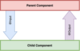
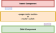

In this article, I want to discuss some ways of passing complex data between routed components in NativeScript applications based on the Angular framework. There are several ways to pass data in Angular applications and I just want to go through some of them briefly while taking a closer look at the other ones.

## Using query parameters and intermediate service

I would recommend you to read more about these two options from [this resource][1]. However, I'm pretty sure that you're familiar with passing data using query parameters like this

```javascript
this.router.navigate(['path/to/navigate'], {
  queryParams: {
    param1: 'value1',
  },
});
```

This is a very quick and robust method. Although it works only with primitive data, you can take it a little more by transferring JSON serialized objects.

Another acceptable way is to use an intermediate provider that is shared between the pages. So the workflow looks as follows. Before starting navigation you should put the required data to the service

```javascript

import { Component } from "@angular/core";
import { RouterExtensions } from '@nativescript/angular';
import { DataProvider } from "../../providers/data.provider";

@Component({
    selector: "InitialPage",
    templateUrl: "./components/initial.page.html",
})
export class InitialPageComponent {

    public constructor(private router: RouterExtensions,
                       private dataProvider: DataProvider) { }

    public onTap() {
        this.dataProvider.data = {
            param1: 'value1',
            nestedData: {
                nestedParam1: 'value2',
            }
        };
        this.router.navigate(['path/to/navigate']);
    }
}

```

After the navigation is done you can easily extract the required data from the service.

This method allows the transferring objects of any complexity. However, I personally do not like it. Why so? Firstly, in this case, we bring an additional instance into the communication of two other ones. As to me, this breaks [Occam's razor principle][2]. Secondly, we become responsible for clearing data after the navigation is done, which adds unnecessary obligations to the developer.

## Using state

Starting from version 7.2 Angular supports passing arbitrary data via a special state object during navigation. This can be easily utilized in an imperative way in a NativeScript application using `NavigationExtras` option

```javascript

export class SomeComponent  {

  constructor(private router: RouterExtensions) {}

  navigateWithState() {
    this.router.navigate(['path/to/navigate'], {
        state: {
            param1: 'value1'
        }
    });
  }
}

```

Retrieving the state is a bit more complex. Since the data in the state exists only during the navigation you cannot get access it in `ngOnInit` lifecycle hook because it will be executed after the router `NavigationEnd` event. So you should read the state inside a component constructor by accessing router navigation extras

```javascript

export class SingleTodoComponent {

    constructor(private router: RouterExtensions) {
        const state = this.router.router.getCurrentNavigation().extras.state;
        // Handle state data

    }
}

```

You can find the full example in [this NativeScript playground sample][3].

## Passing data to child components

Another case that I wanted to discuss is passing data between parent and child components. It's not a problem in a regular case because parent and child components can easily communicate with the `@Input`s and `@Output`s

<br/><br/>



<br/><br/>

```javascript
import { Component } from '@angular/core';

@Component({
  selector: 'ParentComponent',

  template: `
    <ChildComponent [data]="data" (changed)="handleChildChange($event)">
    </ChildComponent>
  `,
})
export class ParentComponent {
  data: any;

  handleChildChange(event: any) {
    // Handle changes from child
  }
}
```

However, what to do if these components are separated via `router-outlet` or `page-router-outlet`? In this case direct Input-Output communications become broken

<br/><br/>



<br/><br/>

Fortunately `page-router-outlet` component same as its ancestor `router-outlet` has `activate` event emitter which provides us with the currently activated element. So we can use this information in order to pass data to the activated child component or subscribe to one's events in an imperative way.

```javascript
import { Component } from '@angular/core';
import { ChildComponent } from './child.component';

@Component({
  selector: 'ParentComponent',
  template: `
    <router-outlet (activate)="handleRouterActivation($event)"></router-outlet>
  `,
})
export class ParentComponent {
  data: any;

  handleChildChange(event: any) {
    // Handle event here
  }

  handleRouterActivation(component: any) {
    if (component instanceof ChildComponent) {
      component.data = this.data;

      component.changed.subscribe((event) => {
        this.handleChildChange(event);
      });
    }
  }
}
```

Remember to unsubscribe from the output even emitters. You can do this either if the instance of the activated component is not the one you subscribed to or use `deactivate` output of the router outlet in a similar manner.

You can find the full example in [this NativeScript playground sample][4].

## Afterwords

So, we've discussed several options for passing complex data between routed components in NativeScript applications. I want to emphasize that each of them was based on the Angular techniques, so they are not straightforwardly applicable i.e. for the NativeScript Vue project. However, the general ideas shared between frameworks are usually very similar, so I think the information from the article was helpful for you in any case.

[1]: https://www.thepolyglotdeveloper.com/2016/10/passing-complex-data-angular-2-router-nativescript/
[2]: https://en.wikipedia.org/wiki/Occam%27s_razor
[3]: https://play.nativescript.org/?template=play-ng&id=L0NsYV
[4]: https://play.nativescript.org/?template=play-ng&id=murBaY
