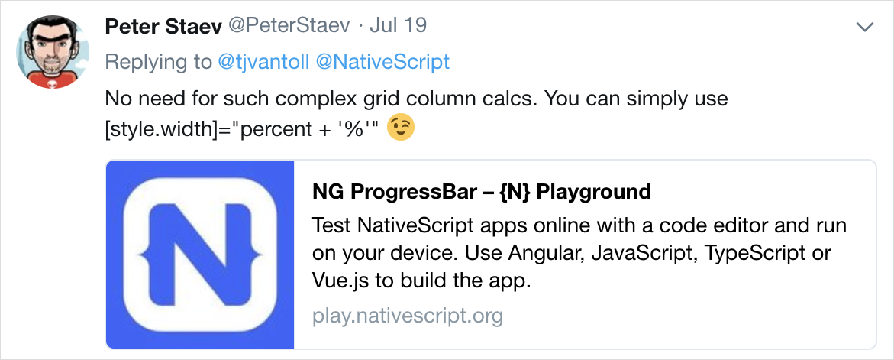

In this series of written and video tutorials, I'll progressively improve the progress bar (see what I did there?) by adding JavaScript animation to its movement, and then using RxJS to animate it.

<br/>

[TJ VanToll](https://twitter.com/tjvantoll) wrote an [excellent post](https://www.nativescript.org/blog/building-a-simple-progressbar-for-your-nativescript-app) on building a simple progress bar with just JavaScript and CSS in a NativeScript Angular application. After the post came out, [Peter Staev](https://twitter.com/PeterStaev) tweeted that the template could be simplified a bit too.

<br/><br/>

> ## Then it hit me; THIS MUST BE ANIMATED!

<br/><br/>

There are two animation approaches that I've been using for a while that I wanted to show with the progress bar:

1.  Plain (brute force) JavaScript animation
2.  Animation using RxJS

<br/>

So I've written down these approaches in this post and created video recordings of all the approaches to go along with the post. You can jump between parts here:
<br/>

1.  [TJ's Approach Modified](#TJs-Approach-Modified)
2.  [Peter's Simplified Template](#Peters-Simplified-Template)
3.  [Alex's JavaScript Animation Added](#Alexs-JavaScript-Animation-Added)
4.  [Alex's RxJS Animation Added](#Alexs-RxJS-Animation-Added)
5.  [Alex's Animation in a Pipe](#Alexs-Animation-in-a-Pipe) (UPDATE!)

<a name="TJs-Approach-Modified"></a>

<br/>

> **\*Note** The videos for each approach is included in each section and all the code can be found on [GitHub](https://github.com/alexziskind1/tnsscratch/tree/master/progressbar).

<br/><br/>
<br/><br/>

## TJ's Approach Modified

The progress bar in TJ's approach works well. However, the updates all arrive at a steady rate and the updates are tiny. This looks nice, but doesn't represent the real stresses that a progress bar might experience in the world. A more realistic progress bar would jump around to random points and update sporadically.

I've simulated that using a separate function that returns a random progress update between the current progress and 100 percent. Otherwise, the rest of the TypeScript code is pretty much the same as in [TJ's post](https://www.nativescript.org/blog/building-a-simple-progressbar-for-your-nativescript-app).

### util.ts

```typescript
export function getNewPercentValue(startingFrom: number): number {
  const newVal = Math.floor(Math.random() * 10) + startingFrom + 10;
  if (newVal > 100) {
    return 100;
  } else {
    return newVal;
  }
}
```

<br/>

Oh and instead of `background` in the CSS, I've also used `background-color`, to make the CSS property more compatible with older versions of NativeScript. You can watch me build this progress bar from scratch in this video:

<a name="Peters-Simplified-Template"></a>

<div class="videoWrapper">
    <iframe width="560" height="315" src="https://www.youtube.com/embed/cKzm14khSx8" frameborder="0" allowfullscreen></iframe>
</div>

<br/><br/>
<br/><br/>

## Peter's Simplified Template

Peter Staev suggested a more streamlined approach to the template.

<br/>



<br/>

Instead of using a binding to the `GridLayout`'s `columns` attribute, where we have to do a crazy string concatenation to calculate new column widths, we can just directly bind internal `StackLayout`'s `style.width` attribute to the percent and use an expression in the binding like this:

<br/>

```xml
<GridLayout  class="progressbar">
    <StackLayout col="0" class="progressbar-value" [style.width]="percent + '%'"></StackLayout>
</GridLayout>
```

Here is a short video showing this new, simpler approach:

<a name="Alexs-JavaScript-Animation-Added"></a>

<div class="videoWrapper">
    <iframe width="560" height="315" src="https://www.youtube.com/embed/WdwKs31L0sY" frameborder="0" allowfullscreen></iframe>
</div>

<br/><br/>
<br/><br/>

## Alex's JavaScript Animation Added

Here is where the animation comes in. First, I wanted to show a plain, brute-force JavaScript animation technique that I've been using. This utilizes a reusable `animate` function that takes in an `easing` function, a `step` function (more on that later), and a `duration` for the animation.

<br/>

The reusable `animate` function can be used for **any** JavaScript animation, not just the progress bar, and it can be part of a set of utility functions. But here, I've just put it inside my component file.

```typescript
function animate(
  easing: (p: number) => number,
  step: (delta: number) => void,
  duration: number
) {
  var start = new Date();
  var id = setInterval(function() {
    var timePassed = new Date().valueOf() - start.valueOf();
    var progress = timePassed / duration;

    if (progress > 1) progress = 1;

    var delta = easing(progress);

    step(delta);

    if (progress == 1) {
      clearInterval(id);
    }
  }, 10);
}
```

<br/>

This function is just an animation loop that calculates where in the animation we are currently. Then it runs our animation progress through the easing function. And finally it executes the step function that we passed in. The step function performs the visual update to our UI for every slice of the animation. Since the animate function doesn't care about what we're updating, it's the responsibility of the component to pass in the step function that will do the UI update. In our case, the step function just updates the percent.

<br/>

Here is the updated component `ngOnInit` function that has our percent update loop:

```typescript
public ngOnInit(): void {
        let percentCurrent = 0;

        let intervalId = setInterval(() => {
            const oldPercent = percentCurrent;
            percentCurrent = getNewPercentValue(percentCurrent);

            animate(
                d3.easeQuadOut,
                (delta) => {
                    const newWidth = amountFromTo({ from: oldPercent, to: percentCurrent })(delta);
                    this.percent = newWidth;
                },
                300);

            if (percentCurrent >= 100) {
                clearInterval(intervalId);
            }
        }, 1000);
    }
```

<br/>

Notice that we are updating the percent inside the step function that we pass to the `animate` function as a parameter.
The full code listing is [here](https://github.com/alexziskind1/tnsscratch/blob/master/progressbar/app/progress3-js-animated/progress-js-animated.component.ts), and the video explaining all this is here:

<a name="Alexs-RxJS-Animation-Added"></a>

<div class="videoWrapper">
    <iframe width="560" height="315" src="https://www.youtube.com/embed/BUMWje2MtLo" frameborder="0" allowfullscreen></iframe>
</div>

<br/><br/>
<br/><br/>

## Alex's RxJS Animation Added

Most Angular applications these days take advantage of RxJS. We use RxJS for internal application stores as I show in the Application State chapter of the [NativeScript with Angular Pro course](https://nativescripting.com/course/nativescript-with-angular-pro/). We also use RxJS for HTTP calls, and so on.

<br/>

Since RxJS is so prevalent in our apps, we can leverage it for animations too! In the video below I walk you through adding reusable animation functions that are built on RxJS and use them to animate our progress bar.

<br/>

Here is a set of reusable RxJS higher order functions that can be used to animate **ANYTHING**! They were inspired by [this amazing talk](https://www.youtube.com/watch?v=X_RnO7KSR-4) by Ben Lesh.

```typescript
const distance = (d: number) => (t: number) => t * d;

const msElapsed = (scheduler = asyncScheduler) =>
  defer(() => {
    const start = scheduler.now();
    return interval(0, scheduler).pipe(map(t => scheduler.now() - start));
  });

const duration = (ms, scheduler = asyncScheduler) =>
  msElapsed(scheduler).pipe(
    map(elapsedMs => elapsedMs / ms),
    takeWhile(t => t <= 1)
  );

const prevAndCurrent = (initialValue: number) => (
  source$: Observable<number>
) =>
  source$.pipe(
    startWith(initialValue),
    bufferCount(2, 1)
  );

const tween = (ms: number, easing: (t: number) => number) => (
  source$: Observable<number>
) =>
  source$.pipe(
    prevAndCurrent(0),
    takeWhile(([p, n]) => n <= 100),
    switchMap(([p, n]) =>
      duration(ms).pipe(
        map(easing),
        map(distance(n - p)),
        map(v => n + v)
      )
    )
  );
```

<br/>

Now our initial progress update loop just has to update a `BehaviorSubject` called `percent$`

```typescript
let percentCurrent = 0;
let intervalId = setInterval(() => {
  percentCurrent = getNewPercentValue(percentCurrent);
  this.percent$.next(percentCurrent);
  if (percentCurrent >= 100) {
    clearInterval(intervalId);
  }
}, 1000);
```

<br/>

And our `StackLayout`'s `[style.width]` attribute gets bound to a new `Observable` called `percentAnimated$` using the async pipe for automatic subscription.

```xml
<GridLayout rows="50,50" class="progressbar">
    <StackLayout #pbVal col="0" class="progressbar-value" [style.width]="(percentAnimated$ | async) + '%'"></StackLayout>
    <Button text="go" row="1" (tap)="onTap()"></Button>
</GridLayout>
```

<br/>

When we initialize our component, we can just derive the new `percentAnimated$` observable from the `percent$` BehaviorSubject, and pipe it through the `tween` animation function.

```typescript
    public ngOnInit(): void {
        this.percentAnimated$ = this.percent$.pipe(
            tween(400, d3.easeQuadOut)
        );
    }
```

<br/>

> **\*Note** I've made a few other updates in styling, and I added a button to trigger the progress. So please see the [full code listing here](https://github.com/alexziskind1/tnsscratch/blob/master/progressbar/app/progress4-rx-animated/progress-rx-animated.component.ts).

You can see me adding the RxJS animation implementation in this video:

<div class="videoWrapper">
    <iframe width="560" height="315" src="https://www.youtube.com/embed/SMW1fGtd-A8" frameborder="0" allowfullscreen></iframe>
</div>
<a name="Alexs-Animation-in-a-Pipe"></a>

<br/><br/>
<br/><br/>

## Abstracting To Angular Pipe

Now that we have all the code in place, wouldn't it be nice to create a reusable "thing" that we can plug into any RxJS Observable that we want to "tween"? As it happens, Angular comes with a built-in concept called a `Pipe`, which is just a class that implements the `PipeTransform` interface and is declared along-side other Components in a module. If you don't know about Pipes, I suggest [reading up on them](https://angular.io/guide/pipes), and then coming back here to watch the video below.

<br/>

In this bonus video, I show you how to abstract away the code we've written so far in this post and in the previous videos of the progress bar series. The code is abstracted away into an Angular Pipe, making it more easily consumable.

<br/><br/>

<div class="videoWrapper">
    <iframe width="560" height="315" src="https://www.youtube.com/embed/zu0UIxYwzlI" frameborder="0" allowfullscreen></iframe>
</div>

<br/><br/>

If you like this style of video tutorials, you might like our courses. The latest [Hands-on UI course](https://nativescripting.com/course/nativescript-hands-on-ui) is a pretty popular starting point for those starting out learning NativeScript and how to work with UI.
<br/><br/>

Let me know if you enjoyed this short tutorial on Twitter: <a href="https://twitter.com/digitalix" target="_blank">@digitalix</a>, and what else you'd like to see in these tutorials.
