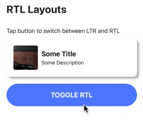

RTL (right-to-left) and LTR (left-to-right) layout support is pretty common for apps catering to an international audience that supports multiple languages. However, building layouts that supports both orientation can be a challenge without the right tools. This is where I believe Nativescript's `FlexboxLayout` true power lies.





We can use a combination of 3 properties to get a basic layout to flip between LTR and RTL. These includes:
- `flexDirection` - setting this to `row` will stack it from left to right, whereas setting this to `row-reverse` will stack it from right to left
- `horizontalAlignment` - UI elements that are horizontally aligned either left or right will need to be aligned in the opposite direction
- `textAlignment` - similarly, everything except aligned center will need to be set to the opposite direction

For the purpose of this tutorial, lets create the above layout using `GridLayout` and convert that to using `FlexboxLayout` followed by adding a flag to toggle between LTR and RTL.

## With GridLayout

```html
<!-- using GridLayout -->
<GridLayout rows="*, *" columns="auto, *" padding="20">
  <Image row="0" rowSpan="2" col="0"></Image>
  <Label text="Some Title" row="0" col="1"></Label>
  <Label text="Some Description" row="1" col="1"></Label>
</GridLayout>
```


## With FlexboxLayout

```html
<!-- using FlexboxLayout -->
<FlexboxLayout direction="row" justifyContent="start" padding="20">
  <Image></Image>
  <StackLayout>
    <Label text="Some Title"></Label>
    <Label text="Some Description"></Label>
  </StackLayout>
</FlexboxLayout>
```


## With FlexboxLayout with RTL/LTR support

```html
<!-- using FlexboxLayout with LTR/RTL -->
<FlexboxLayout [flexDirection]="isRtl ? 'row-reverse' : 'row'" justifyContent="flex-start" padding="20">
  <Image></Image>
  <StackLayout>
    <Label [textAlignment]="isRtl ? 'right' : 'left'" text="Some Title"></Label>
    <Label [textAlignment]="isRtl ? 'right' : 'left'" text="Some Description"></Label>
  </StackLayout>
</FlexboxLayout>
```


If you look at the code above, this looks similar to how bootstrap (web library) handles grids. We would have to create nested divs - one for rows, one for columns within that row. What this does is essentially separating out components that need to be stacked vertically from those that needs to be stacked horizontally.

Having that separation makes it easier to implement LTR/RTL layouts. We can ignore anything that's stacked vertically, since those don't get affected when the layouts are flipped from left to right or vice versa. With that said, we can use any layout for vertical stacking (`StackLayout`, `GridLayout`, `DockLayout`, `AbsoluteLayout`, etc.). With one catch - there shouldn't be any horizontal stacking within that layout.

All the horizontal stacking will then need to use a `FlexboxLayout` in order to enable the change of orientation of its contents. `FlexboxLayout` also comes with some handy properties such as `justifyContent` and `alignContent` giving us some flexibility in terms of positioning the children elements. Though it might not be as powerful as `GridLayout`, a combination of `StackLayout` and `FlexboxLayout` should yield a similar result.

For instance, you can use `GridLayout`'s `rows` properties to organize your components vertically, but instead of using the `columns` property, we will need to use a `FlexboxLayout` within each row in the `GridLayout` for horizontal stacking.


## Things to consider when adding LTR/RTL support

Although the bulk of the work to add LTR/RTL support is in creating and using the right layout, there are still a couple smaller consideration that we would need to think about which I'll talk about in this section.

### Icons/Images
Some icons (that have a direction associated to it) such as arrow icons for "back" or "next" buttons, which might need to be replaced with a different icon that points the opposite direction. A simple solution to this is to bind the `text` or `image` property to a ternary operator that checks a flag to determine which icon to use.

```html
<!-- using ternary operators to switch between icons -->
<Label [text]="isRtl ? 'icon_pointing_right' : 'icon_pointing_left'"></Label>
```

However, this could get really messy if you have a lot of assets that needs to be switched. If thats the case, you could instead create 2 sets of icons that can be selected either directly in the template or through a pipe.

```html
<Label [text]="'icon_pointing_right' | pickIcon"></Label>
```

### Router Navigation
The default navigation behavior in mobile apps (and in Nativescript) is sliding the new page from right to left when navigating forward and the reverse direction when navigating backwards. Unless we use a custom route transition with no direction, such as fade or no animation, we will need to create one that applies the opposite transitions when in RTL.

```typescript
// sample code for navigation transition
this.routerExtensions.navigate(routeArray, {
  animated: true,
  transition: {
    name: this.isRtl ? 'slideRight' : 'slideLeft',
    curve: AnimationCurve.easeInOut,
    duration: 200,
  }
});
```

Almost every layout in Nativescript can be converted to use a `FlexboxLayout`. Some may prove to be more difficult than others and might result in more complex template code, but still possible nonetheless. There are a number of different ways to implement LTR/RTL using the default layouts that Nativescript provides. There are also a couple libraries such as [nativescript-rtl plugin](https://github.com/nativescript-rtl/ui) which provide a drop in replacement for Nativescript layouts and handle the LTR/RTL orientation changes internally, triggered by a change in a flag from our app.

You can checkout a demo showcasing this behavior [here](https://github.com/williamjuan027/nativescript-ui-components). Let me know what you thought of the article in the comment below or on Twitter [@williamjuan027](https://twitter.com/williamjuan27).
