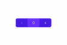

In this article, we'll cover how to create a custom stepper component that can be incremented/decremented using both a touch and a pan gesture. This tutorial not only teaches how to create a fancy UI component using NativeScript provided widgets (no third party plugins), but it shows how to combine some pretty complex interactions using gestures, animations, and styling. 

<br/>

This is what the stepper looks like, but it's what it FEELS like that's really cool. Check out the link at the end of the article to the playground sample, if you're too impatient to build it :)

<br/>



<br/>

## Creating the Component

<br/>

Let's start off with writing an interface for the properties that we can set for the stepper, and setting up default values for those

<br/>

```ts
// stepper-config.ts
export interface StepperConfig {
    width?: number,
    height?: number,
    backgroundColor?: string,
    textColor?: string,
    focusBackgroundColor?: string,
    focusTextColor?: string,
    startingNum?: number,
    limitLower?: number,
    limitUpper?: number
}
```

<br/>

```ts
// snapping-stepper.component.ts
const DEFAULT_CONFIG: StepperConfig = {
    width: 150,
    height: 50,
    backgroundColor: '#1976d2',
    textColor: '#ffffff',
    focusBackgroundColor: '#2196f3',
    focusTextColor: '#ffffff',
    startingNum: 50,
    limitLower: 0,
    limitUpper: 100
}
```

<br/>

We will then use the `DEFAULT_CONFIG` value as the default value for our stepper template to use. The `stepperConfig` property that gets passed in from the parent component will be merged with the default values - replacing the default values of the properties defined in the parent component.

<br/>

```ts
// snapping-stepper.component.ts
@Input() stepperConfig: StepperConfig;          // properties passed in by parent
_stepperConfig: StepperConfig = DEFAULT_CONFIG; // properties that will be used by component

ngOnChanges(changes: SimpleChanges): void {
    if (changes.stepperConfig) {
        // merge and replace the previous values with the parent defined values
        this._stepperConfig = { ...DEFAULT_CONFIG, ...changes.stepperConfig.currentValue };
    }
}
```

<br/>

Moving on to the template for our stepper. It will be comprised of a `GridLayout` with 3 wildcard columns containing 3 `GridLayout`s and a `Label` in each one to display the steppers and count

<br/>

```xml
<!-- snapping-stepper.component.html -->
<GridLayout columns="*, *, *" [width]="_stepperConfig.width" [height]="_stepperConfig.height"
    [backgroundColor]="_stepperConfig.backgroundColor" [borderRadius]="10">
    <GridLayout col="0">
        <Label text="-" verticalAlignment="center" horizontalAlignment="center"
            [color]="_stepperConfig.textColor"></Label>
    </GridLayout>

    <GridLayout col="2">
        <Label text="+" verticalAlignment="center" horizontalAlignment="center"
            [color]="_stepperConfig.textColor"></Label>
    </GridLayout>

    <GridLayout col="1" [backgroundColor]="_stepperConfig.focusBackgroundColor"
        [borderRadius]="10">
        <Label [text]="stepCountSubject | async" verticalAlignment="center"
            horizontalAlignment="center" [color]="_stepperConfig.focusTextColor"></Label>
    </GridLayout>
</GridLayout>
```

<br/>


We can now add basic functionalities to the component, to increment, decrement and emit values, which will be wired up with the touch and pan gestures

<br/>

```ts
// snapping-stepper.component.ts
@Output() valueChange = new EventEmitter<number>();                                       // to emit an event to the parent component

public stepCount: number = this._stepperConfig.startingNum;                               // to keep track of the current count
public stepCountSubject: BehaviorSubject<number> = new BehaviorSubject(this.stepCount);  // to update the view with the current count

stepNegative(shouldEmitValue: boolean = true): void {
  // decrement if still within bounds
  if (this.stepCount > this._stepperConfig.limitLower) {
    this.stepCount -= 1;
    this.stepCountSubject.next(this.stepCount);

    if (shouldEmitValue) {
      this.emitCountValue();
    }
  }
}

stepPositive(shouldEmitValue: boolean = true): void {
  // increment if still within bounds
  if (this.stepCount < this._stepperConfig.limitUpper) {
    this.stepCount += 1;
    this.stepCountSubject.next(this.stepCount);

    if (shouldEmitValue) {
      this.emitCountValue();
    }
  }
}

emitCountValue(): void {
  this.valueChange.emit(this.stepCount);
}
```

<br/>

## Adding touch gesture


The stepper will increment one by one if tapped, but will increment with increasing speed when you hold it.

<br/>

To achieve this effect, we will use a touch gesture, since we will need the on down (finger down) and on up (finger up) events.<br/>
First we will register a touch event on the plus and minus buttons by adding the following:

<br/>

```xml
<!-- snapping-stepper.component.html -->
...
<GridLayout (touch)="onStepTouch($event, 'negative')" col="0">
    <Label text="-" verticalAlignment="center" horizontalAlignment="center"
        [color]="_stepperConfig.textColor"></Label>
</GridLayout>

<GridLayout (touch)="onStepTouch($event, 'positive')" col="2">
    <Label text="+" verticalAlignment="center" horizontalAlignment="center"
        [color]="_stepperConfig.textColor"></Label>
</GridLayout>
...
```

<br/>

Before attaching the handler, we will need a few additional properties that we need to keep track, since we will be having a similar one for the pan event, lets name this `touchOpt`, which will contain the following types and defauls:

<br/>

```ts
// snapping-stepper.component.ts
private touchOpt: { timer: any, interval: number } = {
  timer: null,              // instance of the timer
  interval: 500             // max interval for timer to increment
};
```

<br/>

We will then add a handler for the touch events in the component file:

<br/>

```ts
// snapping-stepper.component.ts
onStepTouch(args, state: 'positive' | 'negative') {
  // touch only gets triggered on first down, then when the fingers move, and up
  // it doesn't keep firing when you hold down your finger
  if (args.action === 'down') {
    // finger down event
  } else if (args.action === 'up') {
    // finger up event
  }
}
```

<br/>

To achieve the acceleration effect, we will use a `setTimeout` recursively as we update the interval - lowering it everytime it gets called.

<br/>

```ts
// snapping-stepper.component.ts
startTouchTimer(state: 'positive' | 'negative'): void {
  if (state === 'positive' && this.stepCount < this._stepperConfig.limitUpper) {
    this.stepPositive(false);
    this.touchOpt.interval = this.touchOpt.interval * 0.8;	// accelerate
    this.touchOpt.timer = setTimeout(this.startTouchTimer.bind(this, state), this.touchOpt.interval);
  } else if (state === 'negative' && this.stepCount > this._stepperConfig.limitLower) {
    this.stepNegative(false);
    this.touchOpt.interval = this.touchOpt.interval * 0.8;  // accelerate
    this.touchOpt.timer = setTimeout(this.startTouchTimer.bind(this, state), this.touchOpt.interval);
  } else {
    // done counting
    this.clearTouchTimer();
  }
}

clearTouchTimer(): void {
  // if timer exist, stop and set it to null
  if (this.touchOpt.timer) {
    clearTimeout(this.touchOpt.timer);
    this.touchOpt.timer = null;
  }
  // reset interval to initial speed
  this.touchOpt.interval = TOUCH_SPEED;
}
```

<br/>

Lets update the previous touch handler to use our new `startTouchTimer` and `clearTouchTimer` functions.
We will need to start the timer on the `down` event, and stop the timer on the `up` event, and just to be safe, we will clear the timer also on the `down` event before starting it, to make sure we don't have multiple timers running.

<br/>

```ts
// snapping-stepper.component.ts
onStepTouch(args, state: 'positive' | 'negative') {
  if (args.action === 'down') {
    // clear timer before starting new timer (in case there is a timer already running);
    this.clearTouchTimer();
    // start the timer when finger is first down
    this.startTouchTimer(state);
  } else if (args.action === 'up') {
    // kill timer after finger is lifted
    this.clearTouchTimer();
    this.emitCountValue();
  }
}
```

<br/>

## Adding pan gesture

We will use a similar approach for our pan gestures, but instead of using the `setTimeout` timer, we will use `setInterval`, since it doesn't need to have varying intervals.
Lets first attach the pan gesture event to our middle layout of our stepper.

<br/>

```xml
<!-- snapping-stepper.component.html -->
...
<GridLayout col="1" [backgroundColor]="_stepperConfig.focusBackgroundColor"
    [borderRadius]="10" (pan)="onCountPan($event)">
    <Label [text]="stepCountSubject | async" verticalAlignment="center"
        horizontalAlignment="center" [color]="_stepperConfig.focusTextColor"></Label>
</GridLayout>
...
```

<br/>

Like the touch event, we will also need several additional properties that we need to keep track of in the pan event, which we will group as an object called `panOpt` with the following type and defaults:

<br/>

```ts
// snapping-stepper.component.ts
private panOpt: { timer: any, prevDeltaX: number, direction: 'left' | 'right' | null } = {
  timer: null,      // to keep track of the timer instance
  prevDeltaX: 0,    // to keep track of how far the component has been panned
  direction: null   // to keep track of what the previous direction of the pan was
};
```

<br/>

We will then add a handler on the component file, which gets triggered everytime it detects a pan on the component. To get a consistent speed for the increment and decrement of the counts, we will need to use a timer. This is because, the pan event will be fired for every up, down, and move - if we increment everytime and we move right, and decrement everytime we move left, the speed will depend on how much you move your finger, making it inconsistent.

<br/>

With the timer, we can listen to when the finger starts moving and when it switches direction and start and stop the timer accordingly. In the following snippet, we stop and start the timer everytime there is a switch in the direction of the pan, and stop the timer when the finger is no longer touching. The finger up event also fires an animation which moves the middle part of the stepper back to its original position, creating the snapping effect.

<br/>

```ts
// snapping-stepper.component.ts
onCountPan(args) {
  let grdLayout: GridLayout = <GridLayout>args.object;
  let newX: number = grdLayout.translateX + args.deltaX - this.panOpt.prevDeltaX;

  if (args.state === 0) {
    // finger down
    this.panOpt.prevDeltaX = 0;
  } else if (args.state === 2) {
    // finger moving
    if (Math.abs(newX) < this._stepperConfig.width / 3 && (Math.abs(args.deltaY) < this._stepperConfig.height)) {
      grdLayout.translateX = newX;

      // increment or decrement stepper depending on pan direction
      // only increment if panning is still within bounds
      if (newX > 0 && this.panOpt.direction !== 'right') {
        // pan right
        this.clearPanTimer();
        // use set interval to make the increment/decrement speed more consistent,
        // not depending on how much movement the panning captures
        this.panOpt.timer = setInterval(() => {
          this.stepPositive(false);
        }, 10);
      } else if (newX <= 0 && this.panOpt.direction !== 'left') {
        // pan left
        this.clearPanTimer();
        this.panOpt.timer = setInterval(() => {
          this.stepNegative(false);
        }, 10);
      }
    } else {
      // out of bounds
      this.clearPanTimer();
    }
    // update how far the pan has moved the component
    this.panOpt.prevDeltaX = args.deltaX;
  } else if (args.state === 3) {
    // finger up
    this.panOpt.prevDeltaX = 0;

    // snap back to original position
    grdLayout.animate({
      translate: { x: 0, y: 0 },
      curve: AnimationCurve.cubicBezier(0, 0.405, 0, 1.285),
      duration: 200
    });
    this.panOpt.direction = null;
    this.clearPanTimer();
    this.emitCountValue();
  }
}

clearPanTimer() {
  if (this.panOpt.timer) {
    clearInterval(this.panOpt.timer);
    this.panOpt.timer = null;
  }
}
```

<br/>

Checkout the demo on [nativescript playground](https://play.nativescript.org/?template=play-ng&id=6wCQbR&v=1) and the component's source code on [github](https://github.com/williamjuan027/nativescript-ui-components/tree/master/snapping-stepper)

