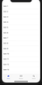
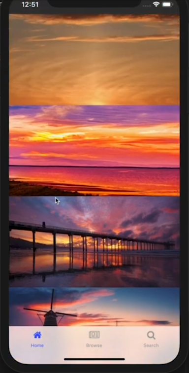
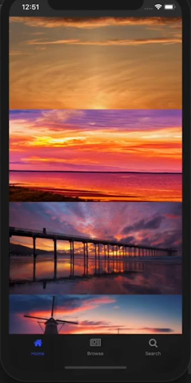

In this NativeScript tutorial, I'll share with you a technique on getting a beautiful, dark translucent tab bar in iOS in your NativeScript apps.

<br/>

## TL;DR

If you prefer watching a video of the tutorial, then here you go:

<br/>

<div class="videoWrapper">
    <iframe width="560" height="315" src="https://www.youtube.com/embed/F5ZHtJDgM5A" frameborder="0" allowfullscreen></iframe>
</div>

<br><br>

## Introduction

If you take a look at the iOS Trailers app, you will notice a dark translucent tab bar that shows the content underneath as you scroll through the movie covers.

<br>


<br>

You can't get this effect out-of-the-box with NativeScript, but I am going to show you a workaround that will get us the same effect in a NativeScript iOS app.

## Let's Jump Right In

For the demo app, I created a NativeScript Angular application from the Tabs template, which gives us an app with a Tab View set up with some pre-configured routes.

<br>



<br>

The default Tab View is actually translucent, but it's hard to see that because it's the same color as the background of the ListView underneath.

<br>

Let's make the app a bit more interesting by replacing the Items ListView with images of Sunsets:

<br>

```xml
<!-- home.component.html -->

<GridLayout>
  <ScrollView>
    <StackLayout>
      <Image src="https://en.es-static.us/upl/2018/06/sun-pillar-6-25-2018-Peter-Gipson-sq.jpg" height="200" stretch="aspectFill"></Image>
      <Image src="https://live.staticflickr.com/4689/38703929614_f06412345c_b.jpg" height="200" stretch="aspectFill"></Image>
      <Image src="https://www.visitcalifornia.com/sites/default/files/VC_LaJollaSunsets_RF_168579929_1280x640_0.jpg" height="200" stretch="aspectFill"></Image>
      <Image src="https://www.iamexpat.nl/sites/default/files/styles/article--full/public/windmills-at-beautiful-sunrise-netherlands.jpg?itok=u2M9p2MF" height="200" stretch="aspectFill"></Image>
      <Image src="https://en.es-static.us/upl/2018/06/sun-pillar-6-25-2018-Peter-Gipson-sq.jpg" height="200" stretch="aspectFill"></Image>
    </StackLayout>
  </ScrollView>
</GridLayout>
```

<br>

If you scroll through the images, you will see them showing beneath the Tab View.

<br>



<br>

The Tab Bar is translucent, but that's not the effect we are going for, we want a dark translucent tab bar, similar to the one in the iOS Trailers app.

<br>

You might think that you can get the same effect by changing the tab bar's color to `black` with CSS:

<br>

```css
/* app.component.ios.scss */

@import 'app.component';

// Place any CSS rules you want to apply only on IOS here
TabView {
  tab-background-color: black;
  selected-tab-text-color: $item-active-color;
}
```

<br>

The effect you get from that isn't really what we are going for. The dark tab bar's translucency is hardly noticeable, and you don't get the nice blur effect on the content beneath it.

<br>



<br>

Instead of getting a dark tab bar by setting its style in CSS, we are going to access the native iOS Tab Bar component and change its style.

<br>

Remember to remove the `tab-background-color: black` from your CSS file.

<br>

In `app.component.html`, add a `loaded` event to the TabView.

<br>

```xml
<!-- app.component.html -->

<TabView androidTabsPosition="bottom" (loaded)="tabViewLoaded($event)">
  <page-router-outlet
    *tabItem="{title: 'Home', iconSource: getIconSource('home')}"
    name="homeTab">
  </page-router-outlet>
  
  <page-router-outlet
    *tabItem="{title: 'Browse', iconSource: getIconSource('browse')}"
    name="browseTab">
  </page-router-outlet>
  
  <page-router-outlet
    *tabItem="{title: 'Search', iconSource: getIconSource('search')}"
    name="searchTab">
  </page-router-outlet>
</TabView>
```

<br>

Then add the `tabViewLoaded()` handler to the code file `app.component.ts`.

<br>

```typescript
// app.component.ts

import { Component, OnInit } from "@angular/core";
import { isAndroid, isIOS } from "tns-core-modules/platform";
import { TabView } from "tns-core-modules/ui/tab-view/tab-view";

@Component({
  selector: "ns-app",
  moduleId: module.id,
  templateUrl: "app.component.html",
  styleUrl: ["./app.component.scss"]
})

export class AppComponent implements OnInit {
  constructor() {
    // Use the component constructor to inject providers.
  }
  
  ngOnInit(): void {
    // Init your component properties here.
  }
  
  getIconSource(icon: string): string {
    const iconPrefix = isAndroid ? "res://" : "res://tabIcons/";
    
    return iconPrefix + icon;
  }
  
  tabViewLoaded(args) {
    const tabView: TabView = args.object;
    
    if (isIOS) {
      let tabBarController: UITabBarController = tabView.ios;
      tabBarController.tabBar.barStyle = UIBarStyle.Black;
    }
  }
}
```

<br>

In the above code, we first grab a reference to the TabView, then we ensure that the code that follows only runs on iOS. On Android, it will crash.

<br>

We get a reference to the underlying `UITabBarController` and the tab bar view associated with this controller. We then set the tab bar view's `barStyle` property. This property determines whether the tab bar uses a dark or light visual style when no background image or tint color is specified. You specify the style with `UIBarStyle`—an `enum`. You can [check here](https://developer.apple.com/documentation/uikit/uibarstyle) for a list of possible values.

<br>

If you want IntelliSense to be active when using native iOS and Android APIs, you should set up NativeScript platform declarations (tns-platform-declarations). [Here is a tutorial on how to do that](https://www.youtube.com/watch?v=vz7qfpeghFs).

<br>

If you run the app, you will now see the dark translucent tab bar, similar to the one in the iOS Trailers app.

<br>


<br>

That brings us to the end of this quick tutorial. I hope it taught you a thing or two.
<br/>
We are creating a series of iOS-focused NativeScript tutorials, so look out for those. Here are some of the posts in the series. We'll be adding to the collection in the coming weeks.

<br>

- [How to Add SHADOWS in iOS](/posts/how-to-add-shadows-in-ios)
- [How to Use iOS Large Titles](/posts/how-to-use-ios-large-titles)
- [How to Create iOS Podcast Cover Art Animation with Inheriting Shadow Color](/posts/how-to-create-ios-podcast-cover-art-animation-with-inheriting-shadow-color)
- [How to Use iOS Collapsing SearchBar](/posts/how-to-use-ios-collapsing-searchbar)
- Translucent Tabs in iOS <- that's this one :)

<br>


If you have any questions or comments about the tutorial, leave them in the comments below, or get in touch with me on Twitter [@davecoffin](https://twitter.com/davecoffin) or Alex [@digitalix](https://twitter.com/digitalix?lang=en).


<br/>

For more video tutorials about NativeScript, check out the courses on [NativeScripting.com](https://nativescripting.com). You'll find courses that cover all flavors of NativeScript (Core, Angular and Vue) and that cater to different levels of experience, whether you are just beginning your journey in the NativeScript world or you have some experience with NativeScript and are looking to level up.
