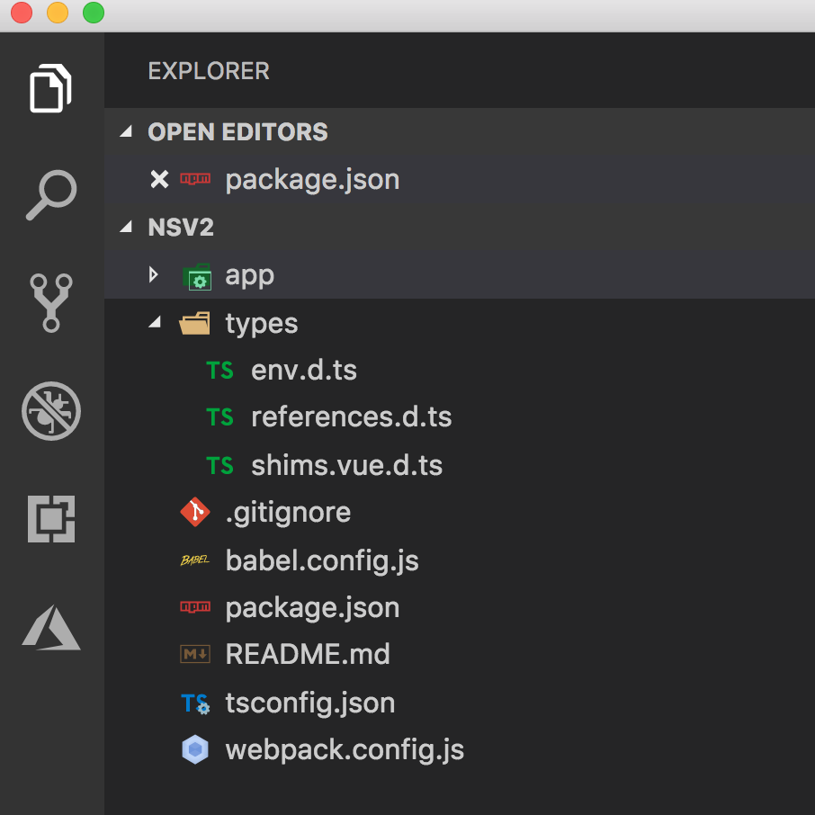

The time that we've all been waiting for has finally come. Ok, maybe the time that I've been waiting for...

<br/>

## Big News

NativeScript-Vue finally got TypeScript support! Here is the [pull request](https://github.com/nativescript-vue/vue-cli-template/pull/121) by [Manuel Saelices](https://twitter.com/linator) that made it possible.

<br/>

Today we'll take a look at how we can use the Vue CLI to generate a new NativeScript-Vue project with TypeScript, AND we're going to add just one more thing that doesn't come in the box: class components.

<br/>

If you like videos instead, watch this one to get all the info about NativeScript-Vue with TypeScript and class components.

<br/>

<div class="videoWrapper">
    <iframe width="560" height="315" src="https://www.youtube.com/embed/Z9koujDvpBM" frameborder="0" allowfullscreen></iframe>
</div>

<br><br>

## First, There is No NativeScript-Vue

Before diving into the TypeScript options, here is just a quick intro to how NativeScript-Vue works. If you want to get to the TypeScript part ASAP, go to the next section.

<br/>

There's no such thing as NativeScript-Vue! Surprised?

<br/>

Here's what I mean. NativeScript-Vue is not a thing, or a tool, or a technology. NativeScript-Vue is a collection of technologies and tools that work together to give you the ability to run the VueJS UI framework on top of native mobile apps. It's a specific workflow.

<br/>

To generate a new project, NativeScript-Vue leverages the Vue CLI and provides a template that the CLI can use to scaffold out a new NativeScript project.

<br/>

To work NativeScript-Vue needs:

<br/>

- ⚫ Vue CLI (2.x or higher) 
- ⚫ The vue cli-init package
- ⚫ The nativescript-vue/vue-cli-template
- ⚫ All the latest [NativeScript bits and pieces](https://docs.nativescript.org/angular/start/quick-setup)

<br/>

Install the Vue CLI and the cli-init tool globally via npm

```
npm install -g @vue/cli @vue/cli-init
```

<br/>

Use the Vue CLI to generate a new NativeScript project using the cli-init tool and the nativescript-vue vue-cli-template.

```
vue init nativescript-vue/vue-cli-template <project-name>
```

<br/>

Boom! You're done!

<br/>

I ALWAYS forget this, please don't: Make sure that when you run your app on the  iOS or Android emulator or device, please, please, please remember to use the `--bundle` flag. Otherwise you'll be scratching your head and creating a bald spot, like me.

```
tns run ios --bundle
```

<br/>

## Now, with TypeScript

Now that TypeScript support comes packaged into the the nativescript-vue/vue-cli-template, we can get TypeScript right out of the box without trying to put a square peg in a round hole later.

<br/>

When you run the Vue CLI command as I've shown above, you get an interactive wizard that asks you some questions.

<br/>

```
- Project name
- Project description
- Applicatio blah blah blah
```

<br/>

The one you want. Scratch that. The one you NEED is: 


```
- Select the programming language
  - javascript
  - typescript <- this one

- and a few more options
```

<br/>

This will create a new NativeScript project, with the proper packages in the package.json file, a properly configured `tsconfig.json`, and here's the big one: a properly comfigured `webpack.config.js` file. There is also a `types` folder that has extra TypeScript declarations for the environment, Vue shims, and nativescript platform references.

<br/>




<br/>

The `app` folder has a `main.ts` file. Yes that's a `.ts` extension you see there.
<br/>
And your single file Vue components have a code block that specifies TypeScript as the language. Notice the `ts` value for the `lang` attribute on the `script` tag.

<br/>

```typescript
<script lang="ts">
  export default {
    data() {
      return {
        msg: 'Hello World!'
      }
    }
  }
</script>
```

<br/>

 By the way, you can omit this lang attribute and just write plain JavaScript here if you want. This is useful for projects that are transitioning from JavaScript to TypeScript, for example.

<br/>

## Finally, with TypeScript AND Class Components

Out of the box, the new nativescript-vue cli template creates function-based TypeScript components. If you want to get Class Components AND TypeScript, there are a few manual steps you need to perform. Hopefully these will be rolled into the template too at some point.

### Step 1

In your project's `package.json` file, add the following dependencies to support Vue class components and and decorators:

```
  "dependencies": {
    ...
    "vue-class-component": "^6.3.2",
    "vue-property-decorator": "^7.3.0",
    ...
  },
```

Run `npm install`

### Step 2 

You can start using Class Components right away.
Create a single file component file, let's call it `MyComp.vue` and add this code:

```typescript
<template>
  <Label class="message" :text="msg" col="0" row="0"/>
</template>

<script lang="ts">
import { Component, Prop, Vue } from "vue-property-decorator";
@Component
export default class MyComp extends Vue {
  @Prop() private msg: string;
}
</script>
```

Notice instead of the default export being a function, here we're exporting a class. And instead of importing `Vue` from `vue`, we're importing it from `vue-property-decorator`.
Don't forget the `@Component` decorator on the class.


<br/><br/>

For more video tutorials about NativeScript, look at our courses on [NativeScripting.com](https://nativescripting.com). If you're feeling adventurous, the new [NativeScript Security Course](https://nativescripting.com/course/securing-nativescript-applications) is an advanced walk-through on making your NativeScript apps secure.

<br/><br/>

Let me know if you enjoyed this short tutorial on Twitter: <a href="https://twitter.com/digitalix" target="_blank">@digitalix</a> or comment here. And send me your NativeScript related questions that I can answer in video form. If I select your question to make a video answer, I'll send you swag - use the hashtag #iScriptNative.

<br/><br/>
