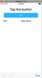

How do you update a value field when using the RadDataForm in NativeScript? At the time of writing, **you can't do it** using any JavaScript API.

<br/>

In this short NativeScript tutorial, I'll show you a workaround.

<br/>

## TL;DR

If you prefer video, I cover how to programmatically update NativeScript RadDataForm in the short video below.

<br/>

<div class="videoWrapper">
    <iframe width="560" height="315" src="https://www.youtube.com/embed/I3YLVyDeRn0" frameborder="0" allowfullscreen></iframe>
</div>

<br/>

## The Problem

The [RadDataForm](https://docs.nativescript.org/ui/professional-ui-components/DataForm/dataform-overview), (or DataForm as it's commonly known) is one of the free NativeScript Professional UI components that is built by the official NativeScript team. It automatically generates UI for editing the properties of a supplied object, thus helping you quickly build mobile forms. It uses iOS and Android libraries under the hood and implements JavaScript versions of the native libraries on top, while exposing TypeScript declarations. It's pretty cool!

<br/>

While using the RadDataForm in a client project I had, I came upon a roadblock while trying to update some fields with user input. The [issue](https://github.com/telerik/nativescript-ui-feedback/issues/344) has been reported and has been open for quite some time on GitHub. At the time of writing, there is still no solution, but there is a workaround, which we'll quickly go over.

<br/>

## The Solution

Before we get to the solution, let's first take a look at the demo app we'll use.

<br/>



<br/>

It's a simple app with a form containing one field. Above the form is a button which when tapped, we want it to update the value of the form's field.

<br/>

Here's the code for that page:

<br/>

```xml
<Page xmlns="http://www.nativescript.org/tns.xsd" navigatingTo="navigatingTo"
  class="page" xmlns:df="nativescript-ui-dataform">

  <StackLayout class="p-20">
      <Label text="Tap the button" class="h1 text-center"/>
      <Button text="TAP" tap="{{ onTap }}" class="btn btn-primary btn-active"/>

      <df:RadDataForm id=myDataForm" source="{{ formModel }}" />
  </StackLayout>

</Page>

```

<br/>

You can see the `Button` and the `RadDataForm` which is bound to the `formModel` data source.

<br/>

The form model has one property with a `title` property which is the name of the field in the form that will be generated.

<br/>

```typescript
import { Observable } from 'tns-core-modules/data/observable';

export class HelloWorldModel extends Observable {
  public formModel = {
    title: 'Hello World'
  };
  public onTap() {}
}
```

<br/>

To update the form's Title field's value when the button is tapped, we first need to get a reference to the DataForm in code:

<br/>

```typescript
import { EventData } from 'tns-core-modules/data/observable';
import { Page } from 'tns-core-modules/ui/page';
import { HelloWorldModel } from './main-view-model';
import { RadDataForm } from 'nativescript-ui-dataform';

export function navigatingTo(args: EventData) {
  const page = <Page>args.object;
  const dataForm = page.getViewById('myDataForm') as RadDataForm;
  page.bindingContext = new HelloWorldModel(dataForm);
}
```

<br/>

Notice we pass `dataFrom` into the view model:

<br/>

```typescript
page.bindingContext = new HelloWorldModel(dataForm);
```

<br/>

It's preferable for the UI to be kept separate from the view model, but for the sake of simplicity in the demo, we let that slide here.

<br/>

In the `HelloWorldModel`, we add a constructor that accepts a `RadDataForm`:

<br/>

```typescript
import { Observable } from 'tns-core-modules/data/observable';
import { RadDataForm } from 'nativescript-ui-dataform';

export class HelloWorldModel extends Observable {

  constructor(private dataForm: RadDataForm) {
      super();
  }
 ...
}
```

<br/>

Now that we have a reference to the DataForm, we can use it in `onTap()` and do all sorts of things with it.

<br/>

Since there is no API to update the form's fields, we'll need to `reload` it. Before reloading the form, we first change the title.

  <br/>

```typescript
public onTap() {
  this.set('formModel', { title: 'Hi' });
  this.dataForm.reload();
}
```

<br/>

You might have been tempted to change the field directly with `this.formModel.title = "Hi";`. This won't work.

<br/>

Since `HelloWorldModel` is an `Observable` class, we use `set()` to set the property of a complex object that's part of the Observable. If you don't call `set()` then the UI won't know that something has changed.

<br/>

## Improving the Solution

When calling the `set()` function, we pass it the name of the Observable property as well as an object with the properties we want to change.

<br/>

In our example, the DataForm has only one property. Your form might not be so simple—it might have multiple properties. In this case, it might be better to refactor the code as shown:

<br/>

```typescript
public onTap() {
  const newFormModel = { ...this.formModel, title: 'Hi there' };
  this.set('formModel', newFormModel);
  this.dataForm.reload();
}
```

<br/>

Here, we create a new object with the properties of the existing `formModel` and the property we want to update, before passing it to `set()`.

<br/>

## Caveat...

We can now change the value of a RadDataForm field in code. However, the solution isn't perfect. Every time we change the form's data, it is reloaded. So, if you have the form in focus, you will lose that focus.

<br/>

Hopefully, the issue will be resolved soon. But for now, we hope that that the tutorial was useful to you.

<br/>

For more video tutorials about NativeScript, look at our courses on [NativeScripting.com](https://nativescripting.com). If you are interested in learning about DataForm beyond the basics, we go pretty deep into creating custom editors in the [NativeScript with Angular Pro course](https://nativescripting.com/course/nativescript-with-angular-pro).

<br/>

Let me know if you enjoyed this short tutorial on Twitter: [@digitalix](https://twitter.com/digitalix?lang=en) or comment down below. You can also send me your NativeScript related questions that I can answer in video form. If I select your question to make a video answer, I'll send you swag. Use the hashtag #iScriptNative.

<br/>
