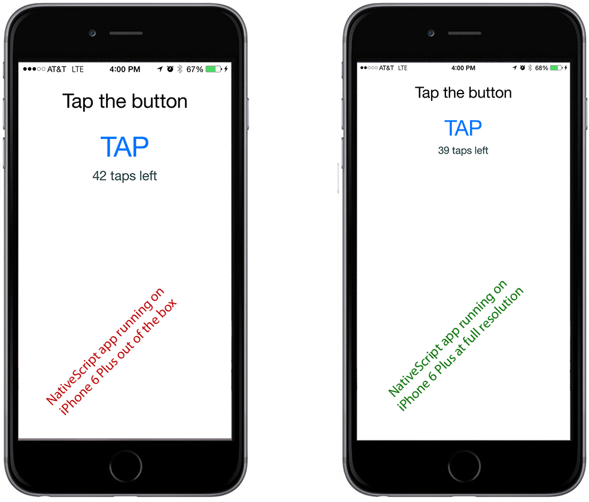

So you've got your NativeScript app up and running and noticed that it looks a bit strange on the iPhone 6 and iPhone 6 Plus. What's going on? Why is the iPhone scaling my app up and not showing it in fully iPhone 6 glory? When you deploy your NativeScript app to the newer iPhones, they will scale your app and you'll see undesired results. Let me show you a workaround to get your app looking good and using all the Pixels.

#### Versions used in this post 

* NativeScript: 0.9.4

## The Problem Illustrated

If you run your NativeScript app on a iPhone 6 or iPhone 6 Plus on either a device or the simulator ([see my post on changing the iOS simulator device](https://nativescripting.com/posts/nativescript-changing-the-ios-simulator-device)), out of the box you will get a screen that looks like an iPhone 4 image that is simply being scaled up. This is a problem because you are loosing valuable screen real estate.

On the left is an example of what the app looks like out of the box, and on the right is the way we want it to look like once the resolution fix that I describe below is in place. 



## Ok, so how do I do it?

The NativeScript will likely build this into their CLI soon, but while we are still on a pre-1.0 version, there still isn't a way to do it automatically. Follow these steps to make your apps show up with the correct resolution in iPhone 6 and iPhone 6 Plus. 

> **Note 1: ** Since you are building for the iPhone, this has to be done on a Mac. You should be pretty familiar with the first 3 steps below, which show you how to create a NativeScript app and add a platform using the CLI. If you need a refresher, visit the [NativeScript Getting Started guide](http://docs.nativescript.org/hello-world/hello-world-ns-cli). 

> **Note 2: ** If you already have an existing project, you can skip steps 1 – 3. 

## Business as usual – creating an app using the NativeScript CLI

1. Create a NativeScript app
    
```
tns create myScreenSizeApp
```

2. Go to the directory of your app
    
```
cd myScreenSizeApp
```

3. Add the iOS platform to your app
    
```
tns platform add ios
```

## Adding support for iPhone HD screen sizes

4. Navigate to the _/platforms/ios/myScreenSizeApp/Images.xcassets/LaunchImage.launchimage_ directory in the myScreenSizeApp app.
    
```
cd platforms/ios/myScreenSizeApp/Images.xcassets/LaunchImage.launchimage
```

5. Here you should see a _Contents.json_ file. Open the file and add the highlighted lines to the top of the "images" array property.

```
{
  "images" : [
    {
      "extent" : "full-screen",
      "idiom" : "iphone",
      "subtype" : "736h",
      "filename" : "iPhone6PlusLaunch.png",
      "minimum-system-version" : "8.0",
      "orientation" : "portrait",
      "scale" : "3x"
    },
    {
      "extent" : "full-screen",
      "idiom" : "iphone",
      "subtype" : "667h",
      "filename" : "iPhone6Launch.png",
      "minimum-system-version" : "8.0",
      "orientation" : "portrait",
      "scale" : "2x"
    },
    {
      "orientation" : "portrait",
      "idiom" : "iphone",
      "extent" : "full-screen",
      "minimum-system-version" : "7.0",
      "scale" : "2x"
    },
…
```

6. Add two image files to this same directory that you are in; one image is a splash screen for iPhone 6 and the other is a splash screen for iPhone 6 Plus. I've included the two images for you to download if you need a placeholder, but just remember that the images are the following dimensions:

    * iPhone 6 – 750 pixels by 1334 pixels
    * iPhone 6 Plus – 1242 pixels by 2208 pixels

The images are called _iPhone6Launch.png_ and _iPhone6PlusLaunch.png_. You can download them from the Download section below.

7. Run the app in either the emulator or on a device and you will see the correct resolution being displayed.

## Downloads

- [iPhone6PlusLaunch.png](iPhone6PlusLaunch.png)
- [iPhone6Launch.png](iPhone6Launch.png)
