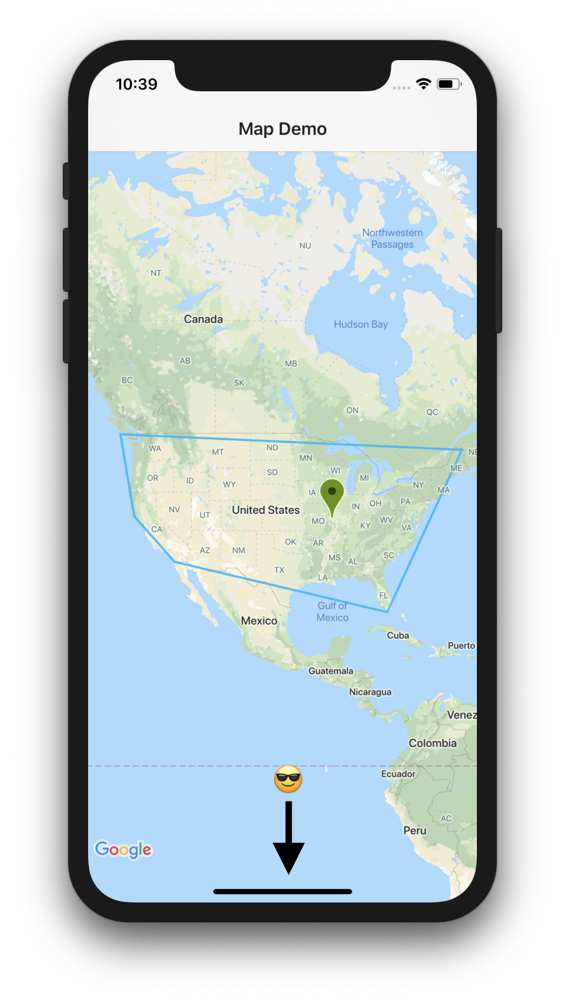
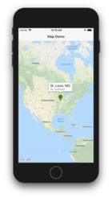
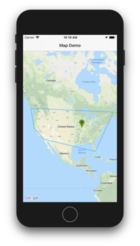

Today I’m going to show you show to do some cool things with Google maps in NativeScript using the *nativescript-google-maps-sdk* plugin.

<br/>

### Here's what we're covering today

1. How to center the map
2.	Place a marker on the map
3.	Draw a polyline on the map
4.	How to remove markers and polylines


>**NOTES**
> 1. I will not be covering how to install and configure the plugin. For help with that refer to the documentation found here: https://github.com/dapriett/nativescript-google-maps-sdk. 
> 2. My demo is using a NativeScript + Angular template so how I get my map in the view might be a little different if you are using NativeScript Core or Vue. The code behind should be very similar though.

<br/>


To do anything with the map we must get a reference to it in our code behind. Let’s see how to do that.

<br/>

There is a `mapReady` event that you can listen for in your code behind. Here is my view.

<br/>

```xml
<ActionBar title="Map Demo" class="action-bar">    
</ActionBar>

<GridLayout>
    <MapView (mapReady)="onMapReady($event)" iosOverflowSafeArea="true"></MapView>
</GridLayout>
```

<br/>

> **NOTE:** The `iosOverflowSafeArea=“true”` is important for iPhone 10+ to allow the map to fill in the safe area. By default it is set to `false`.

> For a video about safe areas in NativeScript, take a look at the bottom of this post

<br/>

See the difference? 

<br/>




<br/>

Then in your code behind we need to add the handler for that event. This event will fire when the map has loaded.

<br/>

```typescript
    onMapReady = (event) => {
        let mapView = event.object as MapView;
	}
```

<br/>


Now that we have the busy work done, now we can do some fun stuff!

<br/>

>**NOTE:** You can add all the code inside of the `onMapReady` event or split it out into methods and call the methods from inside of the `onMapReady` event, it is up to you. For simplicity, we’ll just code inside of the event.

By default the map will center on (0,0)…which is in the South Atlantic Ocean just off the coast of Africa. Sometimes you might want the map to center on a different point. 😁

<br/>
<br/>

### Part 1

Let’s look at how to center the map on the United States


```typescript
    onMapReady = (event) => {
        let mapView = event.object as MapView;

        const NA_CENTER_LATITUDE = 39.8283459;
        const NA_CENTER_LONGITUDE = -98.5816737;

        mapView.latitude = NA_CENTER_LATITUDE;
        mapView.longitude = NA_CENTER_LONGITUDE;
        mapView.zoom = 3;
	}
```


<br/>
<br/>

### Part 2

Let’s add a marker and customize it a little


```typescript
    onMapReady = (event) => {
        let mapView = event.object as MapView;

        const NA_CENTER_LATITUDE = 39.8283459;
        const NA_CENTER_LONGITUDE = -98.5816737;

        mapView.latitude = NA_CENTER_LATITUDE;
        mapView.longitude = NA_CENTER_LONGITUDE;
        mapView.zoom = 3;

        let stLouisCoordinates = {
            latitude: 38.619081,
            longitude: -90.196846
        };

        let stLouisMarker = new Marker();
        stLouisMarker.position = Position.positionFromLatLng(stLouisCoordinates.latitude, stLouisCoordinates.longitude);
        stLouisMarker.title = "St. Louis, MO";
        stLouisMarker.snippet = "Go Cardinals!";
        stLouisMarker.color = "#6B8E23";
        mapView.addMarker(stLouisMarker);
	}
```





<br/>
<br/>


### Part 3

Drawing polylines is similar to placing a marker on the map but with multiple points


```typescript
const US_COORDINATES: Array<USCoordinate> = [
    {
        name: "north-west",
        latitude: 48.893758,
        longitude: -126.051448
    },
    {
        name: "north-east",
        latitude: 47.133486,
        longitude: -68.145135
    },
    {
        name: "south-east",
        latitude: 25.218599,
        longitude: -80.818088
    },
    {
        name: "south-west",
        latitude: 32.661658,
        longitude: -116.872625
    },
    {
        name: "center-west",
        latitude: 38.948326,
        longitude: -123.729374
    }
];
```


```typescript
    onMapReady = (event) => {
        let mapView = event.object as MapView;

        const NA_CENTER_LATITUDE = 39.8283459;
        const NA_CENTER_LONGITUDE = -98.5816737;

        mapView.latitude = NA_CENTER_LATITUDE;
        mapView.longitude = NA_CENTER_LONGITUDE;
        mapView.zoom = 3;

        let stLouisCoordinates = {
            latitude: 38.619081,
            longitude: -90.196846
        };

        let stLouisMarker = new Marker();
        stLouisMarker.position = Position.positionFromLatLng(stLouisCoordinates.latitude, stLouisCoordinates.longitude);
        stLouisMarker.title = "St. Louis, MO";
        stLouisMarker.snippet = "Go Cardinals!";
        stLouisMarker.color = "#6B8E23";
        mapView.addMarker(stLouisMarker);

        const polyline = new Polyline();

        US_COORDINATES.map((coordinates: USCoordinate) => {
            polyline.addPoint(Position.positionFromLatLng(coordinates.latitude, coordinates.longitude));
        });

        // REQUIRED! Used to connect polyline to start point
        polyline.addPoint(Position.positionFromLatLng(US_COORDINATES[0].latitude, US_COORDINATES[0].longitude));

        polyline.visible = true;
        polyline.width = 2;
        polyline.color = new Color("#DD00b3fd");
        polyline.geodesic = false;
        mapView.addPolyline(polyline);

	}
```




<br/>
<br/>

### Part 4

Now let’s see how to clean up our map

<br/>

```typescript
	mapView.removeAllShapes();
	mapView.removeAllMarkers();
```

<br/>

I hope this helps you when working with Google Maps in your NativeScript apps.

<br/>
<br/>

>Here is a video where Dave Coffin shows how to use safe areas in iOS

<div class="videoWrapper">
    <iframe width="560" height="315" src="https://www.youtube.com/embed/XC4Z5r_z7W0" frameborder="0" allowfullscreen></iframe>
</div>

<br><br>
