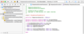
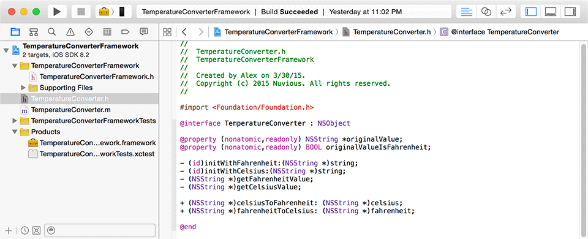
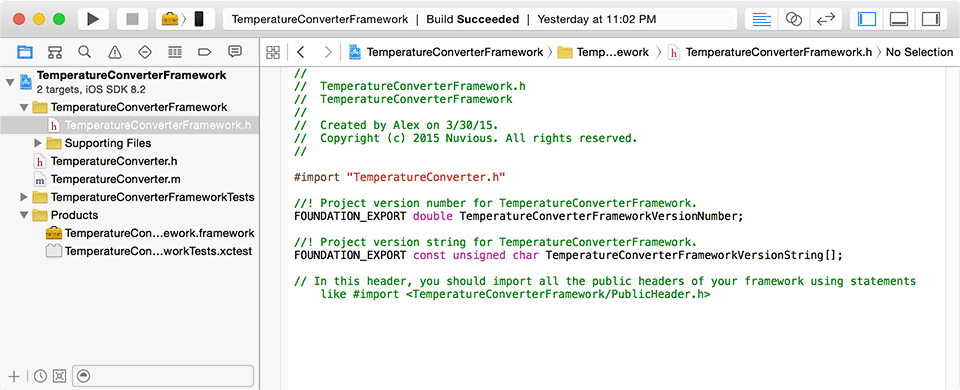
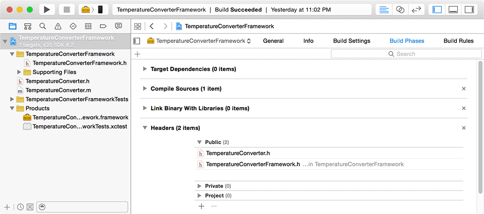
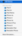
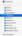
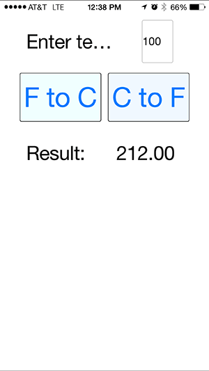

When developing a [NativeScript](https://www.nativescript.org/) app, you might run into a situation where you really need to use a native library that's you've already written, or a library that someone else has already made available as an open source project, for example. Should you rewrite that library or framework in JavaScript or create a new NativeScript module? Well, you certainly could do that, but the good news is that you don't have to. NativeScript has this neat little feature that allows you to import an existing native library and call it from your NativeScript app. This post will show you how you can use a native iOS library in your own app. 

#### Versions used in this post 

* NativeScript: 0.9.4
* Xcode 6

#### Update May 12, 2015

I've updated the companion code in the [GitHub repo](https://github.com/alexziskind1/NativeScript-With-iOS-Lib) for NativeScript version 1.0.1 and included the lib folder for those who just want to download and try out the app right away.

Yes, you read that right.

> You can call your native objects with JavaScript.

Not only can you do this for the standard frameworks that come with iOS and Android, but you can use your own as well. I will show you how to build and configure the framework for iOS using Xcode and how to import and call the library form your NativeScript app. There are a few things that could trip you up and I will make a note of these items in the appropriate sections.

I've prepared a sample for you that you can download from GitHub and try out for yourself. The sample Xcode library is a temperature converter that converts between Celsius and Fahrenheit and vice versa. The steps below will refer to this sample, so if you download it you'll be able to follow along easier. [Here is the sample](https://github.com/alexziskind1/NativeScript-With-iOS-Lib).

## Preparing Your Own Xcode Library

Let's say you already have an existing code base that you wrote and you want to reuse it in your NativeScript app. In the [sample that I provided](https://github.com/alexziskind1/NativeScript-With-iOS-Lib), there is an Xcode project that is set up correctly. All this sample does is convert Celsius and Fahrenheit temperatures. Here is what the header code looks like to give you an idea.



1. The project should be created as a dynamic framework – this is currently the only type of library that is supported.

In Xcode, File->New->Project



2. Classes you want to use in NativeScript should be exposed publicly. I've opened the TemperatureConverterFramework project in Xcode 
    * The main framework header file called _TemperatureConverterFramework.h_ should `#import` the headers that you want accessible in your app so the NativeScript metadata generator can find them. In this case, the only class is imported is _TemperatureConverter.h_
    


    * The header files that you want public should also be exposed in the project Build Phases properties. I wanted _TemperatureConverter.h_ to be available to my NativeScript app, so I moved it from the Project list to the Public list under the Headers section.



3. When building the project, make sure to follow the tips below, or you'll be in for a trick instead of a treat.

> Remember that when building for a device, select the generic iOS Device as the target, build, and then import from the _**iphoneos**_ directory (more on that later). When building for the iOS simulator, select a simulator as the target, build, and then import from the _**iphonesimualtor**_ directory.

    * **Gotcha 1** - Build the Xcode Framework project with your device physically **disconnected** from the Mac. I've lost a couple of hairs figuring this one out. When I build with my iPhone connected, there are problems with finding the library variables when running the app. When I disconnect my device from the Mac and build the project for a generic iOS Device, everything works well. This is the target menu when selecting what device to build for:



    * **Gotcha 2** - If you're going to run the app on the iOS simulator, you have to build the project in Xcode for the simulator, and then you have to import the simulator library into your NativeScript app. See the Importing section later.



## Utilizing an Existing Xcode Library or Framework

Another scenario is you found a cool library that someone else has written and you want to use it in your app.

* Verify that the library was created as a dynamic framework, also known as a Cocoa Touch Framework.
* If the library was not created as a Framework, there are two things you can do if you have the source code:

    * You can attempt to change the framework type in the project properties – but I've found this to be a fragile approach that could lead to further build errors.

    * Create a separate Cocoa Touch Framework project and copy and paste the classes into the new project from the old project.

> Note: For an example of using an existing iOS library in your NativeScript app, see [my post on using NativeScript with Azure Mobile Services part 2](https://nativescripting.com/posts/nativescript-apps-with-azure-mobile-services--part-2).

* If you don't have the source code and the library is of a static type, then at this time you won't be able to use it. But perhaps the NativeScript team will work on a way to get these types of libraries working in the future.

## Importing and Using the Framework in Your App

Once the library (or framework) has been built properly and is the correct project type, you can import it into your NativeScript app and use it. The [sample download](https://github.com/alexziskind1/NativeScript-With-iOS-Lib) includes a demo NativeScript app that uses the TemperatureConverter library. Familiarity with creating and running NativeScript apps with the CLI is assumed, but if you need a refresher, [start here](http://docs.nativescript.org/hello-world/hello-world-ns-cli).

1. If you haven't done this already or you want a clean slate, add the iOS platform to your NativeScript project.

```
tns platform add ios
```

2. Assuming you've built the project correctly (see steps above), you can now add the TemperatureConverterFramework iOS library to your project. Your path might be slightly different due to the randomly generated directory for he product build.

    * If building for a device, add the library from the **Debug-iphoneos** subdirectory

```
tns library add ios /Users/alex//Library/Developer/Xcode/DerivedData/TemperatureConverterFramework-hiimmywwmpyjhselvsqcximsvgic/Build/Products/Debug-iphoneos/TemperatureConverterFramework.framework
```

    * If building for the simulator, add the library from the **Debug-iphonesimulator** subdirectory

```
tns library add ios /Users/alex//Library/Developer/Xcode/DerivedData/TemperatureConverterFramework-hiimmywwmpyjhselvsqcximsvgic/Build/Products/Debug-iphonesimulator/TemperatureConverterFramework.framework
```

3. You will be able to refer to your class in your NativeScript JavaScript code. The included sample utilizes the static members of the class to convert temperatures, but you can just as well new up the object and use the instance members. The highlighted line shows a call to the TemperatureConvert class in the iOS library that was imported.

```
mainViewModel.tapFtoC = function () {
    var tempVal = getTempFieldValue();
    var newTempVal = TemperatureConverter.fahrenheitToCelsius(tempVal);
    mainViewModel.set("result", newTempVal);
};
```

4. Run the app on your device and you will have a functioning app that converts temperatures.



## Summary

As you can see, there are a few gotchas here that can potentially trip you up, but if you follow the steps outlined in this post, you should be fine. Have fun using your libraries. Remember that NativeScript is still pre-release, so if something isn't working and it should, take a step back and remove the iOS platform folder and the library folder, add them back in, and try again – your problem might be fixed.
