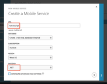
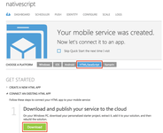
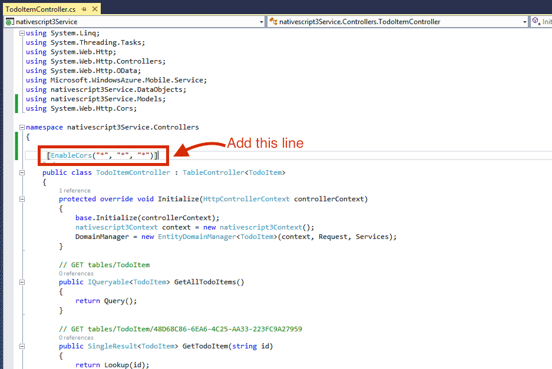
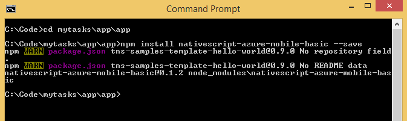
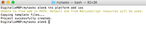

[NativeScript](https://www.nativescript.org/) is a shiny new cross-platform mobile development framework that I'm exploring and comparing to existing frameworks. One common task that we have to do as developers is to connect mobile apps to far away data storage. These days Backend as a Service (BaaS) solutions are pretty popular to simplify development time. Azure Mobile Services is such a BaaS.

This post will show you how to call into [Azure Mobile Services](http://azure.microsoft.com/en-us/services/mobile-services/) using a custom NativeScript module to pull a list of items stored in an Azure SQL database.

#### Versions used in this post 

* NativeScript: 0.9.4
* NativeScript Azure Mobile Services Module: 0.1.2

#### Things you will need

1. Azure subscription ([get one here for free](http://azure.microsoft.com/en-us/pricing/free-trial/))
2. Visual Studio 2013 ([grab a free community edition if you don’t have it](http://www.visualstudio.com/Free%E2%80%8E))
3. NativeScript
4. NativeScript azure mobile services basic module. You can get this by installing nativescript-azure-mobile-basic package with npm (read later for details). The source code for the module can be found [here on GitHub](https://github.com/alexziskind1/NativeScript-Azure-Mobile-Services-Module-Basic).

## Creating and configuring an Azure Mobile Service

You should be familiar with Azure Concepts like using the portal and provisioning new artifacts and services, as well as publishing from Visual studio. If you're not, please see this post on setting up the azure side of things for finer details of the steps below.

1. Create an Azure Mobile service with a name you prefer with a .NET backend. I'm going to call mine "nativescript". Make sure that your Azure SQL Database that will ultimately hold your data is in the same region as your service. You can create a new SQL database or reuse an existing one.



2. Once your service has been created (this shouldn't take more than a minute or so), download the Visual Studio Project from the HTML/JavaScript platform tab.



3. Open the downloaded solution in Visual Studio and using the solution explorer, navigate to the TodoItemController in the Controllers directory. Place the EnableCors attribute on the controller class itself. This will open up all actions in the controller to be called from any origin, with any header, using any method. This will do for development purposes, but in production, make sure you narrow these scopes.



4. Right click on the project and publish your service to Azure.

> **Note**: you can use the "try it out" feature of the service to perform REST calls if you want to manipulate or view the data. I've done this to add a few more items to the data table so that's why you'll see I will have a few extra items than the default in the steps below.

## Creating a NativeScript project with a list layout

This will show you how to create a new NativeScript project and create a list structure so you can view the tasks list items from the Azure table.

> **Note**: Using a directory shared between OSX and Windows allows me to use either one. So I switch between OSX and Windows terminology (ie. Terminal vs. Command prompt), but the concepts are exactly the same. 

1. Open a command prompt and create a NativeScript project called _mytasks_.

```
tns create mytasks
```


2. Modify the following files in the `mytasks\app\app` directory

    * **main-page.xml** - replace the contents with the following code

```
<Page loaded="onPageLoaded">
    <GridLayout rows="auto, *">
        <ListView items="{{ tasks }}" row="1">
            <ListView.itemTemplate>
                <Label text="{{ name }}" cssClass="rowClass" />
            </ListView.itemTemplate>
        </ListView>
    </GridLayout>
</Page>
```

    * **main-page.js** - replace the contents with the following code

```
var vmModule = require("./main-view-model");
 
//Handler for Page loaded event in main-page.xml
function onPageLoaded(args) {
    var page = args.object;
    page.bindingContext = vmModule.mainViewModel;
    vmModule.mainViewModel.loadTasks();
}
exports.onPageLoaded = onPageLoaded;
```

    * **main-view-model.js** \- replace the contents with the following code

```
var observable = require("data/observable");
var observableArray = require("data/observable-array");
 
var mainViewModel = new observable.Observable();
var tasks =  new observableArray.ObservableArray([]);
var msUrl = 'https://<your-service-url>.azure-mobile.net/';
var msKey = '<your-service-app-key>';
var msTableName = 'todoitem';
var msColumnName = 'text';
 
mainViewModel.set('tasks', tasks);
 
mainViewModel.loadTasks = function() {
    var itemArr = [];
};
 
exports.mainViewModel = mainViewModel;
```

    * **app.css** - add the following code to the end of the file

```
label {
    margin: 15;
}
textfield {
    margin: 15;
}
```

## Installing the NativeScript Azure Mobile Services Module

This basic module will allow you to query for a list of data. It's a very simple module that wraps a call to Azure Mobile Services using HTTP.  The current Mobile Service Clients for JavaScript that are published with azure have some dependencies that are not present in a NativeScript app. Therefore a separate module was created to help out.

1. Change directory to your NativeScript project, then to the app directory, then to the app directory inside.
    
```
cd mytasks\app\app
```

2. Install the nativescript-azure-mobile-basic from npm at this location.
        
```
npm install nativescript-azure-mobile-basic --save
```



3. Add reference to the module in your tasks view model. Open the file main-view-model.js and add the following highlighted line

```
var observable = require("data/observable");
var observableArray = require("data/observable-array");
var azuremobile = require( "./node_modules/nativescript-azure-mobile-basic/azuremobilebasic" );
 
var mainViewModel = new observable.Observable();
var tasks =  new observableArray.ObservableArray([]);
```

4. Call the getTableItems function on the MobileServiceClient to get the table items. In the main-view-model.js file, add the following to the load tasks function

```
mainViewModel.loadTasks = function() {
    var itemArr = [];
    var client = new azuremobile.MobileServiceClient(msUrl, msKey);
 
    client.getTableItems(msTableName, msColumnName, itemArr)
        .then(function(){
            for (var i = 0; i < itemArr.length; ++i) {
                tasks.push(itemArr[i]);
            }
        });
};
```

## Running the app

I will demonstrate running the app on the iPhone simulator, but the same can be done for android emulator as well.

1. From the project directory called mytasks run the platform add command for iOS. This has to be done on a Mac

```
tns platform add ios
```



2. Execute the nativescript run command with the emulator option to start the app using the simulator. After a few seconds, you should see the items appear in your list view.

```
tns run ios --emulator
```


## Summary

This post demonstrates how to call an Azure Mobile Service using a NativeScript app as a client. It is a rudimentary proof of concept and should not be used in production, but it gives you an idea of how to link these systems together.
